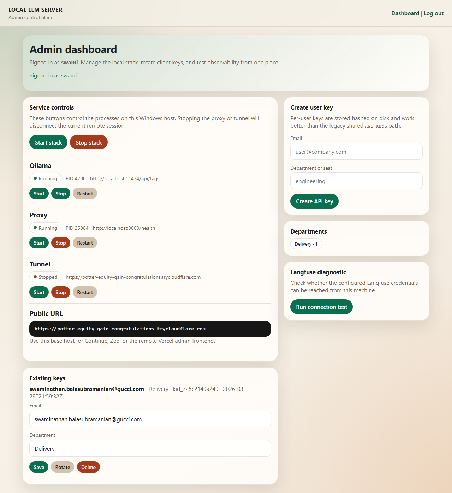
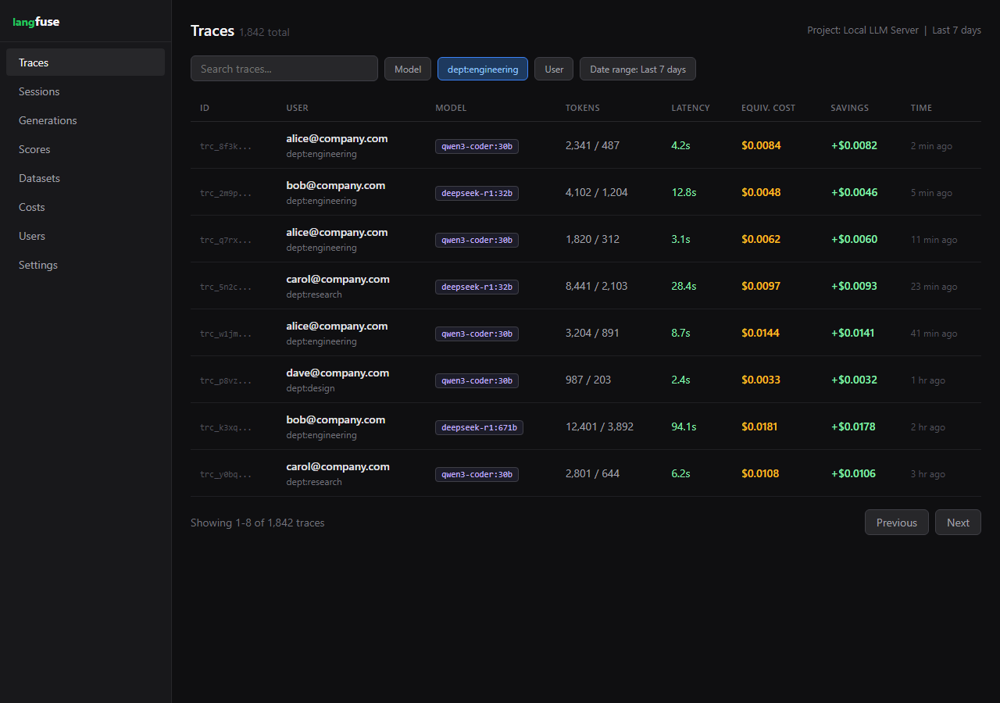
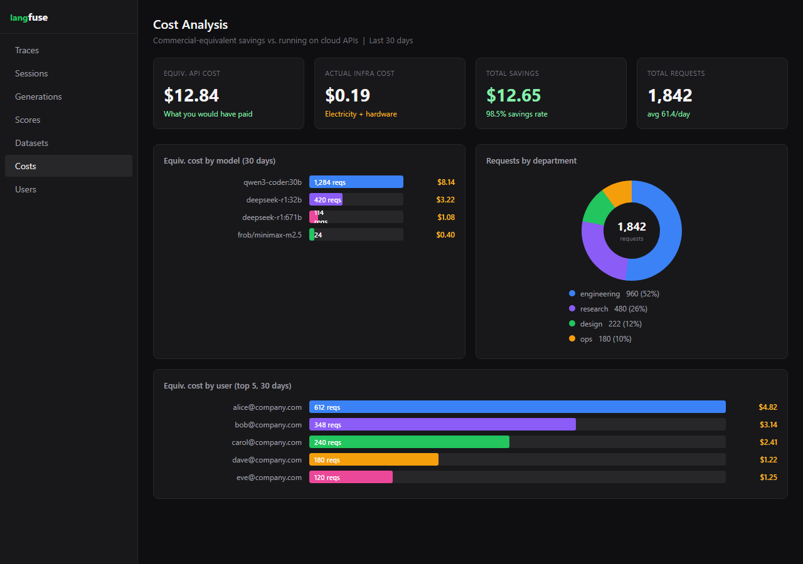
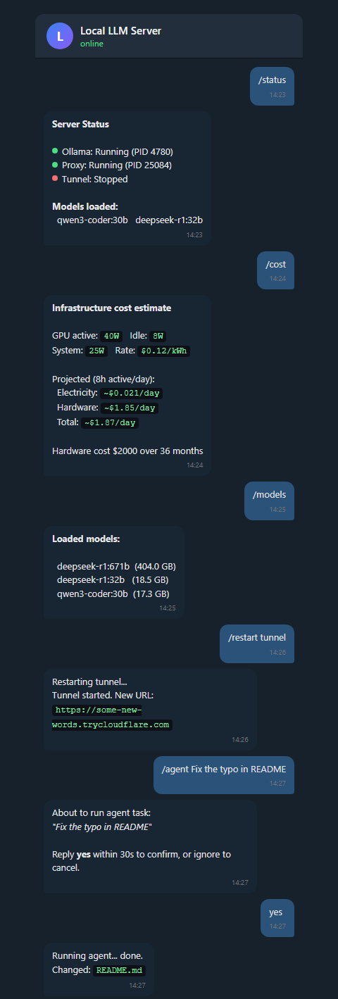

# Local LLM Remote Access Server

Run powerful open-source AI models on your home PC and access them securely from **any device, anywhere** — using the same API interface as OpenAI or Anthropic.

No cloud costs. No data sent to third parties. Full control over your models.

---

## This Setup — Connection Details

> The server runs on a personal laptop. Use these credentials to connect from any client machine.
>
> **API Key:** `REDACTED_API_KEY`
>
> **Tunnel URL:** Run `setup_ngrok.py` once on the personal laptop to get a **permanent static URL** — see [Permanent URL](#permanent-url) below. Once set up, the URL is pinned in the Admin UI and never changes.
>
> Until then, find the current ephemeral URL via:
> - Admin UI on the personal laptop: `http://localhost:8000/admin/ui/` → **Public URL** field (editable — paste a permanent URL here to pin it)
> - Running: `./get_tunnel_url.sh` (macOS/Linux) or `.\get_tunnel_url.ps1` (Windows)
>
> To use with Claude Code CLI once you have the URL:
> ```bash
> export ANTHROPIC_BASE_URL=https://<tunnel-url>
> export ANTHROPIC_API_KEY=REDACTED_API_KEY
> claude
> ```
> To verify the connection:
> ```bash
> curl https://<tunnel-url>/v1/models \
>   -H "Authorization: Bearer REDACTED_API_KEY"
> ```

---

## Documentation

| Guide | What it covers |
|-------|---------------|
| [Quick Start](#quick-start) | Get running in 10 minutes |
| [Claude Code + Qwen Setup](docs/claude-code-setup.md) | Use Claude Code CLI against local models |
| [Telegram Bot Setup](docs/telegram-bot.md) | Remote control from your phone |
| [Admin Dashboard Guide](docs/admin-dashboard.md) | Browser UI walkthrough |
| [Feature Guide](docs/features.md) | Every feature explained |
| [Langfuse Observability](docs/langfuse-observability.md) | Traces, cost metrics, dashboards |
| [Configuration Reference](docs/configuration-reference.md) | Every `.env` variable |
| [Troubleshooting](docs/troubleshooting.md) | Common problems and fixes |
| [Device Compatibility](docs/device-compatibility.md) | RAM/VRAM guide by hardware tier |
| [Changelog](docs/changelog.md) | Release history |

---

## What You Get

- **OpenAI-compatible API** — `/v1/chat/completions`, `/v1/models`, `/v1/embeddings`
- **Anthropic API compatibility** — `/v1/messages` for Claude Code CLI and Anthropic SDK
- **Ollama native passthrough** — `/api/chat`, `/api/generate`, `/api/tags`
- **Multi-user key management** — per-user email/department, stored hashed, rotatable
- **Browser admin UI** — service control, key management, Langfuse diagnostics
- **Remote admin API** — JSON endpoints for programmatic management (+ Vercel frontend)
- **Telegram bot** — `/status`, `/models`, `/cost`, service control from Telegram
- **Coding agent API** — planner → executor → verifier loop for autonomous code tasks
- **Langfuse observability** — per-request traces with latency, cost, and department tags
- **Infrastructure cost tracking** — true electricity + hardware amortization per request
- **Commercial savings estimation** — "what would this have cost on Claude/OpenAI?"
- **Cloudflare tunnel** — public HTTPS URL, no port forwarding, no static IP required

---

## Architecture

```
Internet
    │
    ▼
[Cloudflare Tunnel]   https://xxx.trycloudflare.com (or named tunnel)
    │
    ▼
[FastAPI Proxy]       localhost:8000
    │  ├─ Bearer token auth + per-key rate limiting
    │  ├─ Anthropic /v1/messages  ← Claude Code, Anthropic SDK
    │  ├─ OpenAI   /v1/*          ← Cursor, Continue, Aider, Python SDK
    │  ├─ Ollama   /api/*         ← Ollama-native clients
    │  ├─ Agent    /agent/*       ← planner/executor/verifier loop
    │  ├─ Admin    /admin/*       ← browser UI + remote API
    │  └─ Langfuse tracing + infra cost metadata on every chat request
    │
    ▼
[Ollama]              localhost:11434
    │
    ▼
[Model weights]       D:\aipc-models  (or OLLAMA_MODELS path)
```

**Also runs alongside:**

- **Telegram bot** (`telegram_bot.py`) — connects to proxy via localhost admin API
- **Remote admin frontend** (`remote-admin/`) — static site deployable to Vercel

---

## Models

### Default coding stack

Two models run simultaneously — planner/verifier and executor in parallel:

| Model | Size | Role | Equivalent (2026) |
|-------|------|------|-------------------|
| `qwen3-coder:30b` | 17 GB | Executor — IDE coding, completion, review | Claude Sonnet 4.6 class |
| `deepseek-r1:32b` | 18.5 GB | Planner + Verifier — reasoning, architecture | Claude Opus 4.6 class |
| `deepseek-r1:671b` | 404 GB | Flagship (optional) — hard research, math | Claude Opus 4.6 / GPT-5 class |

Both 30B models fit in 128 GB RAM simultaneously. The 671B requires ~404 GB storage; use mmap from Gen4 NVMe if it exceeds RAM.

### Extended local models (download with `-Extended` flag)

| Model | Pull tag | Size | Notes |
|-------|----------|------|-------|
| MiniMax M2.5 | `frob/minimax-m2.5:230b-a10b-q4_K_M` | 138 GB | 229B MoE (10B active), 192K ctx, community GGUF |

### Cloud-proxy models (download with `-CloudProxy` flag)

These pull an Ollama stub that routes requests to the vendor's cloud API. **No local weights are stored.** A vendor API key must be configured in Ollama.

| Model | Pull tag | Vendor | Notes |
|-------|----------|--------|-------|
| DeepSeek V3.2 | `deepseek-v3.2:cloud` | DeepSeek | 685B MoE, MIT license, 160K ctx |
| MiniMax M2.7 | `minimax-m2.7:cloud` | MiniMax | Local weights not yet released |
| GLM-5 | `glm-5:cloud` | Z.ai | 744B MoE (40B active), Apache 2.0 weights on HuggingFace but not in Ollama |

### Not yet locally runnable (as of 2026-03-31)

| Model | Reason |
|-------|--------|
| **MiMo-V2-Pro** (Xiaomi) | Proprietary — weights not released |
| **Step 3.5 Flash** (stepfun) | Apache 2.0, available on HuggingFace (111 GB Q4), but not in Ollama library yet. Download via: `huggingface-cli download stepfun-ai/Step-3.5-Flash-GGUF` |

### 2026 open model equivalence map

| Closed tier | Best open match | Practical match |
|------------|-----------------|-----------------|
| Claude Opus 4.6 | DeepSeek-R1, GLM-5 | 75–85% |
| Claude Sonnet 4.6 | **qwen3-coder:30b**, DeepSeek V3.2 | 80–90% |
| GPT-4.1-mini | qwen2.5-coder:32b, MiniMax M2.5 | 80–90% |
| Claude Haiku | Mistral 7B, Gemma 3, Llama 3 8B | 85–95% |

Mental shortcut: **Opus → DeepSeek-R1 · Sonnet → Qwen3-Coder · Haiku → 7B class**

---

## Hardware Requirements

| | Minimum | Recommended |
|-|---------|-------------|
| **RAM** | 16 GB | 128+ GB |
| **Storage** | 50 GB free | 500 GB+ NVMe SSD |
| **GPU VRAM** | 8 GB | 24+ GB (or iGPU with shared RAM) |
| **OS** | Windows 10 / macOS 12 / Ubuntu 20.04 | Any |

For detailed per-device guidance (Apple Silicon, NVIDIA tiers, Intel Arc, CPU-only), see [docs/device-compatibility.md](docs/device-compatibility.md).

---

## Quick Start

### 1. Install Ollama

```bash
# macOS / Linux
curl -fsSL https://ollama.com/install.sh | sh

# Windows
winget install Ollama.Ollama
```

### 2. Clone and configure

```bash
git clone https://github.com/strikersam/local-llm-server.git
cd local-llm-server
cp .env.example .env
```

Edit `.env` — minimum required:

```env
API_KEYS=your-secret-key-here
OLLAMA_MODELS=D:\aipc-models       # Windows — adjust path for your OS
PROXY_DEFAULT_MAX_TOKENS=8192
PROXY_STRIP_THINK_TAGS=true
```

For team use, also add:

```env
KEYS_FILE=keys.json
ADMIN_SECRET=<python -c "import secrets; print(secrets.token_urlsafe(32))">
```

### 3. Download models

```powershell
# Windows — pulls to D:\aipc-models automatically
.\download_models.ps1                    # default coding stack (~36 GB)
.\download_models.ps1 -Lightweight       # 7B tier only (~10 GB)
.\download_models.ps1 -IncludeFlagship   # also pulls deepseek-r1:671b (~404 GB)
.\download_models.ps1 -Extended          # also pulls MiniMax M2.5 (~138 GB)
.\download_models.ps1 -CloudProxy        # cloud-proxy stubs (no local weights)
```

Manual pull (any OS):

```bash
ollama pull qwen3-coder:30b
ollama pull deepseek-r1:32b
```

### 4. One-time setup

```bash
# Linux / macOS
chmod +x *.sh && ./install.sh

# Windows
.\install.ps1
```

### 5. Start

```bash
./start_server.sh      # Linux/macOS
.\start_server.ps1     # Windows
```

Output:

```
[1/3] Starting Ollama...     ✓ Ready (qwen3-coder:30b, deepseek-r1:32b)
[2/3] Starting Proxy...      ✓ Port 8000
[3/3] Starting Tunnel...     ✓ https://example-words.trycloudflare.com
```

### 6. Use it

```bash
# OpenAI-compatible
curl https://your-tunnel-url/v1/chat/completions \
  -H "Authorization: Bearer your-key" \
  -H "Content-Type: application/json" \
  -d '{"model":"qwen3-coder:30b","messages":[{"role":"user","content":"Hello"}]}'

# Claude Code CLI
export ANTHROPIC_BASE_URL=https://your-tunnel-url
export ANTHROPIC_API_KEY=your-key
claude
```

Full Claude Code setup: [docs/claude-code-setup.md](docs/claude-code-setup.md)

---

## User Management

**Personal use:**

```env
API_KEYS=your-key-here
```

**Team use** (enables Langfuse per-user tracking and the admin UI):

```bash
# Create a user key
python generate_api_key.py --email alice@company.com --department engineering

# Or via admin API
curl http://localhost:8000/admin/keys \
  -H "X-Admin-Secret: your-admin-secret" \
  -H "Content-Type: application/json" \
  -d '{"email":"alice@company.com","department":"engineering"}'
```

**Browser admin UI:**

```
http://localhost:8000/admin/ui/login
```

Full admin dashboard documentation: [docs/admin-dashboard.md](docs/admin-dashboard.md)

---

## Client Setup

### Cursor IDE

1. Settings → Models → OpenAI API Key section
2. API Key: your proxy key
3. Override Base URL: `https://your-tunnel-url/v1`
4. Add model names: `qwen3-coder:30b`, `deepseek-r1:32b`

See `client-configs/cursor_settings.json`.

### VS Code Continue Extension

```bash
cp client-configs/continue_config.yaml ~/.continue/config.yaml
# Edit: replace YOUR_TUNNEL_URL and YOUR_API_KEY
```

Recommended `.env` settings for Continue:

```env
PROXY_DEFAULT_SYSTEM_PROMPT_ENABLED=false
PROXY_STRIP_THINK_TAGS=true
```

### Claude Code CLI

```bash
export ANTHROPIC_BASE_URL=https://your-tunnel-url
export ANTHROPIC_API_KEY=your-key
claude
```

Full guide: [docs/claude-code-setup.md](docs/claude-code-setup.md)

### Aider

```bash
source client-configs/aider_config.sh    # Linux/macOS
. .\client-configs\aider_config.ps1      # Windows PowerShell
aider --model openai/qwen3-coder:30b
```

### Open WebUI

```bash
docker run -d -p 3000:8080 \
  -e OPENAI_API_BASE_URL=https://your-tunnel-url/v1 \
  -e OPENAI_API_KEY=your-key \
  ghcr.io/open-webui/open-webui:main
# Open http://localhost:3000
```

### Python SDK

```python
from openai import OpenAI
client = OpenAI(base_url="https://your-tunnel-url/v1", api_key="your-key")
response = client.chat.completions.create(
    model="qwen3-coder:30b",
    messages=[{"role": "user", "content": "Hello"}]
)
```

---

## Coding Agent API

```bash
# One-off run
curl https://your-tunnel-url/agent/run \
  -H "Authorization: Bearer your-key" \
  -H "Content-Type: application/json" \
  -d '{"instruction":"Add a docstring to main()","auto_commit":false,"max_steps":3}'

# With session (maintains history)
curl https://your-tunnel-url/agent/sessions \
  -H "Authorization: Bearer your-key" \
  -H "Content-Type: application/json" \
  -d '{"title":"Auth refactor"}'
# → {"session_id": "sess_xyz"}

curl https://your-tunnel-url/agent/sessions/sess_xyz/run \
  -H "Authorization: Bearer your-key" \
  -d '{"instruction":"Add rate limiting to POST /admin/keys"}'
```

---

## Langfuse Setup

```env
LANGFUSE_PUBLIC_KEY=pk-lf-...
LANGFUSE_SECRET_KEY=sk-lf-...
LANGFUSE_BASE_URL=https://cloud.langfuse.com
```

Every chat request is traced with: user identity, model, token counts, latency, time-to-first-token, infrastructure electricity cost, hardware amortization, and commercial-equivalent savings.

Full observability guide: [docs/langfuse-observability.md](docs/langfuse-observability.md)

---

## Telegram Bot

```env
TELEGRAM_BOT_TOKEN=your-bot-token
TELEGRAM_ALLOWED_USER_IDS=12345678
TELEGRAM_ADMIN_USER_IDS=12345678
TELEGRAM_PROXY_API_KEY=your-admin-secret
```

```bash
python telegram_bot.py
```

Commands: `/status`, `/models`, `/cost`, `/start|stop|restart <service>`, `/keylist`, `/keycreate`, `/agent`

Full setup guide: [docs/telegram-bot.md](docs/telegram-bot.md)

---

## API Reference

All routes except `/health` require `Authorization: Bearer <key>` or `x-api-key: <key>`.

```
GET  /health                          — Ollama status + model list (no auth)

POST /v1/chat/completions             — OpenAI chat (streaming + non-streaming)
POST /v1/messages                     — Anthropic Messages API (Claude Code)
GET  /v1/models                       — Model list (includes Claude aliases)
POST /v1/embeddings                   — Embeddings
POST /api/chat                        — Ollama native chat
GET  /api/tags                        — Ollama model list
POST /api/generate                    — Ollama text generation

POST /agent/sessions                  — Create agent session
POST /agent/sessions/{id}/run         — Run task in session
POST /agent/run                       — One-off agent run
POST /agent/sessions/{id}/rollback-last-commit

GET  /admin/ui/login                  — Browser admin login
GET  /admin/ui/                       — Browser admin dashboard
POST /admin/api/login                 — Get session token
GET  /admin/api/status                — Service health + tunnel URL
POST /admin/api/control               — Start/stop/restart services
GET  /admin/api/users                 — List API keys
POST /admin/api/users                 — Create key
PATCH /admin/api/users/{id}           — Update email/department
DELETE /admin/api/users/{id}          — Revoke key
POST /admin/api/users/{id}/rotate     — Rotate token
```

---

## Security

| Threat | Mitigation |
|--------|-----------|
| Unauthorized access | Bearer token required on all `/api/*`, `/v1/*`, `/agent/*` routes |
| Brute force | Rate limiting per key (default 60 req/min) |
| MitM | Cloudflare handles TLS — HTTPS end-to-end |
| Direct Ollama exposure | Ollama binds `127.0.0.1` only |
| Key compromise | Revoke and rotate individually; `key_id` stable across rotation |
| Admin access | Separate `ADMIN_SECRET` or Windows credentials; session tokens expire in 12h |

**Never commit `.env`** — it's in `.gitignore`. Use `.env.example` as the template.

---

## Auto-Start on Boot

```powershell
# Windows — Task Scheduler
.\register_task.ps1
```

```bash
# Linux — crontab
(crontab -l 2>/dev/null; echo "@reboot cd $(pwd) && ./start_server.sh") | crontab -
```

---

## Permanent URL

The default quick-tunnel URL changes on every restart. Run `setup_ngrok.py` once to get a **free permanent static domain** from ngrok (no domain purchase required):

**Step 1** — Sign up free at [dashboard.ngrok.com](https://dashboard.ngrok.com) and copy your authtoken from **Getting Started → Your Authtoken**

**Step 2** — On your personal laptop, run:

```bash
python setup_ngrok.py --token <YOUR_NGROK_AUTH_TOKEN>
```

This will:
- Authenticate ngrok with your token
- Claim your free static domain (e.g. `yourword-yourword-1234.ngrok-free.app`)
- Save `PUBLIC_URL`, `NGROK_AUTH_TOKEN`, and `NGROK_DOMAIN` to `.env`
- Rewrite `run_tunnel.sh` / `run_tunnel.bat` to use ngrok automatically

After that, just run `./start_server.sh` as normal — the URL is permanent and pinned in the Admin UI.

> **Alternative:** For a custom domain (e.g. `llm.yourdomain.com`), create a named tunnel via the [Cloudflare Zero Trust dashboard](https://one.cloudflare.com) and paste the URL into the **Public URL** field in the Admin UI.

---

## Troubleshooting

See [docs/troubleshooting.md](docs/troubleshooting.md) for a comprehensive guide.

Quick checks:

```bash
curl http://localhost:8000/health        # proxy up?
curl http://localhost:11434/api/tags     # ollama up?
ollama ps                                # model loaded?
tail -30 logs/proxy.log                  # proxy errors?
.\get_tunnel_url.ps1                     # current tunnel URL?
```

---

## Repository Structure

```
qwen-server/
├── proxy.py                      # FastAPI proxy — core of this project
├── chat_handlers.py              # OpenAI + Ollama request translation
├── langfuse_obs.py               # Langfuse tracing + cost tracking
├── commercial_equivalent.py      # Commercial API pricing map
├── infra_cost.py                 # Electricity + hardware cost model
├── telegram_bot.py               # Telegram remote control bot
├── admin_auth.py                 # Windows + secret admin auth
├── admin_gui.py                  # Browser admin dashboard
├── key_store.py                  # Hashed key storage
├── service_manager.py            # Process management
├── .env.example                  # Config template
├── requirements.txt              # Python dependencies
│
├── handlers/
│   └── anthropic_compat.py       # Anthropic Messages API translation
│
├── agent/
│   ├── loop.py                   # Planner/executor/verifier loop
│   ├── tools.py                  # Workspace tools (read, write, search)
│   ├── models.py                 # Pydantic models
│   ├── prompts.py                # System prompts
│   └── state.py                  # Session storage
│
├── docs/
│   ├── claude-code-setup.md      # Claude Code + Qwen setup guide
│   ├── telegram-bot.md           # Telegram bot setup guide
│   ├── admin-dashboard.md        # Admin UI guide
│   ├── features.md               # Feature documentation
│   ├── langfuse-observability.md # Langfuse + cost metrics guide
│   ├── configuration-reference.md# All .env variables
│   ├── troubleshooting.md        # Problem-solving guide
│   ├── device-compatibility.md   # Hardware/RAM guide
│   └── changelog.md              # Release history
│
├── templates/
│   ├── admin/                    # Jinja2 admin UI templates
│   └── codex_local_ide_system_prompt.txt
│
├── client-configs/               # IDE/client configuration examples
├── remote-admin/                 # Vercel-deployable admin frontend
├── scripts/                      # CLI utilities
├── tests/                        # Automated tests
│
├── start_server.ps1 / .sh        # Start all services
├── stop_server.ps1 / .sh         # Stop all services
├── install.ps1 / .sh             # One-time setup
├── download_models.ps1           # Pull models to D:\aipc-models
└── get_tunnel_url.ps1 / .sh      # Show current public URL
```

---

## Screenshots

| | |
|--|--|
|  |  |
| **Admin dashboard** — service controls, key management, tunnel URL | **Langfuse traces** — per-user requests with latency and savings |
|  |  |
| **Langfuse cost dashboard** — commercial-equivalent savings by model/user | **Telegram bot** — `/status`, `/cost`, `/models`, `/agent` with approval |

---

## Why Not Just Use the Cloud?

| | Cloud API | This Setup |
|--|-----------|-----------|
| Cost | Pay per token | Free after hardware |
| Privacy | Data sent to provider | Stays on your machine |
| Rate limits | Provider enforced | You control |
| Model choice | Provider's catalogue | Any open-weight model |
| Offline use | No | Yes |
| 671B access | Very expensive | Free |

---

## License

MIT — use freely, modify freely, no warranty.

---

## Acknowledgements

- [Ollama](https://ollama.com) — local model serving
- [DeepSeek](https://deepseek.com) — DeepSeek-R1 open-weight models
- [Qwen / Alibaba Cloud](https://qwenlm.github.io) — Qwen3-Coder models
- [MiniMax](https://minimax.io) — MiniMax M2.5 open-weight model
- [Cloudflare Tunnel](https://developers.cloudflare.com/cloudflare-one/connections/connect-apps) — free secure tunneling
- [FastAPI](https://fastapi.tiangolo.com) — async Python web framework
- [Langfuse](https://langfuse.com) — LLM observability platform
