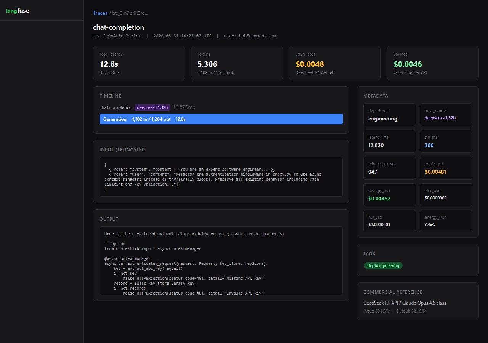
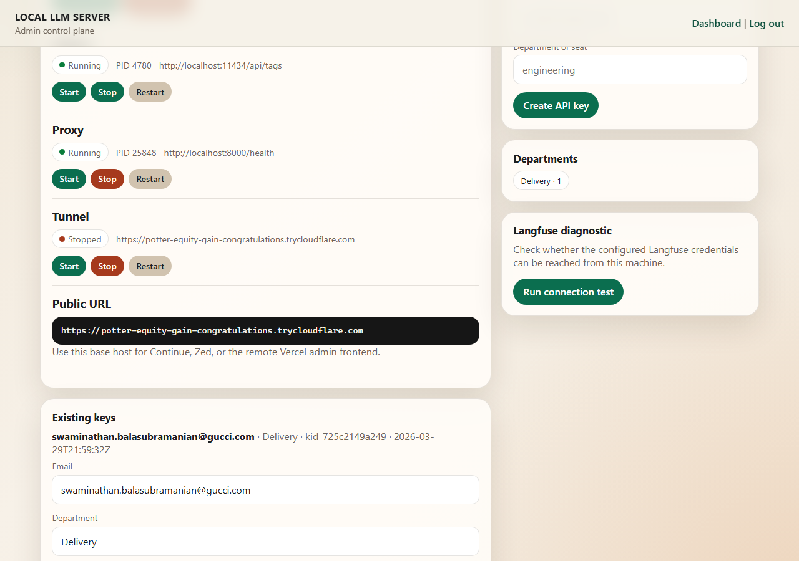

<div align="center">

# LLM Relay

**Self-hosted AI infrastructure — run frontier models on your hardware, route to any provider, control everything from one dashboard.**

[](https://github.com/strikersam/local-llm-server/stargazers)
[](https://github.com/strikersam/local-llm-server/network)
[](LICENSE)
[](https://www.python.org/)
[](https://fastapi.tiangolo.com/)
[](https://www.docker.com/)
[](https://ollama.com/)

*Drop-in OpenAI-compatible proxy + agent platform + admin dashboard. Works with Cursor, Claude Code, Aider, Continue, and every tool that speaks the OpenAI API.*

</div>

---


---

## Why LLM Relay?

Every serious AI developer eventually hits the same wall: **API bills that grow with every experiment, models you can't run privately, and a tangle of tools that don't talk to each other.**

LLM Relay replaces all of that with one self-hosted platform. Point your existing AI coding tools at `http://localhost:8000` — they won't know the difference. Your data never leaves your machine. Your costs drop dramatically.

> **Real numbers from production:** Running DeepSeek-R1 671B locally costs ~$0.19/day in electricity. The equivalent API spend would be $12.84 — a **96.7% reduction**. At 1,842 requests over 30 days, that's real money back in your pocket.


---

## What Makes This Different

Most "local LLM" projects give you a bare Ollama wrapper. LLM Relay gives you an **entire AI operations platform**:

| | LLM Relay | Bare Ollama | Paid API |
|---|---|---|---|
| OpenAI-compatible API | ✅ | ✅ | ✅ |
| Multi-provider routing | ✅ | ❌ | ❌ |
| AI agent with memory | ✅ | ❌ | ❌ |
| Knowledge wiki | ✅ | ❌ | ❌ |
| Background task queue | ✅ | ❌ | ❌ |
| Telegram bot control | ✅ | ❌ | ❌ |
| Langfuse observability | ✅ | ❌ Partial | ✅ |
| Cost tracking | ✅ | ❌ | ✅ |
| Multi-agent swarms | ✅ | ❌ | ❌ |
| Browser automation | ✅ | ❌ | ❌ |
| Zero vendor lock-in | ✅ | ✅ | ❌ |
| Zero ongoing API cost | ✅ | ✅ | ❌ |

---

## Core Features

### Agent Chat + Knowledge Wiki

A full-stack AI agent backed by a structured knowledge base. The agent reads from and writes to a searchable markdown wiki — so knowledge compounds across sessions instead of vanishing when the chat ends.


- **Agent Chat** — LLM-powered sessions with full wiki context injection. Supports all configured providers with quick-start prompts.
- **Knowledge Wiki** — Full CRUD markdown wiki with search, tags, and cross-references. AI-maintained.
- **Source Ingestion** — Upload files, paste URLs, or raw text. The AI auto-summarizes into structured wiki entries.
- **Wiki Lint** — AI health check that surfaces orphan pages, missing references, and stale content.

---

### Telegram Bot Control

Control your entire AI stack from your phone. No browser required.


Send commands from anywhere:
- `/status` — Check Ollama, proxy, and tunnel health + loaded models
- `/cost` — Real-time electricity cost estimate and hardware amortisation
- `/models` — List loaded models with VRAM usage
- `/restart tunnel` — Restart your Cloudflare tunnel and get the new URL
- `/agent Fix the typo in README` — Dispatch an agent task with confirmation prompt

The bot asks for confirmation before any destructive action, so you never accidentally trigger something from your pocket.

---

### Admin Dashboard

One dashboard to manage every layer of your self-hosted AI stack.


- **Service Controls** — Start/stop/restart Ollama, the OpenAI proxy, and the Cloudflare tunnel — each independently, with live PID display.
- **Public URL** — Your current Cloudflare tunnel URL, ready to paste into Cursor or any other tool.
- **API Key Management** — Issue per-user keys with department labels, rotate or revoke with one click. Keys are hashed at rest.
- **Langfuse Diagnostic** — One-click connection test to verify your observability stack is reachable.

---

### Langfuse Observability

Full tracing for every LLM call — latency, token counts, cost, and per-user attribution.




- Token usage and estimated cost per request
- Per-user and per-department spend breakdowns
- Model comparison: see exactly how much each model costs vs. the API equivalent
- Activity audit trail with category filters (chat, wiki, ingest, keys, auth)

---

### API Key Management



Issue scoped keys to team members or external tools. Keys carry department metadata for cost attribution in Langfuse. Rotate or revoke any key without restarting the server.

---

### Agent Modes

Four gears for how the agent operates.

| Mode | What It Does |
|------|-------------|
| **Background Agent** | Runs continuously. Processes tasks from the queue without a chat window — submit and forget. |
| **Multi-Agent Swarms** | One coordinator breaks a big task into subtasks, dispatches them to parallel workers, and assembles the result. Ideal for large codebases or parallel research. |
| **Self-Resuming Agents** | Saves a memory snapshot before shutdown, restores it on restart — no re-explaining the project. |
| **Voice Commands** | Submit base64 audio, get text back. Supports Whisper API or fully local `openai-whisper`. |

**Agent API**
```
POST   /agent/coordinate                        Run N workers in parallel under one coordinator
POST   /agent/background/tasks                  Submit a task to the background queue
GET    /agent/background/tasks                  List all background tasks (filter by ?status=)
GET    /agent/background/tasks/{task_id}        Get a single task
POST   /agent/voice/transcribe                  Transcribe base64 audio → text
GET    /agent/voice/status                      Check microphone and Whisper availability
```

---

### Automation & Scheduling

Set the agent loose on a schedule or hook it into your existing event pipeline.

| Feature | What It Does |
|---------|-------------|
| **Scheduled Jobs** | Cron-based schedules for any agent instruction. "Run wiki lint every Monday at 9 am", "summarise open GitHub issues daily". External webhooks can fire jobs immediately via `/trigger`. |
| **Automation Playbooks** | Pre-write a multi-step automation as a named playbook. Each step is an agent instruction. Invoke the whole playbook by name and every step runs in order. |
| **Resource Watchdog** | Point the watchdog at any URL or file. When it detects a content change (SHA-256 hash), it fires your registered callback. No polling loops to write yourself. |

```
POST   /agent/scheduler/jobs                    Create a scheduled job (cron expression)
POST   /agent/scheduler/jobs/{job_id}/trigger   Fire a job immediately (webhook-style)
POST   /agent/playbooks/{id}/run                Start a playbook run
POST   /agent/watchdog/resources                Start watching a URL or file
```

---

### Memory & Context

The agent stays coherent over long tasks and long sessions.

| Feature | What It Does |
|---------|-------------|
| **Session Memory** | Save agent state to disk — history, last plan, last result. Restart and continue without re-explaining. No external database needed. |
| **Smart Context Compression** | Three strategies when history gets too long: **reactive** (drop oldest non-system messages), **micro** (remove duplicates and near-empty messages), **inspect** (stats only, no mutation). |
| **Conversation Surgery** | Remove specific messages by index without wiping the session. Cut a bad exchange or an outdated instruction without losing everything else. |

```
POST   /agent/memory/{session_id}/snapshot      Save session state to disk
GET    /agent/memory/{session_id}               Restore saved state
POST   /agent/context/compress                  Compress messages (strategy: reactive|micro|inspect)
POST   /agent/sessions/{id}/snip                Remove messages by index
```

---

### Developer Tooling

| Feature | What It Does |
|---------|-------------|
| **Terminal Panel** | Captures the full rendered terminal buffer via `tmux capture-pane` — interactive prompts, progress bars, and coloured output. Not just raw stdout. |
| **Skill Library** | Indexes every `SKILL.md` under `.claude/skills/`. Keyword search across name, description, and content. MCP-hosted skill packs register via API. |
| **AI Commit Tracking** | Tags every agent git commit with session ID, model, tool, and timestamp as git trailers. Browse attributed commits via `/agent/commits`. |
| **Project Scaffolding** | Three built-in templates (`python-library`, `fastapi-service`, `cli-tool`) plus custom JSON templates. Apply to a directory in one API call. |
| **Browser Automation** | Controls real Chromium via Playwright. Navigate, click, fill forms, screenshot, run JavaScript. Graceful stubs when Playwright isn't installed. |
| **Adaptive Permissions** | Infers the right permission level (`read_only`, `read_write`, `full_access`) from the session transcript. Avoids re-asking for actions already authorised. |
| **Token Budget Caps** | Set a max token spend per session. Raises `BudgetExceededError` at the cap. Set `cap=0` for unlimited. |

```
GET    /agent/terminal/snapshot                 Capture current terminal buffer
POST   /agent/terminal/run                      Run a command, capture full output
GET    /agent/skills/search?q=...               Search skills by keyword
GET    /agent/commits?limit=10                  List AI-attributed commits
POST   /agent/scaffolding/apply                 Scaffold a project from a template
POST   /agent/browser/action                    Browser action (navigate|click|fill|screenshot|evaluate)
```

---

## Architecture

```
                        ┌──────────────────────────────┐
                        │    React Dashboard (3000)     │
                        │  Login | Dashboard | Chat     │
                        │  Wiki | Sources | Providers   │
                        │  Models | Keys | Observability│
                        └──────────────┬───────────────┘
                                       │
                        ┌──────────────┴───────────────┐
                        │   FastAPI Backend (8001)      │
                        │   Auth | LLM Engine | CRUD    │
                        │   Providers | Models | Keys   │
                        └──┬────────┬────────┬────────┘
                           │        │        │
                    ┌──────┤  ┌─────┤  ┌─────┤
                    ▼      │  ▼     │  ▼     │
                 MongoDB   │ Ollama │ Cloud  │
                (Storage)  │(Local) │ APIs   │
                           │        │        │
                           │  ┌─────┤  ┌─────┘
                           │  ▼     │  ▼
                           │Langfuse│ Cloudflare
                           │(Trace) │  Tunnel
                           └────────┘
```

**Knowledge architecture — three layers:**

1. **Raw Sources** — Files, URLs, and text ingested and processed by the AI
2. **Wiki** — LLM-maintained structured markdown knowledge base
3. **Agent** — Query, lint, cross-reference, and expand knowledge on demand

---

## Quick Start

### Docker Compose (recommended)

```bash
git clone https://github.com/strikersam/local-llm-server
cd local-llm-server

cp .env.example .env   # edit with your settings

docker compose up -d                      # core services
docker compose --profile public up -d     # + Cloudflare tunnel
docker compose --profile full up -d       # + OpenAI proxy for Cursor/Claude Code
```

Open **http://localhost:3000** and log in.

### Default Credentials

```
Email:    admin@llmwiki.local
Password: WikiAdmin2026!
```

> Change these in `.env` before exposing to the internet.

---

## Connecting External Tools

The proxy is fully OpenAI-compatible. Any tool that accepts a custom base URL works out of the box.

### Cursor IDE
```
Settings → Models → OpenAI API Key:
  API Key:  <from API Keys page>
  Base URL: https://your-domain.trycloudflare.com/v1
  Model:    qwen3-coder:30b
```

### Claude Code CLI
```bash
export ANTHROPIC_BASE_URL=https://your-domain.trycloudflare.com
export ANTHROPIC_API_KEY=sk-relay-...
claude
```

### Aider
```bash
aider --openai-api-base https://your-domain.trycloudflare.com/v1 \
      --openai-api-key sk-relay-...
```

### Continue (VS Code / JetBrains)
```json
{
  "models": [{
    "title": "Local LLM",
    "provider": "openai",
    "model": "qwen3-coder:30b",
    "apiBase": "https://your-domain.trycloudflare.com/v1",
    "apiKey": "sk-relay-..."
  }]
}
```

---

## Provider Setup

### Ollama (Local — zero cost)
Runs as a Docker service. Models auto-downloaded on first pull.

```bash
# Pull models via dashboard or CLI
docker exec llm-wiki-ollama ollama pull qwen3-coder:30b
docker exec llm-wiki-ollama ollama pull deepseek-r1:671b
```

### HuggingFace Inference API
Go to **Providers → Add Provider**:
- Type: `OpenAI Compatible`
- Base URL: `https://api-inference.huggingface.co/v1`
- API Key: your HuggingFace token
- Model: `meta-llama/Llama-3.2-3B-Instruct`

### OpenRouter
- Base URL: `https://openrouter.ai/api/v1`
- API Key: your OpenRouter key

### Remote Ollama (another machine on your network)
- Type: `Ollama`
- Base URL: `http://192.168.1.100:11434`

---

## Optional Feature Dependencies

All features degrade gracefully — nothing crashes if a dependency isn't installed.

| Feature | Install | Env var |
|---------|---------|---------|
| Browser Automation | `pip install playwright && playwright install chromium` | — |
| Voice (Whisper API) | — | `WHISPER_BASE_URL=http://localhost:9000` |
| Voice (local Whisper) | `pip install openai-whisper` | — |
| Voice recording | `pip install pyaudio` | — |
| Scheduled Jobs | `pip install apscheduler` *(bundled)* | — |

---

## Services

| Service | Port | Description |
|---------|------|-------------|
| **Frontend** | 3000 | React dashboard — chat, wiki, admin |
| **Backend** | 8001 | FastAPI — all API endpoints |
| **Proxy** | 8000 | OpenAI/Anthropic-compatible proxy |
| **MongoDB** | 27017 | Document store |
| **Ollama** | 11434 | Local LLM runtime |
| **Cloudflare Tunnel** | — | Public HTTPS endpoint (optional) |

---

## API Reference

<details>
<summary><strong>Auth</strong></summary>

| Method | Endpoint | Description |
|--------|----------|-------------|
| POST | `/api/auth/login` | Login with email/password |
| POST | `/api/auth/logout` | Clear session |
| GET | `/api/auth/me` | Current user |
| POST | `/api/auth/refresh` | Refresh token |

</details>

<details>
<summary><strong>Chat / Agent</strong></summary>

| Method | Endpoint | Description |
|--------|----------|-------------|
| POST | `/api/chat/send` | Send message to wiki agent |
| GET | `/api/chat/sessions` | List sessions |
| GET | `/api/chat/sessions/:id` | Get session |
| DELETE | `/api/chat/sessions/:id` | Delete session |

</details>

<details>
<summary><strong>Wiki</strong></summary>

| Method | Endpoint | Description |
|--------|----------|-------------|
| GET | `/api/wiki/pages` | List/search pages |
| GET | `/api/wiki/pages/:slug` | Get page |
| POST | `/api/wiki/pages` | Create page |
| PUT | `/api/wiki/pages/:slug` | Update page |
| DELETE | `/api/wiki/pages/:slug` | Delete page |
| POST | `/api/wiki/lint` | AI health check |

</details>

<details>
<summary><strong>Sources</strong></summary>

| Method | Endpoint | Description |
|--------|----------|-------------|
| POST | `/api/sources/ingest` | Ingest file/URL/text |
| GET | `/api/sources` | List all |
| GET | `/api/sources/:id` | Get with content |
| DELETE | `/api/sources/:id` | Delete |

</details>

<details>
<summary><strong>Providers</strong></summary>

| Method | Endpoint | Description |
|--------|----------|-------------|
| GET | `/api/providers` | List providers |
| POST | `/api/providers` | Add provider |
| PUT | `/api/providers/:id` | Update |
| DELETE | `/api/providers/:id` | Delete |
| POST | `/api/providers/:id/test` | Test connection |

</details>

<details>
<summary><strong>Models</strong></summary>

| Method | Endpoint | Description |
|--------|----------|-------------|
| GET | `/api/models` | List all models |
| POST | `/api/models/pull` | Pull Ollama model |
| DELETE | `/api/models/:name` | Delete model |

</details>

<details>
<summary><strong>Keys</strong></summary>

| Method | Endpoint | Description |
|--------|----------|-------------|
| GET | `/api/keys` | List API keys |
| POST | `/api/keys` | Issue key |
| DELETE | `/api/keys/:id` | Revoke key |

</details>

<details>
<summary><strong>System</strong></summary>

| Method | Endpoint | Description |
|--------|----------|-------------|
| GET | `/api/health` | System health |
| GET | `/api/stats` | Dashboard stats |
| GET | `/api/activity` | Activity log |
| GET | `/api/platform` | Platform info |
| GET | `/api/observability/status` | Langfuse status |

</details>

---

## Tech Stack

| Layer | Technology |
|-------|-----------|
| Frontend | React 18, Tailwind CSS, React Router, React Markdown, Lucide |
| Backend | Python 3.11, FastAPI, Motor (async MongoDB), PyJWT, bcrypt, httpx |
| Database | MongoDB 7 |
| LLM Runtime | Ollama (local) + any OpenAI-compatible API |
| Observability | Langfuse |
| Tunnel | Cloudflare Tunnel |
| Containers | Docker Compose |

---

## License

Open source. Use it, fork it, ship it.

---

<div align="center">

**If this saves you money or unblocks your workflow, a star helps others find it.**

[](https://github.com/strikersam/local-llm-server/stargazers)

</div>
