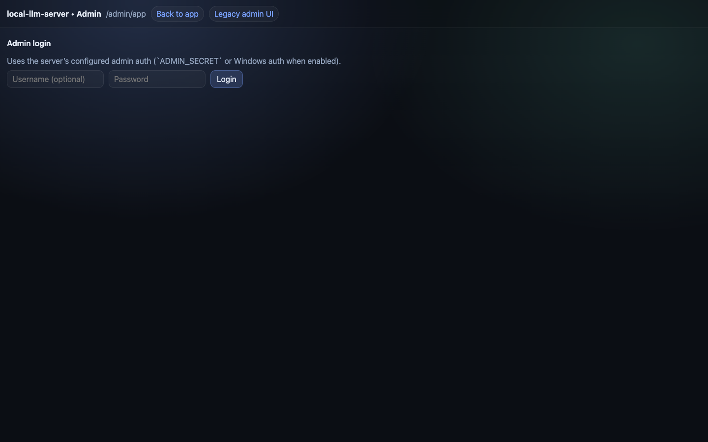
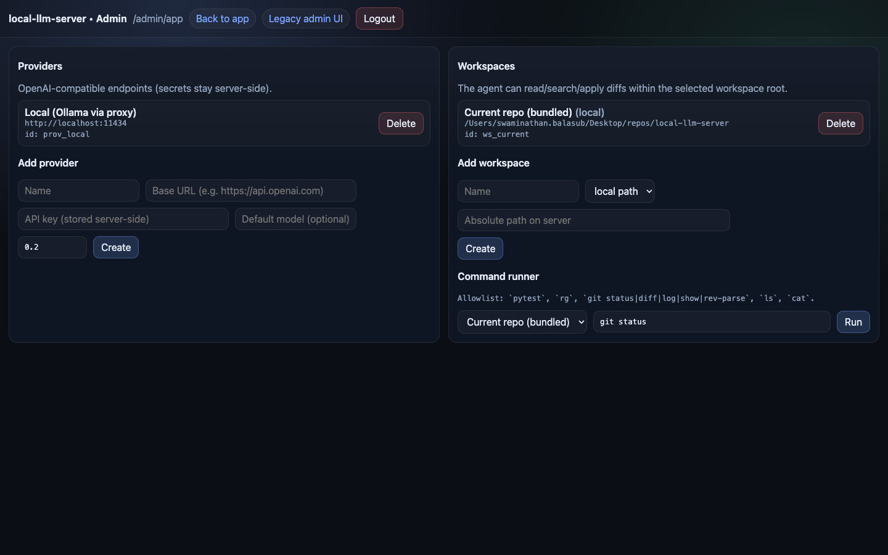

<div align="center">

# LLM Relay

### Your own AI control room.

**One place to run local AI, connect your tools, manage agents, and keep your data close to home.**

[](docs/changelog.md)
[](https://github.com/strikersam/local-llm-server/stargazers)
[](https://github.com/strikersam/local-llm-server/network)
[](LICENSE)

[**Quick start**](#quick-start) · [**What's new in v4.0**](#whats-new-in-v40) · [**See the product**](#see-the-product) · [**What it can do**](#what-it-can-do) · [**Technical docs**](#technical-docs)

</div>

---

## What is LLM Relay?

If someone brand new to AI asked, I would say:

> **LLM Relay is a smart front desk for your AI helpers.**
> It knows who is allowed in, which helper should do the job, what it costs, and where everything should go.

In normal people words:

- you can run **AI on your own computer or server**
- you can connect **Cursor, Claude Code, Aider, Continue, scripts, and dashboards** to one place
- you can give your team a **simple web app** to chat, create tasks, manage agents, and watch what is happening
- you can keep control of **costs, access, secrets, and data**

### Why this feels different

Many AI tools solve only one piece of the puzzle.
LLM Relay tries to bring the important pieces together in one product:

- **one place to connect tools** instead of many separate configs
- **one dashboard for people** instead of making everyone live in terminals
- **one set of rules** for cost, access, routing, and safety
- **one shared memory** for chats, tasks, sources, and team knowledge

That means less setup pain, less tool sprawl, and fewer "wait, where did that answer come from?" moments.

<p align="center">
  
  <br/>
  <sub><em>The main control plane: one screen for chat, tasks, agents, models, knowledge, and system health.</em></sub>
</p>

---

## What's new (2026-05-09)

**Vision routing, session-aware Langfuse traces, and feature flag bulk controls.**

- **Vision routing** — the proxy automatically detects `image_url` content parts in requests and routes them to the best registered vision-capable model (Gemma4, Llama4, Qwen3.6). Set `VISION_MODEL=<name>` to pin. `X-Model-Override` still takes priority.
- **`X-Session-Id` → Langfuse** — pass `X-Session-Id` or `X-Claude-Code-Session-Id` in any request and all turns from that session will cluster under one Langfuse trace with a `session:<id>` tag. Claude Code CLI sends this automatically.
- **`FEATURE_DISABLE` / `FEATURE_ENABLE` bulk env vars** — disable or enable multiple features at once: `FEATURE_DISABLE=jcode_runtime,social_auth`. Previously only single-feature `FEATURE_<ID>=<tier>` overrides were supported.

See `docs/changelog.md` for the full diff.

---

## What's new in v4.0

v4.0 is the biggest release yet — it ships a native-grade mobile experience, a non-blocking async agent engine, NVIDIA NIM as a first-class free provider, and a stack of reliability and observability improvements.

### 📱 Native mobile-first UI

The entire front end was rebuilt around a unified dark app shell: safe-area-aware chrome, thumb-friendly bottom navigation, elevated message bubbles, and a pill-style composer that stays out of the way on small screens.

<p align="center">
  
  &nbsp;&nbsp;
  
  <br/>
  <sub><em>Left: new dark login shell on mobile. Right: setup wizard on mobile — step navigation, provider cards, and responsive controls.</em></sub>
</p>

### ⚡ Async agent jobs — no more blocking

In v3, sending a complex task to the agent would hold the HTTP connection open until it finished (or timed out).
In v4, `agent_mode=true` returns **202 Accepted** immediately with a poll-able job ID.
The agent runs in the background; the mobile chat surface shows a live job-status card with progress events and a cancel button.
Long-running coding tasks no longer time out or leave the UI hanging.

### 🆓 NVIDIA NIM — free-tier AI, zero config

NVIDIA NIM is now the **first recommended provider** in the setup wizard.
Set `NVIDIA_API_KEY` and the system:
- auto-detects it during setup and marks the card "already configured"
- adds NIM at priority −10 so it is always tried first
- routes planner, coder, verifier, and judge phases to separate NIM models
- falls back to local Ollama only when needed

Free-tier NIM models cover most workloads at zero cost, making LLM Relay useful without any local GPU.

### 🧠 Per-role model configuration

Each phase of the agent pipeline — planner, executor/coder, verifier, judge — can now use a different model.
That means you can pair a fast model for planning with a more powerful one for code generation, all without touching routing config.

### 🩺 Runtime preflight validation

v4 validates every runtime before a task starts and surfaces **actionable structured errors** (missing binary, wrong config, Docker unavailable) instead of cryptic late failures mid-execution.

### 🔄 Concurrent task fanout

The task engine now fans out work concurrently across agents.
Auto-assignment prefers less-busy agents that match the task type, so idle agents pick up queued work automatically instead of waiting for a manual trigger.

### 🔭 Langfuse observability from direct chat

Direct-chat messages now emit Langfuse traces with token counts, latency metadata, and provider attribution — the same detail level previously only available for agent runs.

### 🛡 Provider reliability: bounded timeouts + smart cooldowns

Each provider now gets a bounded per-request timeout. On failure the system applies failure-type-aware cooldowns (401/403 → 5 min; connection error → 15 s; other → 30 s) and retries healthy fallbacks without keeping a broken provider pinned.

### Other v4 highlights

- JWT access/refresh tokens include unique `iat`/`jti` claims — replay and same-second refresh attacks are closed
- Setup wizard state now persists to MongoDB so hosted setups survive Render restarts
- Dashboard replaced with a cleaner mobile-first workspace overview (usage, routing, agents, schedules in operational cards)
- Social login OAuth callbacks now land correctly without a `/login` redirect bounce
- CodeQL path-traversal finding on agent workspace directories closed

See the full [changelog](docs/changelog.md) for every fix.

---

## Why people use it

Most teams hit the same problems:

- AI tools are scattered across too many tabs and services
- cloud AI bills grow fast
- local models are powerful, but harder for normal people to use
- one person knows the setup, everyone else is confused
- nobody knows which model, agent, or tool did what

LLM Relay turns that mess into **one home for your AI work**.

### In one glance

| If you want... | LLM Relay gives you... |
|---|---|
| one simple way to use local AI | one URL your tools can all talk to |
| lower cloud spend | local-first and cost-aware routing |
| a team-friendly AI product | chat, tasks, agents, schedules, and knowledge in one place |
| more trust and control | logins, roles, audit trails, secrets, and activity history |
| free cloud AI to start | NVIDIA NIM free-tier, auto-configured |
| something that can start small | a setup that works for solo use and grows into a team control plane |

---

## What it can do

### 🧠 1. Run AI from one simple address

Instead of teaching every app a different setup, you point them all at one URL.
Cursor, Claude Code, Aider, Continue, scripts, and internal tools can all use the same front door.

### 💸 2. Help you spend less

LLM Relay prefers **free NVIDIA NIM models first**, then local models, and only uses paid services when needed.
That makes it easier to keep costs under control without asking every user to think about pricing all day.

### 🤖 3. Give you agents, not just chat

You can create agents with different roles:

- a coding helper (executor/coder phase)
- a planner (maps out steps before touching code)
- a verifier (checks the output)
- a judge (approves or blocks the result)
- a scheduled worker that runs later

Each role can use a different model optimised for that job.

### ⚡ 4. Non-blocking async task execution

Agent tasks return immediately with a job ID.
You can poll for status, stream progress events, or cancel the job from the UI.
Complex long-running tasks no longer time out or block the dashboard.

### 🗂 5. Turn AI work into visible tasks

Instead of losing everything inside chat messages, you can create tasks, move them across a board, add comments, approve work, retry runs, and see what is blocked.

### 📚 6. Keep team knowledge in one place

LLM Relay includes a wiki and source library so your team can save useful information, project notes, links, and imported material.

### 🛡 7. Control who can do what

It supports API keys, admin login, dashboard login, roles, social login, audit trails, encrypted secrets, and safer shared access for teams.

### 🔭 8. Show you what is happening

You can see activity, routing decisions, usage, savings, logs, health, and observability data instead of guessing whether the system is working.
Direct chat now emits Langfuse traces so every conversation has token and latency attribution.

### 🧰 9. Grow with you

You can start small and still have room for bigger workflows later:

- free cloud AI via NVIDIA NIM (no GPU needed to start)
- local models with Ollama when you want privacy or cost control
- remote providers like Hugging Face, OpenRouter, DeepSeek, Anthropic
- GitHub integration
- schedules and automations
- browser automation
- voice transcription
- Telegram control
- peer sync between machines

### ❤️ Why this can create traction inside a team

Good internal AI tools spread when they are easy to explain.
This one is easy to explain:

- **for leaders:** better visibility and cost control
- **for operators:** better permissions, logs, and safer access
- **for builders:** better model flexibility and automation
- **for everyone else:** a simpler place to just use AI without learning five different systems

---

## See the product

Run `python scripts/gen_v4_screenshots.py` to regenerate all v4 mockup screenshots. Run `make ui-docs` to refresh the built-in `/app` and `/admin/app` captures.

<!-- README_UI_GALLERY:START -->
### 🛬 Login

The v4 login screen splits into a feature panel on the left and a sign-in form on the right, both in the native dark shell. Mobile users see a full-screen dark auth flow.

<p align="center">
  
  &nbsp;
  
</p>

### 🧙 Setup Wizard

The wizard walks you through providers → models → runtime → agent → cost policy. NVIDIA NIM appears first with "★ Recommended" and "Free" badges, and is auto-marked "already configured" when `NVIDIA_API_KEY` is set on the server.

<p align="center">
  
  &nbsp;
  
</p>

### 🏠 Dashboard

The v4 control plane opens with usage stats, live provider health, running task progress bars, and quick-action cards — all in a single mobile-first workspace overview.

<p align="center"></p>

### 💬 Chat

Direct chat with a real Agent Mode toggle (off by default for fast LLM responses). Enable it for complex multi-step tasks — async job status cards replace the old blocking request so the UI never hangs.

Agent Mode async contract: when Agent Mode is enabled the server will accept the task and return a 202 Accepted job envelope (session_id, job_id, status, phase, message). The client should render a pending job card and poll /api/chat/agent-jobs/{job_id} for status. When the job completes, the job response includes a canonical final_message and structured result; clients MUST render final_message as the assistant reply instead of raw job metadata. Runtime preflight and GitHub preflight errors return structured actionable errors (HTTP 412) to surface missing tokens, missing git binary, Docker unavailability, or workspace issues.

Git / GitHub repo preflight: If a prompt involves repository operations and request.metadata contains a 'repo_url' or 'repository' field, the server performs a non-destructive preflight using 'git ls-remote --heads' to validate access. This is a best-effort, non-destructive check that will fail early with a structured error (code: git_repo_access) if the repo is unreachable or the token lacks access.

Docker/runtime gating: Runtimes that require Docker are deliberately conservative. If Docker is unavailable ("docker version" fails), Docker-backed runtimes are marked unavailable and will not be auto-selected. This prevents silent routing into broken container runtimes; enable AGENT_MODE_DOCKER or fix Docker on the host to allow docker-based runtimes.

<p align="center"></p>

### 🗂 Task Board

AI work made visible. v4 fans tasks out concurrently — multiple agents pick up work from the queue simultaneously, and the board shows live step progress for each running job.

<p align="center"></p>

### 🤖 Agent Roster

Each agent now has per-role model configuration: planner, coder/executor, verifier, and judge can all use different models optimised for their phase of the pipeline.

<p align="center"></p>

### ⚙️ Runtimes

v4 adds runtime preflight validation. The panel shows structured diagnostics — green for healthy, yellow with an actionable message for unavailable runtimes (e.g. Docker socket missing) — instead of cryptic late failures.

<p align="center"></p>

### 🛣 Routing Policy

Choose your strategy (free-first, local-first, cost-aware, quality) and see the live provider priority order. v4 adds bounded per-provider timeouts and failure-type-aware cooldowns shown in the stats panel.

<p align="center"></p>

### 🔌 Providers and Models

NVIDIA NIM sits at priority −10 with "★ Recommended" and "Free Tier" badges, auto-configured from `NVIDIA_API_KEY`. The models table lists NIM, Ollama, and cloud models with context window, type, and cost at a glance.

<p align="center">
  
  &nbsp;
  
</p>

### 📚 Knowledge

Your team's memory: wiki pages with tags, plus a source library for GitHub repos, URLs, and uploaded files. Agents can pull from these sources during task execution.

<p align="center"></p>

### 🔭 Logs and Activity

Real-time event feed with INFO/WARN/ERROR badges and inline Langfuse trace links. v4 emits traces from direct chat too, so every conversation has token counts and latency attribution.

<p align="center"></p>

### 🗓 Schedules

Automated agent jobs on cron schedules. v4 adds a **Run now** button per schedule and fixes cron expression submission from the UI so `daily` / `weekly` presets map correctly to 5-field cron strings.

<p align="center"></p>

### 🧭 Settings

Central configuration for server name, default cost policy, Langfuse tracing, agent defaults (max steps, timeout, per-role models), and integrations.

<p align="center"></p>

### 🛡 Admin portal

API key management with create / revoke, system health at a glance, and server version info.

<p align="center"></p>

### 🖥 Built-in web UI

The proxy ships a lightweight built-in app at `/app`, usable without the separate hosted dashboard.

<p align="center"></p>

### 🔐 Built-in admin login

Dedicated login gate before exposing sensitive controls in the in-proxy admin surface.

<p align="center"></p>

### 🧰 Built-in admin workspace

Manage providers, workspaces, and runtime metadata directly from the in-proxy UI.

<p align="center"></p>
<!-- README_UI_GALLERY:END -->

---

## What kinds of people is this for?

LLM Relay works for:

- **solo builders** who want one clean way to use local AI (or free NVIDIA NIM)
- **non-technical teams** who need a dashboard instead of command lines
- **engineering teams** who want routing, agent runs, GitHub workflows, and observability
- **ops/admin owners** who need control, auditability, and safer access
- **cost-conscious companies** who want more local AI and fewer surprise bills

---

## Common use cases

### "I just want local AI to work with my tools."
Use the proxy and point your tools to it.

### "I want free cloud AI with no GPU."
Set `NVIDIA_API_KEY` — the setup wizard auto-detects it and configures free-tier NIM models for every phase.

### "I want a team dashboard."
Use the control plane so people can chat, create tasks, manage agents, and see results.

### "I want AI jobs to happen on their own."
Use schedules, tasks, playbooks, and workflows.

### "I want to mix local and cloud models safely."
Use routing policies, provider priority, and approval-aware escalation.

### "I want our AI to remember project context."
Use the wiki, sources, and GitHub integration.

### "I want something I can demo in five minutes."
Open the control plane, show chat, tasks, agents, routing, and logs, and people quickly understand the value.

---

## Quick start

### Fastest path — free cloud AI, no GPU needed

```bash
git clone https://github.com/strikersam/local-llm-server
cd local-llm-server

cat > .env <<'ENV'
API_KEYS=sk-relay-dev
ADMIN_SECRET=replace-with-a-long-random-secret
ADMIN_EMAIL=admin@llmrelay.local
ADMIN_PASSWORD=replace-with-a-strong-password
JWT_SECRET=replace-with-another-long-random-secret
NVIDIA_API_KEY=nvapi-...
ENV

docker compose up -d
docker compose --profile dashboard up -d
```

The setup wizard will detect `NVIDIA_API_KEY` automatically and configure free NIM models as defaults.

Then open:

- **http://localhost:3000** → full control plane
- **http://localhost:8000/admin/ui/login** → built-in admin portal
- **http://localhost:8000/app** → built-in web UI
- **http://localhost:8000/health** → health check

### If you also want local models (Ollama)

```bash
docker exec llm-server-ollama ollama pull qwen3-coder:30b
docker exec llm-server-ollama ollama pull deepseek-r1:32b
```

Set `INCLUDE_LOCAL_FALLBACK=true` in `.env` to include Ollama in the provider chain when NIM is configured.

### If you only want the core proxy

```bash
uvicorn proxy:app --reload --port 8000
```

> Right now, this repo does **not** include a committed `.env.example`, so create `.env` yourself.

---

## Sign in

### Full control plane (`http://localhost:3000`)

- **Email:** `ADMIN_EMAIL`
- **Password:** `ADMIN_PASSWORD`

### Built-in admin portal (`http://localhost:8000/admin/ui/login`)

- **Username:** anything
- **Password:** `ADMIN_SECRET`

> Pick strong secrets before exposing this outside your machine.

---

## Connect your tools

### Cursor

```text
API Key:                  sk-relay-...
Override OpenAI Base URL: http://localhost:8000/v1
```

### Claude Code

```bash
export ANTHROPIC_BASE_URL=http://localhost:8000
export ANTHROPIC_API_KEY=sk-relay-...
claude
```

### Simple API call

```bash
curl http://localhost:8000/v1/chat/completions \
  -H "Authorization: Bearer sk-relay-..." \
  -H "Content-Type: application/json" \
  -d '{"model":"qwen/qwen2.5-coder-32b-instruct","messages":[{"role":"user","content":"hello"}]}'
```

If you use Aider, Continue, Zed, VS Code, or Python scripts, examples live in [`client-configs/`](client-configs/).

---

## What is included under the hood?

You do **not** need to learn all of this to get started, but the platform includes:

- OpenAI-style and Anthropic-style API compatibility
- Ollama support + NVIDIA NIM free-tier support
- local + remote model routing with bounded timeouts and smart cooldowns
- async agent jobs with poll-able job IDs and live progress events
- per-role model config (planner / coder / verifier / judge)
- task boards and schedules with concurrent fanout
- agent sessions and runtimes with preflight validation
- workflows and approvals
- knowledge wiki and source ingestion
- GitHub repo and pull request flows
- secrets storage
- sync between machines
- Langfuse observability (traces from chat + agent runs)
- hardware detection
- browser and voice tools
- Telegram bot controls

Most people start with **chat + models + one dashboard**, then add the rest when the team is ready.

If you want the deep technical breakdown, jump to the docs below.

---

## Technical docs

For engineers and advanced admins:

- [Documentation index](docs/README.md)
- [Feature guide](docs/features.md)
- [API surfaces and route map](docs/api-surfaces.md)
- [Configuration reference](docs/configuration-reference.md)
- [Architecture overview](docs/architecture/overview.md)
- [Model routing guide](docs/model-routing.md)
- [Claude Code setup](docs/claude-code-setup.md)
- [Agent runtime setup](docs/runbooks/agent-runtime-setup.md)
- [Docker agent runtimes](docs/runbooks/docker-agent-runtimes.md)
- [Langfuse observability](docs/langfuse-observability.md)
- [Admin dashboard guide](docs/admin-dashboard.md)
- [Device compatibility](docs/device-compatibility.md)
- [Troubleshooting](docs/troubleshooting.md)
- [Changelog](docs/changelog.md)

---

## A simple way to think about it

LLM Relay is:

- **a front door** for AI requests
- **a switchboard** that picks the right model
- **a control room** for teams
- **a memory box** for saved knowledge
- **a manager** for agents, tasks, and schedules

It is built for people who want AI to feel like **one understandable product**, not a pile of disconnected tools.

If you want AI to feel less like scattered tools and more like one product, that is what this repo is trying to do.

---

## License

Open source. Use it, change it, and make it better.

---

<div align="center">

If LLM Relay helps you, a star helps other people find it.

[](https://github.com/strikersam/local-llm-server/stargazers)

</div>
