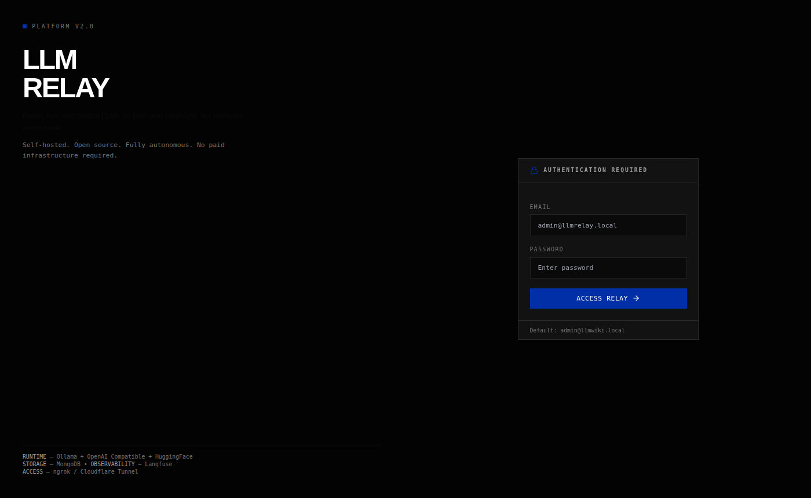
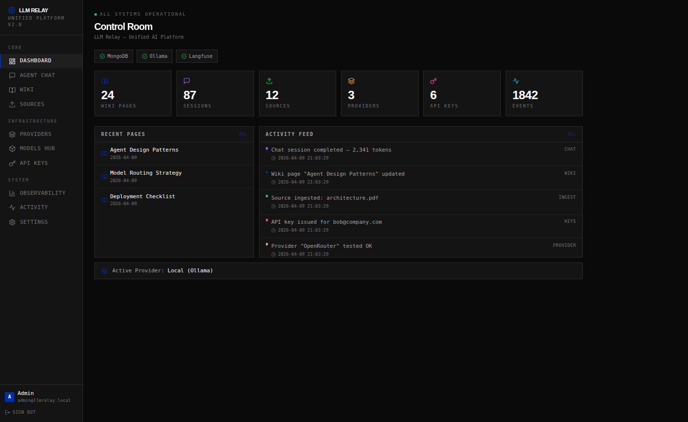
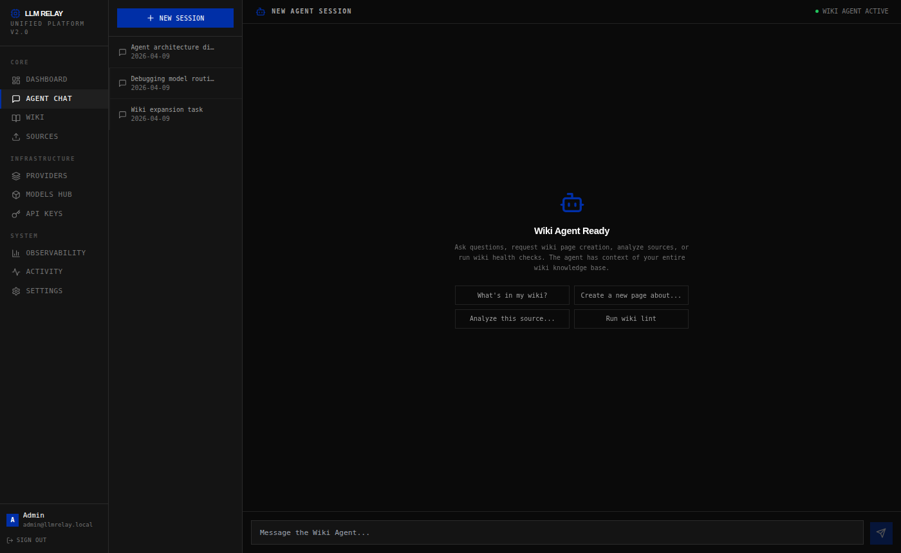
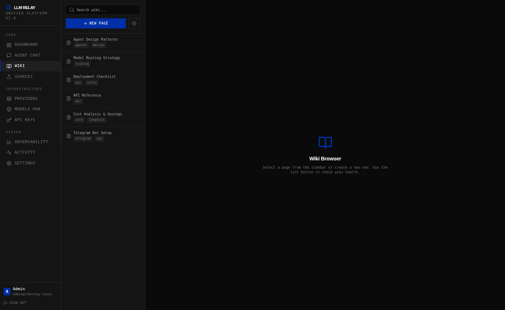
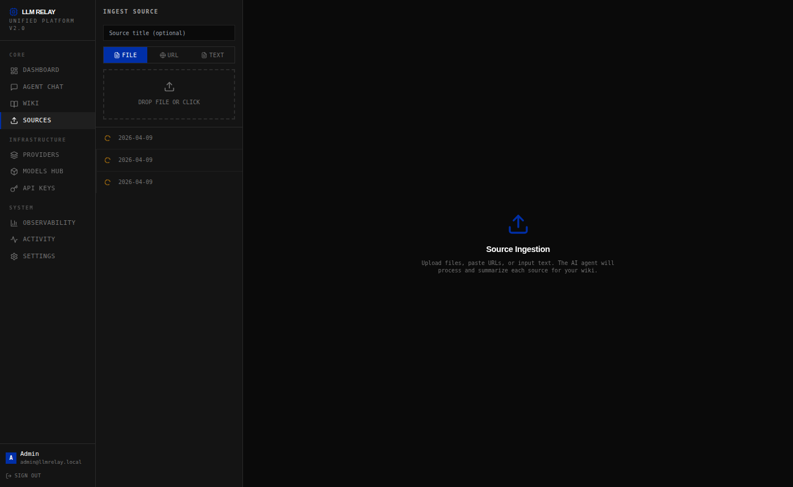
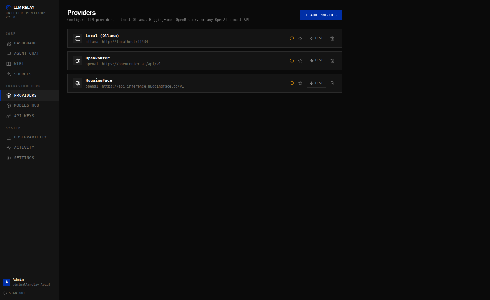
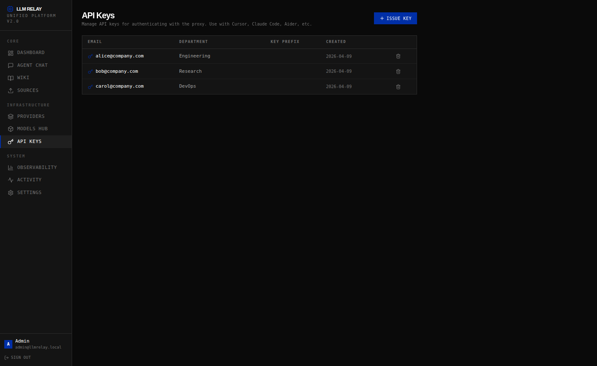
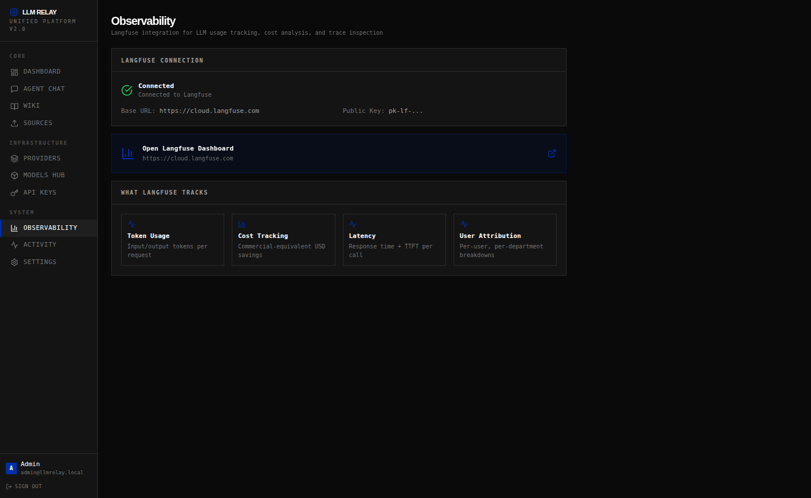

<div align="center">

# LLM Relay

**Self-hosted AI platform — run frontier models on your own hardware, route to any provider, and control everything from one unified dashboard.**

[](https://github.com/strikersam/local-llm-server/stargazers)
[](https://github.com/strikersam/local-llm-server/network)
[](LICENSE)
[](https://www.python.org/)
[](https://fastapi.tiangolo.com/)
[](https://www.docker.com/)
[](https://react.dev/)

*Drop-in OpenAI-compatible proxy. Point Cursor, Claude Code, Aider, or Continue at it and everything just works. Your hardware. Your data. Zero API bills.*

</div>

---



---

## What's New

**Latest additions (April 2026)**

- **User Memory Store** — the agent remembers things about each user across sessions (preferences, project paths, conventions). Stored in SQLite; injected into the planner automatically.
- **Anthropic Managed-Agents best practices** — five harness-level reliability techniques (observation masking, context compaction, JIT file retrieval, durable event log, condensed sub-agent summaries) baked in transparently.
- **Anthropic advisor strategy** — the Anthropic compat layer now strips server-side beta tool types (`advisor_20260301`, `computer_use`, `web_search`, `text_editor`, `bash`) before forwarding to Ollama, and preserves advisor content blocks as plain-text context on follow-up turns.
- **Commit Rollback** — revert the last AI-authored git commit in one API call.

**Previously shipped (19 capabilities from Claude Code architecture analysis)**

**Agent Modes** — Background Agent · Multi-Agent Swarms · Self-Resuming Agents · Voice Commands

**Automation** — Scheduled Jobs · Automation Playbooks · Resource Watchdog

**Memory & Context** — Session Memory · Smart Context Compression · Conversation Surgery

**Intelligence** — Adaptive Permissions · Token Spend Caps

**Developer Tooling** — Terminal Panel · Skill Library · AI Commit Tracking · Project Scaffolding · Browser Automation

Full details and API reference in the [Features](#one-platform-every-ai-tool-you-need) section below.

---

## One platform. Every AI tool you need.

LLM Relay is not just a proxy. It is a complete AI operations platform built around a dark, keyboard-friendly dashboard that lives at `http://localhost:3000`. Everything is in one place:

- **Agent Chat** backed by a persistent knowledge wiki
- **Knowledge Wiki** — searchable, tagged, AI-maintained markdown pages
- **Source Ingestion** — drop files, URLs, or raw text; AI summarises into the wiki
- **Multi-provider routing** — Ollama, OpenRouter, HuggingFace, any OpenAI-compatible API
- **Models Hub** — pull and manage Ollama models without touching a terminal
- **API Key management** — issue scoped keys per user and department
- **Langfuse observability** — token usage, cost, latency, per-user attribution
- **Telegram bot** — control everything from your phone
- **OpenAI-compatible proxy** — plug in Cursor, Claude Code, Aider, Continue

---

### Agent Modes

These control *how* the agent operates — think of them as gears on a gearbox.

| Feature | What It Does |
|---------|-------------|
| **Background Agent** | The agent runs continuously in the background, watching for events. It processes tasks from webhooks, the scheduler, and the watchdog without you opening a chat window. Submit a task to the queue and the agent handles it whenever the worker is free. |
| **Multi-Agent Swarms** | One coordinator agent breaks a big task into subtasks and hands each one to a worker agent. Workers run in parallel (up to `max_concurrent`), report back, and the coordinator assembles the result. Good for large codebases, parallel research, or anything too big for one agent in one shot. |
| **Self-Resuming Agents** | The agent saves a memory snapshot before it shuts down and reloads it on restart — picking up exactly where it left off without you having to re-explain the project. Pairs with `POST /agent/memory/{session_id}/snapshot`. |
| **Voice Commands** | Submit base64-encoded audio to the agent and get a text transcript back. Supports a Whisper-compatible REST API (`WHISPER_BASE_URL` env var) or local `openai-whisper` for fully offline transcription. |

**API — Agent Modes**

```
POST   /agent/coordinate                        Run N workers in parallel under one coordinator
POST   /agent/background/tasks                  Submit a task to the background queue
GET    /agent/background/tasks                  List all background tasks (filter by ?status=)
GET    /agent/background/tasks/{task_id}        Get a single task
POST   /agent/voice/transcribe                  Transcribe base64 audio → text
GET    /agent/voice/status                      Check microphone and Whisper availability
```

---

### Automation & Scheduling

Set the agent loose on a schedule or hook it into your existing event pipeline.

| Feature | What It Does |
|---------|-------------|
| **Scheduled Jobs** | Create cron-based schedules for any agent instruction — "run wiki lint every Monday at 9 am", "summarise open GitHub issues daily". Jobs store their last-run timestamp and run count. External webhooks can fire jobs immediately via `/trigger`. |
| **Automation Playbooks** | Pre-write a multi-step automation as a named playbook. Each step is an agent instruction. Invoke the whole playbook by name and it runs every step in order. Track runs with start/finish timestamps. |
| **Resource Watchdog** | Point the watchdog at any URL or file. When it detects a content change (via SHA-256 hash comparison), it fires your registered callback. No polling loops to write yourself — just register and start. |

**API — Automation**

```
POST   /agent/scheduler/jobs                    Create a scheduled job (cron expression)
GET    /agent/scheduler/jobs                    List all jobs
GET    /agent/scheduler/jobs/{job_id}           Get a job
POST   /agent/scheduler/jobs/{job_id}/trigger   Fire a job immediately (webhook-style)
DELETE /agent/scheduler/jobs/{job_id}           Delete a job

POST   /agent/playbooks                         Register a playbook
GET    /agent/playbooks                         List playbooks (filter by ?tag=)
GET    /agent/playbooks/{id}                    Get a playbook
DELETE /agent/playbooks/{id}                    Delete a playbook
POST   /agent/playbooks/{id}/run                Start a playbook run
GET    /agent/playbooks/{id}/runs               List runs for a playbook

POST   /agent/watchdog/resources                Start watching a URL or file
GET    /agent/watchdog/resources                List watched resources
DELETE /agent/watchdog/resources/{id}           Stop watching
POST   /agent/watchdog/resources/{id}/check     Check a resource right now
```

---

### Memory & Context

The agent stays useful over long tasks and long sessions.

| Feature | What It Does |
|---------|-------------|
| **Session Memory** | Save a snapshot of the agent's current session state to disk. On restart the agent restores its history, last plan, and result from the snapshot — no external database needed, no re-explaining the project from scratch. |
| **Persistent SQLite Sessions** | All agent sessions and message history are written to `.data/agent.db` automatically. Sessions survive server restarts — no snapshot needed. The event log is also stored here for post-mortem inspection. |
| **User Memory Store** | A per-user key/value store backed by SQLite. The agent can call `save_memory` and `recall_memory` tools during a run to persist and recall facts about a user across sessions and server restarts. Stored preferences are automatically injected into the planner system prompt on every run, so the agent remembers things like "always use TypeScript" or "my repo is at ~/project" without being told again. |
| **Smart Context Compression** | Three strategies when conversation history gets too long: **reactive** (drop oldest non-system messages until under the token threshold), **micro** (remove exact duplicates and near-empty messages), **inspect** (return statistics without modifying anything). |
| **Conversation Surgery** | Remove specific messages from session history by index without wiping everything. Good for cutting out a bad exchange, an outdated instruction, or a confusing tangent. |

**API — Memory & Context**

```
POST   /agent/memory/{session_id}/snapshot      Save session state to disk
GET    /agent/memory/{session_id}               Restore saved state
GET    /agent/memory                            List all snapshots
DELETE /agent/memory/{session_id}               Delete a snapshot

POST   /agent/context/compress                  Compress messages (strategy: reactive|micro|inspect)
POST   /agent/context/inspect                   Get token stats for a message list

POST   /agent/sessions/{id}/snip                Remove messages by index from session history
```

---

### Intelligence & Planning

Make the agent think harder before it acts.

| Feature | What It Does |
|---------|-------------|
| **Adaptive Permissions** | Analyses the session transcript and infers the appropriate permission level: `read_only`, `read_write`, or `full_access`. Signals include write-intent words (create, edit, commit) and risky words (sudo, exec, destroy). The agent can use this to avoid asking for approval on actions the session has already authorised. |
| **Token Spend Caps** | Set a maximum token budget per session. Record prompt and completion token counts; when the total reaches the cap a `BudgetExceededError` is raised. Set `cap=0` for unlimited. Useful for metered cloud backends. |

**API — Intelligence**

```
GET    /agent/sessions/{id}/permissions         Infer permission level from session history
PUT    /agent/budget/{session_id}               Set a token cap  {"cap": 50000}
GET    /agent/budget/{session_id}               Get current usage and remaining budget
GET    /agent/budget                            List all session budgets
```

---

### Agent Engine Reliability

Five internal best practices from Anthropic's April 2026 "Scaling Managed Agents" article are baked into the agent harness. These run automatically — no configuration required.

| Technique | What Happens |
|-----------|-------------|
| **Observation Masking** | Tool call *records* stay visible in the context window (the model knows what it already tried), but the *content* of old tool results is truncated to ≤ 300 chars. Keeps context lean without losing execution history. Inspired by JetBrains Junie (cited in the Anthropic article). |
| **Context Compaction** | When conversation history grows past 16 messages, the harness asks the model to summarise the session so far. The summary replaces old messages; the most recent exchanges are kept verbatim. The model retains the gist without burning tokens on verbatim repetition. |
| **Just-In-Time Retrieval** | Three-tier file-access hierarchy: `file_index` (lightweight directory listing, always loaded) → `head_file` (first N lines when content is large) → `read_file` (full content only when truly needed). The executor is prompted to escalate progressively, avoiding context bloat from large files the model doesn't fully need. |
| **Append-Only Event Log** | Every agent step (user message, plan start, tool call, compaction, assistant reply) is written to a durable SQLite `agent_events` table with a positional index. Sessions are recoverable outside the LLM context window. Browse events at `.data/agent.db`. |
| **Condensed Sub-Agent Summaries** | When a sub-agent (worker in a swarm) returns its result to the coordinator, the harness trims the result to ~2 000 tokens automatically. Keeps the coordinator's context window lean across large parallel runs. Tool errors are caught and returned as `[tool error: ...]` strings so sandbox failures are handled gracefully by the model rather than crashing the run. |

---

### Developer Tooling

Utilities that make building on top of LLM Relay easier.

| Feature | What It Does |
|---------|-------------|
| **Terminal Panel** | Captures the full rendered terminal buffer via `tmux capture-pane`, or falls back to running a command and capturing stdout+stderr. The agent can read interactive prompts, progress bars, and coloured output — not just raw stdout. |
| **Skill Library** | Automatically indexes every `SKILL.md` found under `.claude/skills/`. Supports keyword search across name, description, and full content. MCP-hosted skill packs can be registered via the API and are searchable alongside local skills. |
| **AI Commit Tracking** | Every git commit the agent makes can be tagged with `Agent-Session`, `Agent-Model`, `Agent-Tool`, and `Agent-Timestamp` git trailers. Browse attributed commits via `/agent/commits` to trace which AI session wrote which change. |
| **Project Scaffolding** | Three built-in project templates (`python-library`, `fastapi-service`, `cli-tool`) plus support for loading custom templates from JSON files. Apply a template to a directory in one API call. |
| **Browser Automation** | Controls a real Chromium browser via Playwright. Navigate pages, click, fill forms, take screenshots, evaluate JavaScript. Install Playwright to activate; runs in stub mode (graceful failures) when not installed. |

**API — Dev Tooling**

```
GET    /agent/terminal/snapshot                 Capture current terminal buffer
POST   /agent/terminal/run                      Run a command and capture full output

GET    /agent/skills                            List skills (filter by ?source=local|mcp)
GET    /agent/skills/search?q=...               Search skills by keyword
POST   /agent/skills/mcp                        Register an MCP-hosted skill

GET    /agent/commits?limit=10                  List recent AI-attributed commits

GET    /agent/scaffolding/templates             List available project templates
POST   /agent/scaffolding/apply                 Scaffold a new project from a template

POST   /agent/browser/start                     Start a browser session
POST   /agent/browser/stop                      Stop the browser session
POST   /agent/browser/action                    Execute a browser action (navigate|click|fill|screenshot|evaluate|get_state)
```

---

## The Dashboard Tour

### Control Room

The landing page after login. Every number is clickable — it drills into the relevant section.



Six live stats (wiki pages, chat sessions, ingested sources, providers, API keys, activity events), a real-time activity feed colour-coded by category, recently updated wiki pages, and a health bar showing MongoDB, Ollama, and Langfuse status at a glance.

---

### Agent Chat



A full chat interface connected to your wiki knowledge base. Sessions are persistent and listed in the sidebar. Quick-prompt buttons get you started immediately:

- *What's in my wiki?*
- *Create a new page about...*
- *Analyze this source...*
- *Run wiki lint*

The agent has context of your entire wiki on every message. Responses are rendered as markdown with syntax highlighting.

---

### Knowledge Wiki



A searchable, tagged markdown wiki. The left sidebar lists every page with its tags — click to read, edit, or delete. The **NEW PAGE** button opens an inline editor. The lint button runs an AI health check that flags orphan pages, missing cross-references, and stale content.

---

### Source Ingestion



Three ingestion modes in one panel: drag-and-drop **FILE**, paste a **URL**, or type/paste raw **TEXT**. The AI processes each source and produces a structured wiki entry. The source list tracks everything you've ingested so the agent can always trace where its knowledge came from.

---

### Providers



Add any LLM backend from this single screen. Local Ollama, OpenRouter, HuggingFace, or any OpenAI-compatible endpoint. Hit **TEST** to verify the connection before using it. Star a provider to make it the default for all chat and agent calls.

---

### API Keys



Issue scoped API keys per user with department labels for cost attribution in Langfuse. Keys are hashed at rest — the plaintext is shown once at creation. One-click revocation, no server restart needed. Use these keys in Cursor, Claude Code, Aider, or Continue.

---

### Observability



Built-in Langfuse integration. The dashboard shows connection status and links directly to your Langfuse project. Every LLM call is traced automatically — token usage, cost-equivalent savings vs. commercial APIs, latency, and per-user attribution.

The actual cost data speaks for itself:


> **96.7% cost reduction** — $0.19 actual (electricity) vs $12.84 commercial-equivalent across 1,842 requests.

---

### Telegram Bot Control

Control your entire stack from your phone. No browser, no VPN.


| Command | What it does |
|---------|-------------|
| `/status` | Health of Ollama, proxy, and tunnel + models loaded |
| `/cost` | Real-time electricity estimate and hardware amortisation |
| `/models` | All loaded models with size |
| `/restart tunnel` | Restart Cloudflare tunnel, returns new public URL |
| `/agent <task>` | Dispatch an agent task — confirms before running |

---

## Why Not Just Use Bare Ollama?

| | LLM Relay | Bare Ollama | Paid API |
|---|---|---|---|
| Unified dashboard | ✅ | ❌ | ❌ |
| Agent chat + wiki | ✅ | ❌ | ❌ |
| Multi-provider routing | ✅ | ❌ | ❌ |
| Source ingestion | ✅ | ❌ | ❌ |
| Cost tracking | ✅ | ❌ | ✅ |
| Telegram bot | ✅ | ❌ | ❌ |
| Per-user API keys | ✅ | ❌ | ✅ |
| Zero ongoing cost | ✅ | ✅ | ❌ |
| Zero vendor lock-in | ✅ | ✅ | ❌ |

---

## Quick Start

### Option A — Deploy to Render (free public URL, works from anywhere)

1. Connect [github.com/strikersam/local-llm-server](https://github.com/strikersam/local-llm-server) to [render.com](https://render.com) → **New → Web Service** → Render auto-detects `render.yaml`
2. Set these env vars in the Render dashboard:

| Variable | What to put |
|---|---|
| `ADMIN_SECRET` | A strong password you choose — **this is your admin login password** |
| `API_KEYS` | A bearer token for API clients, e.g. `sk-mykey123` |
| `OLLAMA_BASE` | Your Windows machine Cloudflare tunnel URL (see below), or leave blank to use a cloud provider |

3. Deploy → Render gives you `https://your-app.onrender.com`

**No Windows machine? Use a free cloud provider instead** — add ONE of these to Render env vars:

| Provider | `OPENAI_COMPAT_BASE_URL` | `OPENAI_COMPAT_API_KEY` | `OPENAI_COMPAT_MODEL` |
|---|---|---|---|
| **HuggingFace** (free) | `https://api-inference.huggingface.co/v1` | `hf_xxx` from huggingface.co/settings/tokens | `Qwen/Qwen2.5-Coder-32B-Instruct` |
| **Groq** (free, fast) | `https://api.groq.com/openai/v1` | Groq API key | `llama-3.3-70b-versatile` |
| **OpenRouter** (free models) | `https://openrouter.ai/api/v1` | OpenRouter key | `meta-llama/llama-3.3-70b-instruct:free` |

**Access the deployed service:**

| What | URL |
|---|---|
| Web UI (agent chat) | `https://your-app.onrender.com/app` — enter your `API_KEYS` value |
| Admin dashboard | `https://your-app.onrender.com/admin/app` — username: anything, password: `ADMIN_SECRET` |
| Health / model list | `https://your-app.onrender.com/health` |

> Render free tier sleeps after 15 min idle (30 s wake-up). Upgrade to Starter ($7/mo) for always-on.

---

### Option B — Local Docker + public tunnel (Windows machine with Ollama)

```bash
git clone https://github.com/strikersam/local-llm-server
cd local-llm-server

cp .env.example .env
# Edit .env — set API_KEYS and ADMIN_SECRET

docker compose up -d                    # proxy on :8000 + Ollama on :11434
docker compose --profile tunnel up -d  # also starts free Cloudflare public URL
```

The Cloudflare tunnel container prints a `*.trycloudflare.com` URL — that's your public URL. Open **http://localhost:8000/app** locally.

**Alternative: ngrok tunnel** (persistent subdomain, requires a free ngrok account)
```bash
# Get your token at https://dashboard.ngrok.com/get-started/your-authtoken
# Add NGROK_AUTHTOKEN=your_token to .env, then:
docker compose --profile ngrok up -d
```
ngrok gives you a stable `*.ngrok-free.app` subdomain — useful when you want a consistent URL across restarts.

**Expose your Windows Ollama to Render** (so cloud-deployed proxy can reach local models):
```powershell
winget install Cloudflare.cloudflared
cloudflared tunnel --url http://localhost:11434
# Copy the printed *.trycloudflare.com URL → paste as OLLAMA_BASE in Render env vars
```

---

## Connecting Your AI Tools

The proxy speaks both the OpenAI and Anthropic APIs. Replace `https://your-app.onrender.com` with your Render URL or Cloudflare tunnel URL.

### Cursor IDE
```
Settings → Models → OpenAI API Key:
  API Key:  <your API_KEYS value>
  Base URL: https://your-app.onrender.com/v1
  Model:    claude-sonnet-4-6   (or any model from /v1/models)
```

### Claude Code CLI
```bash
export ANTHROPIC_BASE_URL=https://your-app.onrender.com
export ANTHROPIC_API_KEY=&lt;your API_KEYS value&gt;
claude
```

### Aider
```bash
aider --openai-api-base https://your-app.onrender.com/v1 \
      --openai-api-key &lt;your API_KEYS value&gt;
```

### Continue (VS Code / JetBrains)
```json
{
  "models": [{
    "title": "Local LLM",
    "provider": "openai",
    "model": "qwen3-coder:30b",
    "apiBase": "https://your-app.onrender.com/v1",
    "apiKey": "&lt;your API_KEYS value&gt;"
  }]
}
```

---

## Optional Feature Dependencies

Some features require additional packages. All degrade gracefully when not installed.

| Feature | Install command | Env var |
|---------|-----------------|---------|
| Browser Automation | `pip install playwright && playwright install chromium` | — |
| Voice (Whisper API) | — | `WHISPER_BASE_URL=http://localhost:9000` |
| Voice (local Whisper) | `pip install openai-whisper` | — |
| Voice recording | `pip install pyaudio` | — |
| Scheduled Jobs (cron) | `pip install apscheduler` *(bundled)* | — |

---

## Provider Setup

### Ollama (Local — zero cost)
```bash
# Pull models after `docker compose up`
docker exec llm-server-ollama ollama pull qwen3-coder:30b
docker exec llm-server-ollama ollama pull deepseek-r1:32b
```

### OpenRouter
- Base URL: `https://openrouter.ai/api/v1`
- API Key: your OpenRouter key

### HuggingFace Inference API
- Base URL: `https://api-inference.huggingface.co/v1`
- API Key: your HuggingFace token

### Remote Ollama (another machine)
- Type: `Ollama`
- Base URL: `http://192.168.1.100:11434`

---

## Agent Capabilities

Beyond basic chat, the agent supports advanced modes accessible via the REST API:

| Mode | Description |
|------|-------------|
| **Multi-Agent Swarms** | One coordinator breaks a task into subtasks and runs them on parallel workers. |
| **Background Tasks** | Submit tasks to a queue; the agent processes them without a chat window open. |
| **Self-Resuming Sessions** | Snapshots agent state to disk — resumes exactly where it left off after restart. |
| **Automation Playbooks** | Pre-written multi-step automations invoked by name. |
| **Scheduled Jobs** | Cron-based agent instructions — "run wiki lint every Monday at 9 am". |
| **Resource Watchdog** | Watch a URL or file; fires a callback when content changes. |
| **Browser Automation** | Controls real Chromium via Playwright for navigate, click, screenshot, evaluate. |
| **Voice Transcription** | Submit base64 audio; get text back via Whisper API or local openai-whisper. |
| **Token Budget Caps** | Set max token spend per session; raises BudgetExceededError at the cap. |
| **Commit Rollback** | One-click revert of the last AI-authored git commit in a session. Uses `git revert` (non-destructive), updates session history, and works per-workspace. |

---

## Optional Feature Dependencies

All features degrade gracefully when dependencies are absent.

| Feature | Install | Env var |
|---------|---------|---------|
| Browser Automation | `pip install playwright && playwright install chromium` | — |
| Voice (Whisper API) | — | `WHISPER_BASE_URL=http://localhost:9000` |
| Voice (local Whisper) | `pip install openai-whisper` | — |
| Scheduled Jobs | `pip install apscheduler` *(bundled)* | — |

---

## Services

| Service | Port | Description |
|---------|------|-------------|
| **Frontend** | 3000 | Unified React dashboard |
| **Backend** | 8001 | FastAPI — all API endpoints |
| **Proxy** | 8000 | OpenAI/Anthropic-compatible proxy |
| **MongoDB** | 27017 | Document store (wiki, sources, chat sessions) |
| **SQLite** | — | Agent session store (`.data/agent.db` — auto-created) |
| **Ollama** | 11434 | Local LLM runtime |
| **Cloudflare Tunnel** | — | Public HTTPS endpoint (optional, `--profile tunnel`) |
| **ngrok** | — | Alternative public tunnel (optional, `--profile ngrok`) |

---

## API Reference

<details>
<summary><strong>Auth</strong></summary>

| Method | Endpoint | Description |
|--------|----------|-------------|
| POST | `/api/auth/login` | Login with email/password |
| POST | `/api/auth/logout` | Clear session |
| GET | `/api/auth/me` | Current user |
| POST | `/api/auth/refresh` | Refresh token |

</details>

<details>
<summary><strong>Chat / Agent</strong></summary>

| Method | Endpoint | Description |
|--------|----------|-------------|
| POST | `/api/chat/send` | Send message to agent |
| GET | `/api/chat/sessions` | List sessions |
| GET | `/api/chat/sessions/:id` | Get session |
| DELETE | `/api/chat/sessions/:id` | Delete session |

</details>

<details>
<summary><strong>Wiki</strong></summary>

| Method | Endpoint | Description |
|--------|----------|-------------|
| GET | `/api/wiki/pages` | List/search pages |
| POST | `/api/wiki/pages` | Create page |
| PUT | `/api/wiki/pages/:slug` | Update page |
| DELETE | `/api/wiki/pages/:slug` | Delete page |
| POST | `/api/wiki/lint` | AI health check |

</details>

<details>
<summary><strong>Sources</strong></summary>

| Method | Endpoint | Description |
|--------|----------|-------------|
| POST | `/api/sources/ingest` | Ingest file/URL/text |
| GET | `/api/sources` | List all |
| DELETE | `/api/sources/:id` | Delete |

</details>

<details>
<summary><strong>Providers & Models</strong></summary>

| Method | Endpoint | Description |
|--------|----------|-------------|
| GET | `/api/providers` | List providers |
| POST | `/api/providers` | Add provider |
| PUT | `/api/providers/:id` | Update |
| DELETE | `/api/providers/:id` | Delete |
| POST | `/api/providers/:id/test` | Test connection |
| GET | `/api/models` | List all models |
| POST | `/api/models/pull` | Pull Ollama model |
| DELETE | `/api/models/:name` | Delete model |

</details>

<details>
<summary><strong>Keys & System</strong></summary>

| Method | Endpoint | Description |
|--------|----------|-------------|
| GET | `/api/keys` | List API keys |
| POST | `/api/keys` | Issue key |
| DELETE | `/api/keys/:id` | Revoke key |
| GET | `/api/health` | System health |
| GET | `/api/stats` | Dashboard stats |
| GET | `/api/activity` | Activity log |
| GET | `/api/observability/status` | Langfuse status |

</details>

<details>
<summary><strong>Admin API</strong> (requires <code>ADMIN_SECRET</code> auth)</summary>

| Method | Endpoint | Description |
|--------|----------|-------------|
| POST | `/admin/api/login` | Admin login |
| POST | `/admin/api/logout` | Admin logout |
| GET | `/admin/api/status` | Service status (Ollama, tunnel, proxy PID) |
| POST | `/admin/api/control` | Start/stop/restart a service (`action`, `target`) |
| GET | `/admin/api/users` | List all API key holders |
| POST | `/admin/api/users` | Create new API key |
| PATCH | `/admin/api/users/:key_id` | Update email/department metadata |
| DELETE | `/admin/api/users/:key_id` | Revoke API key |
| POST | `/admin/api/users/:key_id/rotate` | Rotate API key (new secret, same metadata) |
| POST | `/admin/keys` | Legacy key creation endpoint |

</details>

<details>
<summary><strong>Agent — Advanced</strong></summary>

| Method | Endpoint | Description |
|--------|----------|-------------|
| POST | `/agent/sessions` | Create a named agent session |
| GET | `/agent/sessions/:id` | Get session state and history |
| POST | `/agent/sessions/:id/run` | Run a task inside a session (persistent history) |
| POST | `/agent/sessions/:id/rollback-last-commit` | Revert the last AI-authored git commit |
| POST | `/agent/run` | One-shot agent run (no persistent session) |
| POST | `/agent/coordinate` | Multi-agent swarm |
| POST | `/agent/background/tasks` | Submit background task |
| GET | `/agent/background/tasks` | List tasks |
| POST | `/agent/memory/:session/snapshot` | Save session state to disk |
| GET | `/agent/memory/:session` | Restore session state |
| POST | `/agent/context/compress` | Compress message history |
| POST | `/agent/scheduler/jobs` | Create scheduled job |
| POST | `/agent/playbooks/:id/run` | Run automation playbook |
| POST | `/agent/watchdog/resources` | Watch a URL or file |
| POST | `/agent/browser/action` | Browser automation action |
| POST | `/agent/voice/transcribe` | Transcribe audio |
| GET | `/agent/budget/:session` | Token budget status |

</details>

---

## Tech Stack

| Layer | Technology |
|-------|-----------|
| Frontend | React 18, Tailwind CSS, React Router, React Markdown, Lucide |
| Backend | Python 3.11, FastAPI, Motor (async MongoDB), PyJWT, bcrypt, httpx |
| Document Store | MongoDB 7 (wiki pages, sources, activity log, chat sessions) |
| Agent Store | SQLite (`.data/agent.db` — sessions, message history, event log, user memories) |
| LLM Runtime | Ollama (local) + any OpenAI-compatible API |
| Observability | Langfuse |
| Tunnel | Cloudflare Tunnel or ngrok |
| Containers | Docker Compose |

---

## License

Open source. Use it, fork it, ship it.

---

<div align="center">

**If this saves you money or unblocks your workflow, a star helps others find it.**

[](https://github.com/strikersam/local-llm-server/stargazers)

</div>
