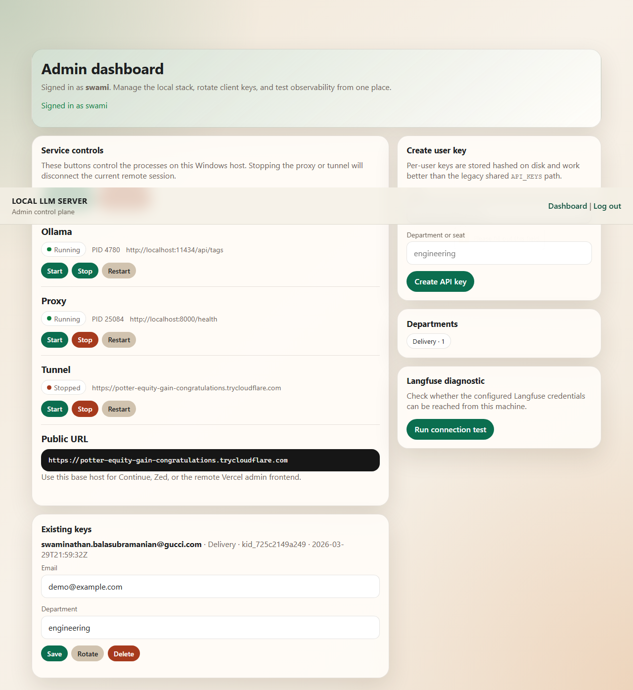

<div align="center">

# LLM Relay

**A complete self-hosted AI platform — unified dashboard, multi-provider LLM routing, AI agent with memory, knowledge wiki, Telegram bot control, and full Langfuse observability.**

[](https://github.com/strikersam/local-llm-server/stargazers)
[](https://github.com/strikersam/local-llm-server/network)
[](LICENSE)
[](https://www.python.org/)
[](https://fastapi.tiangolo.com/)
[](https://www.docker.com/)
[](https://ollama.com/)

*Drop-in OpenAI-compatible proxy — point Cursor, Claude Code, Aider, or Continue at it and everything just works. Your hardware. Your data. Zero API bills.*

</div>

---

## The Unified Interface

One dark-themed dashboard for everything: chat with your AI agent, manage providers and workspaces, run commands, and control access — all without touching a terminal.


> The agent knows your workspace, remembers context across sessions, and executes tasks directly in your project. Hit **New session**, paste your API key, pick a model, and start building.

---

## Why LLM Relay?

Every serious AI developer eventually hits the same wall: API bills that compound with every experiment, models you can't run privately, and a pile of tools that don't talk to each other.

LLM Relay replaces that with a single self-hosted platform. Your existing tools — Cursor, Claude Code, Aider, Continue — keep working without changes. The data never leaves your machine. And the cost difference is stark:

> **Real production numbers:** DeepSeek-R1 671B locally costs ~$0.19/day in electricity. The API equivalent: $12.84 — a **96.7% reduction** across 1,842 requests.


---

## What Makes This Different

| | LLM Relay | Bare Ollama | Paid API |
|---|---|---|---|
| OpenAI-compatible API | ✅ | ✅ | ✅ |
| Unified web dashboard | ✅ | ❌ | ❌ |
| Multi-provider routing | ✅ | ❌ | ❌ |
| AI agent with memory | ✅ | ❌ | ❌ |
| Knowledge wiki | ✅ | ❌ | ❌ |
| Background task queue | ✅ | ❌ | ❌ |
| Telegram bot control | ✅ | ❌ | ❌ |
| Cost tracking + attribution | ✅ | ❌ | ✅ |
| Multi-agent swarms | ✅ | ❌ | ❌ |
| Browser automation | ✅ | ❌ | ❌ |
| Zero vendor lock-in | ✅ | ✅ | ❌ |
| Zero ongoing API cost | ✅ | ✅ | ❌ |

---

## Features

### Providers, Workspaces & Command Runner

The admin panel in the unified UI lets you wire up any LLM backend, point the agent at your codebase, and run commands — all from the same interface.


- **Providers** — Add any OpenAI-compatible endpoint: local Ollama, HuggingFace, OpenRouter, or a remote machine. Test the connection in one click.
- **Workspaces** — Bind the agent to a directory on disk. The agent reads, writes, and searches only within that scope.
- **Command Runner** — Execute shell commands (e.g. `git status`, `pytest`) directly from the dashboard and capture the full output.

---

### Telegram Bot Control

Control your entire AI stack from your phone — no browser, no VPN needed.


| Command | What It Does |
|---------|-------------|
| `/status` | Ollama, proxy, and tunnel health + models loaded and VRAM usage |
| `/cost` | Real-time electricity estimate and hardware amortisation breakdown |
| `/models` | List every loaded model with size |
| `/restart tunnel` | Restart the Cloudflare tunnel and return the new public URL |
| `/agent Fix the typo in README` | Dispatch an agent task — confirms before executing |

The bot prompts for confirmation before any write or restart action, so nothing fires accidentally from your pocket.

---

### Langfuse Observability

Full distributed tracing for every LLM call — latency, token counts, per-request cost, and per-user attribution.


- Per-request cost in dollars, visible per user and per department
- Model comparison: see exactly what local inference saves vs. the cloud equivalent
- Latency breakdown across every span in the call chain
- Activity audit trail with category filters (chat, wiki, ingest, keys, auth)

---

### Service Controls & API Key Management

The admin control plane lets you start, stop, and restart each service independently, manage your Cloudflare tunnel, and issue scoped API keys — all without SSH.


- **Service controls** — Start/stop/restart Ollama, the proxy, and the tunnel independently. Live PID and URL display.
- **Public URL** — Your current Cloudflare tunnel URL, always visible and ready to paste into Cursor or any other tool.
- **API keys** — Issue per-user keys with department labels for cost attribution. Keys are hashed at rest. Rotate or revoke without restarting the server.



---

### Agent Chat + Knowledge Wiki

The agent is backed by a structured knowledge base. It reads from and writes to a searchable markdown wiki — so knowledge compounds across sessions instead of vanishing when the chat ends.

- **Agent Chat** — Persistent sessions with full wiki context injection. All configured providers available. Quick-start prompts included.
- **Knowledge Wiki** — Full CRUD markdown wiki with search, tags, and cross-references. AI-maintained.
- **Source Ingestion** — Upload files, paste URLs, or raw text. The AI auto-summarises into structured wiki entries.
- **Wiki Lint** — AI health check that surfaces orphan pages, missing references, and stale content.

---

### Agent Modes

Four gears for how the agent operates.

| Mode | What It Does |
|------|-------------|
| **Background Agent** | Runs continuously. Processes tasks from the queue without a chat window open — submit and forget. |
| **Multi-Agent Swarms** | One coordinator breaks a big task into subtasks, dispatches them to parallel workers (up to `max_concurrent`), and assembles the result. Ideal for large codebases or parallel research. |
| **Self-Resuming Agents** | Saves a full memory snapshot before shutdown and restores it on restart — picks up exactly where it left off without re-explaining the project. |
| **Voice Commands** | Submit base64-encoded audio, get a text transcript back. Supports Whisper API or fully local `openai-whisper` for offline transcription. |

**Agent API**
```
POST   /agent/coordinate                        Run N workers in parallel under one coordinator
POST   /agent/background/tasks                  Submit a task to the background queue
GET    /agent/background/tasks                  List all background tasks (filter by ?status=)
GET    /agent/background/tasks/{task_id}        Get a single task
POST   /agent/voice/transcribe                  Transcribe base64 audio → text
GET    /agent/voice/status                      Check microphone and Whisper availability
```

---

### Automation & Scheduling

Set the agent on a schedule or hook it into your existing event pipeline.

| Feature | What It Does |
|---------|-------------|
| **Scheduled Jobs** | Cron-based schedules for any agent instruction — "run wiki lint every Monday", "summarise open GitHub issues daily". Webhooks can fire jobs immediately via `/trigger`. |
| **Automation Playbooks** | Pre-write a multi-step automation as a named playbook. Each step is an agent instruction. Invoke by name — every step runs in order. Runs are timestamped. |
| **Resource Watchdog** | Point at any URL or file. When content changes (SHA-256 hash comparison), fires your registered callback. No polling loop to write yourself. |

```
POST   /agent/scheduler/jobs                    Create a scheduled job (cron expression)
POST   /agent/scheduler/jobs/{job_id}/trigger   Fire a job immediately (webhook-style)
POST   /agent/playbooks/{id}/run                Start a playbook run
POST   /agent/watchdog/resources                Start watching a URL or file
```

---

### Memory & Context

The agent stays coherent over long tasks and long sessions.

| Feature | What It Does |
|---------|-------------|
| **Session Memory** | Snapshot agent state (history, last plan, last result) to disk. Restart and continue — no external database, no re-explaining. |
| **Smart Context Compression** | Three strategies when history grows too long: **reactive** (drop oldest non-system messages), **micro** (remove duplicates and near-empty messages), **inspect** (stats only, no mutation). |
| **Conversation Surgery** | Remove specific messages by index without wiping the session — cut a bad exchange or an outdated instruction without losing everything else. |

```
POST   /agent/memory/{session_id}/snapshot      Save session state to disk
GET    /agent/memory/{session_id}               Restore saved state
POST   /agent/context/compress                  Compress messages (strategy: reactive|micro|inspect)
POST   /agent/sessions/{id}/snip                Remove messages by index
```

---

### Developer Tooling

| Feature | What It Does |
|---------|-------------|
| **Terminal Panel** | Captures the full rendered terminal buffer via `tmux capture-pane` — interactive prompts, progress bars, coloured output. Not just raw stdout. |
| **Skill Library** | Indexes every `SKILL.md` under `.claude/skills/`. Keyword search across name, description, and content. MCP-hosted skill packs register via the API. |
| **AI Commit Tracking** | Tags every agent git commit with session ID, model, tool, and timestamp as git trailers. Browse attributed commits via `/agent/commits`. |
| **Project Scaffolding** | Three built-in templates (`python-library`, `fastapi-service`, `cli-tool`) plus custom JSON templates. Apply to a directory in one API call. |
| **Browser Automation** | Controls real Chromium via Playwright — navigate, click, fill forms, screenshot, run JavaScript. Graceful stubs when Playwright isn't installed. |
| **Adaptive Permissions** | Infers `read_only`, `read_write`, or `full_access` from the session transcript. Avoids re-asking for actions already authorised. |
| **Token Budget Caps** | Set a max token spend per session. Raises `BudgetExceededError` at the cap. Set `cap=0` for unlimited. |

```
GET    /agent/terminal/snapshot                 Capture current terminal buffer
POST   /agent/terminal/run                      Run a command, capture full output
GET    /agent/skills/search?q=...               Search skills by keyword
GET    /agent/commits?limit=10                  List AI-attributed commits
POST   /agent/scaffolding/apply                 Scaffold a project from a template
POST   /agent/browser/action                    Browser action (navigate|click|fill|screenshot|evaluate)
```

---

## Architecture

```
 ┌─────────────────────────────────────────────────────────────────┐
 │                  CLIENT TOOLS (your machine)                    │
 │  Cursor · Claude Code · Aider · Continue · any OpenAI client    │
 └────────────────────────┬────────────────────────────────────────┘
                          │  OpenAI / Anthropic-compatible API
                          ▼
 ┌─────────────────────────────────────────────────────────────────┐
 │                    PROXY  (port 8000)                           │
 │  proxy.py — FastAPI                                             │
 │  ┌──────────────┐  ┌──────────────┐  ┌─────────────────────┐   │
 │  │  Auth + Keys │  │  LLM Router  │  │ Agent / Task Queue  │   │
 │  │  (key_store) │  │(model_router)│  │  (agent/loop.py)    │   │
 │  └──────────────┘  └──────┬───────┘  └─────────────────────┘   │
 │  ┌──────────────────────┐ │  ┌────────────────────────────────┐ │
 │  │  Admin Portal        │ │  │  WebUI / Chat SPA              │ │
 │  │  /admin/ui/login     │ │  │  /app  (React, served static)  │ │
 │  │  /admin/app  (React) │ │  └────────────────────────────────┘ │
 │  └──────────────────────┘ │                                     │
 └───────────────────────────┼─────────────────────────────────────┘
                             │
           ┌─────────────────┼──────────────────┐
           ▼                 ▼                  ▼
    ┌─────────────┐  ┌──────────────┐  ┌───────────────┐
    │   Ollama    │  │  Cloud APIs  │  │   Langfuse    │
    │ (port 11434)│  │ HuggingFace  │  │ (observability│
    │ local LLMs  │  │  OpenRouter  │  │   & tracing)  │
    └─────────────┘  └──────────────┘  └───────────────┘

 ┌─────────────────────────────────────────────────────────────────┐
 │             OPTIONAL: Dashboard stack (Docker Compose)          │
 │  React frontend (3000) + FastAPI backend (8001) + MongoDB       │
 │  Adds: wiki, sources ingestion, social login, richer UI         │
 └─────────────────────────────────────────────────────────────────┘
```

**Two ways to run this project:**

| Mode | What you get |
|------|-------------|
| **Proxy only** (`proxy.py`) | OpenAI-compatible endpoint + built-in admin portal + agent + WebUI |
| **Full stack** (Docker Compose) | Everything above + React dashboard + wiki + MongoDB backend |

---

## Quick Start

### Docker Compose (recommended)

```bash
git clone https://github.com/strikersam/local-llm-server
cd local-llm-server

cp .env.example .env   # edit with your settings

docker compose up -d                      # core services
docker compose --profile public up -d     # + Cloudflare tunnel
docker compose --profile full up -d       # + OpenAI proxy for Cursor/Claude Code
```

Open **http://localhost:3000** — the unified dashboard loads immediately.

### Default Credentials

**React dashboard** (port 3000 / backend API port 8001):
```
Email:    admin@llmrelay.local
Password: set ADMIN_PASSWORD in .env
```

**Proxy admin portal** (port 8000 — see [Admin Portal Setup](#admin-portal-setup) below):
```
Username: anything (e.g. admin)
Password: value of ADMIN_SECRET in .env
```

> Change all credentials in `.env` before exposing to the internet.

---

## Admin Portal Setup

The proxy ships a built-in browser admin portal. It is **disabled by default** and must be explicitly enabled by setting `ADMIN_SECRET`.

### Step 1 — Generate a strong secret

```bash
python -c "import secrets; print(secrets.token_urlsafe(32))"
```

### Step 2 — Add it to `.env`

```ini
ADMIN_SECRET=<paste-the-generated-value-here>
```

> Weak values (`admin`, `password`, `secret`, `change-me`) are rejected at startup.

### Step 3 — Restart the proxy

```bash
uvicorn proxy:app --reload --port 8000
# or: docker compose restart proxy
```

### Step 4 — Log in

Open **http://localhost:8000/admin/ui/login** in your browser.

| Field | Value |
|-------|-------|
| Username | Any string (e.g. `admin`) |
| Password | The exact value of `ADMIN_SECRET` |

> This is **not** the same as `ADMIN_PASSWORD`. `ADMIN_PASSWORD` is the credential for the React dashboard backend at port 8001. The proxy admin portal always uses `ADMIN_SECRET` as the password.

### What you can do in the admin portal

| Feature | Description |
|---------|-------------|
| **Service controls** | Start, stop, and restart Ollama, the proxy, and the Cloudflare tunnel independently |
| **API key management** | Issue, rotate, and revoke per-user Bearer tokens (hashed at rest) |
| **Public URL** | View and update your Cloudflare tunnel URL |
| **Langfuse diagnostics** | Test your observability connection from the dashboard |

### Alternative: React admin UI

A React-based admin panel is also available at **http://localhost:8000/admin/app**. It provides the same `ADMIN_SECRET`-based login and manages providers and workspaces.

### API-based admin auth

Scripts and bots can authenticate against the JSON admin API directly:

```bash
# Get a session token
curl -s -X POST http://localhost:8000/admin/api/login \
  -H "Content-Type: application/json" \
  -d '{"username":"admin","password":"<ADMIN_SECRET>"}' | jq .token

# Use the token as a Bearer header
curl -H "Authorization: Bearer <token>" http://localhost:8000/admin/api/status
```

Or pass `ADMIN_SECRET` directly as the Bearer token (for scripts that don't need a session):

```bash
curl -H "Authorization: Bearer <ADMIN_SECRET>" http://localhost:8000/admin/api/status
```

---

## Connecting External Tools

The proxy is OpenAI API-compatible. Any tool that accepts a custom base URL works without modification.

---

### Before You Start

#### 1 — Your server URL

| Where you're connecting from | URL to use |
|---|---|
| Same machine as the server | `http://localhost:8000` |
| Another device on your LAN | `http://192.168.x.x:8000` (your server's local IP) |
| Anywhere on the internet | `https://your-domain.ngrok-free.dev` (ngrok) or `https://xxx.trycloudflare.com` (Cloudflare) |

To enable remote access, run ngrok once to set up a stable free domain:
```bash
python setup_ngrok.py          # generates run_tunnel.sh and saves domain to .env
./run_tunnel.sh                # start the tunnel (keep this running)
```
Or use Cloudflare Tunnel: `docker compose --profile tunnel up -d`

The current public URL is always shown in the **Settings → Public Access** section of the dashboard.

#### 2 — Generate an API key

```bash
python generate_api_key.py     # prints a new key — add it to .env API_KEYS
```

Or via the dashboard: **Admin → API Keys → Issue Key**.

Keys look like `sk-relay-xxxxxxxxxxxxxxxx`. Use this value anywhere `YOUR_API_KEY` appears below.

#### 3 — Critical `.env` check

> **`OLLAMA_BASE` must always be `http://localhost:11434`** (or wherever Ollama is running locally).
> Never set it to your ngrok or Cloudflare URL — that makes the proxy call itself through the internet,
> which breaks LLM calls whenever the tunnel is offline.

```env
# .env — correct
OLLAMA_BASE=http://localhost:11434

# .env — WRONG: causes circular routing and 404 errors when tunnel is offline
# OLLAMA_BASE=https://your-domain.ngrok-free.dev   ← do NOT do this
```

---

### Cursor IDE

**All platforms** — works with Cursor's built-in model picker.

1. Open **Settings** (`Ctrl+,` / `Cmd+,`) → **Models** → scroll to the bottom
2. Toggle **ON** "OpenAI API Key"
3. Fill in:
   ```
   API Key:               sk-relay-...
   Override OpenAI Base URL:  https://your-domain.ngrok-free.dev/v1
   ```
   *(For local access use `http://localhost:8000/v1`)*
4. Click **Verify** — the model list auto-populates from `/v1/models`
5. Type model names and press Enter to add them:
   ```
   qwen3-coder:30b
   deepseek-r1:32b
   deepseek-r1:671b
   ```

The full reference config is in `client-configs/cursor_settings.json`.

---

### Claude Code CLI

The proxy implements the Anthropic Messages API at `/v1/messages`, so Claude Code connects directly.

**Remote access (different machine / phone)**:
```bash
export ANTHROPIC_BASE_URL=https://your-domain.ngrok-free.dev
export ANTHROPIC_API_KEY=sk-relay-...
claude
```

**Local access (same machine as server)**:
```bash
export ANTHROPIC_BASE_URL=http://localhost:8000
export ANTHROPIC_API_KEY=sk-relay-...
claude
```

> Note: `ANTHROPIC_BASE_URL` takes no `/v1` suffix — Claude Code appends the path itself.

To make these permanent, add the exports to your shell profile (`~/.bashrc`, `~/.zshrc`, or PowerShell profile).

---

### Aider

#### Linux / macOS / WSL

```bash
# Option A: source the helper script
source client-configs/aider_config.sh   # edit YOUR_TUNNEL_URL and YOUR_API_KEY first

# Option B: set env vars directly
export OPENAI_API_BASE="https://your-domain.ngrok-free.dev/v1"
export OPENAI_API_KEY="sk-relay-..."

# Then run aider — prefix model name with openai/
aider --model openai/qwen3-coder:30b
aider --model openai/deepseek-r1:32b
aider --model openai/deepseek-r1:671b
```

#### Windows PowerShell

```powershell
# Option A: source the helper script
. .\client-configs\aider_config.ps1   # edit YOUR_TUNNEL_URL and YOUR_API_KEY first

# Option B: set env vars directly
$env:OPENAI_API_BASE = "https://your-domain.ngrok-free.dev/v1"
$env:OPENAI_API_KEY  = "sk-relay-..."

# Then run aider
aider --model openai/qwen3-coder:30b
```

---

### Continue (VS Code)

Continue stores its config in `~/.continue/config.yaml` (current versions) or `~/.continue/config.json` (older installs).

**Current versions (config.yaml)**:
```bash
cp client-configs/continue_config.yaml ~/.continue/config.yaml
```

Then open `~/.continue/config.yaml` and replace the two placeholders:
```yaml
models:
  - name: Qwen3-Coder 30B
    provider: openai
    model: qwen3-coder:30b
    apiBase: https://your-domain.ngrok-free.dev/v1   # ← your URL here
    apiKey: sk-relay-...                              # ← your key here
    roles:
      - chat
      - edit
      - apply
      - autocomplete
      - summarize

  - name: DeepSeek-R1 32B
    provider: openai
    model: deepseek-r1:32b
    apiBase: https://your-domain.ngrok-free.dev/v1
    apiKey: sk-relay-...
    roles:
      - chat

tabAutocompleteModel:
  name: Qwen3-Coder 30B Autocomplete
  provider: openai
  model: qwen3-coder:30b
  apiBase: https://your-domain.ngrok-free.dev/v1
  apiKey: sk-relay-...
```

**Older versions (config.json)**:
```bash
cp client-configs/continue_config.json ~/.continue/config.json
# Then edit apiBase and apiKey in the file
```

After saving, reload the Continue extension — your local models appear in the model picker immediately.

---

### Continue (JetBrains)

Same config file as VS Code — Continue reads `~/.continue/config.yaml` on all platforms.

1. Install the **Continue** plugin from JetBrains Marketplace
2. Copy and edit `client-configs/continue_config.yaml` as shown above
3. Restart the IDE — models appear in the Continue tool window

---

### VS Code (generic OpenAI extension)

For extensions that use VS Code's built-in OpenAI settings (not Continue):

Open **File → Preferences → Settings → Open settings.json** and add:

```json
{
  "openai.apiKey": "sk-relay-...",
  "openai.organization": "",
  "openai.baseUrl": "https://your-domain.ngrok-free.dev/v1"
}
```

The full reference is in `client-configs/vscode_settings.json`.

---

### Zed Editor

Zed reads its settings from:

| Platform | Path |
|---|---|
| macOS | `~/.config/zed/settings.json` |
| Linux | `~/.config/zed/settings.json` |
| Windows | `%APPDATA%\Zed\settings.json` |

1. Set your API key as a system environment variable named `OPENAI_API_KEY` (Zed reads it at startup):
   ```bash
   # macOS / Linux
   export OPENAI_API_KEY=sk-relay-...   # add to ~/.bashrc or ~/.zshrc
   
   # Windows
   [System.Environment]::SetEnvironmentVariable("OPENAI_API_KEY","sk-relay-...","User")
   ```

2. Merge the following into your Zed `settings.json`:
   ```json
   {
     "language_models": {
       "openai": {
         "api_url": "https://your-domain.ngrok-free.dev/v1",
         "available_models": [
           {
             "name": "qwen3-coder:30b",
             "display_name": "Qwen3-Coder 30B",
             "max_tokens": 262144,
             "max_completion_tokens": 8192,
             "capabilities": { "tools": false, "images": false, "chat_completions": true }
           },
           {
             "name": "deepseek-r1:32b",
             "display_name": "DeepSeek-R1 32B",
             "max_tokens": 131072,
             "max_completion_tokens": 8192,
             "capabilities": { "tools": false, "images": false, "chat_completions": true }
           },
           {
             "name": "deepseek-r1:671b",
             "display_name": "DeepSeek-R1 671B",
             "max_tokens": 163840,
             "max_completion_tokens": 8192,
             "capabilities": { "tools": true, "images": false, "chat_completions": true }
           }
         ]
       }
     }
   }
   ```

3. Restart Zed and open the **Agent** panel — your models appear in the model dropdown.

The full reference config is in `client-configs/zed_settings.json`.

---

### Python / OpenAI SDK

```bash
pip install openai
```

```python
from openai import OpenAI

client = OpenAI(
    base_url="https://your-domain.ngrok-free.dev/v1",  # or http://localhost:8000/v1
    api_key="sk-relay-...",
)

# List available models
for m in client.models.list().data:
    print(m.id)

# Chat (non-streaming)
response = client.chat.completions.create(
    model="qwen3-coder:30b",
    messages=[{"role": "user", "content": "Hello"}],
)
print(response.choices[0].message.content)

# Chat (streaming)
stream = client.chat.completions.create(
    model="deepseek-r1:32b",
    messages=[{"role": "user", "content": "Explain binary search"}],
    stream=True,
)
for chunk in stream:
    if chunk.choices[0].delta.content:
        print(chunk.choices[0].delta.content, end="", flush=True)
```

A runnable example is in `client-configs/python_client_example.py`.

---

### iOS Shortcuts (Quick Note → Claude)

Sends any URL or text from the iOS Share Sheet to the proxy's quick-note queue for async processing by Claude Code.

**Setup** (one-time):
1. Open `client-configs/quick-note-to-claude.shortcut` on your iPhone/iPad
2. When prompted, fill in:
   - **Server URL**: `http://192.168.x.x:8000/v1/quick-notes` (LAN) or `https://your-domain.ngrok-free.dev/v1/quick-notes` (remote)
   - **API Key**: `Bearer sk-relay-...` (include the `Bearer ` prefix)
3. Add to the Share Sheet

**Usage**: In Safari or any app, tap Share → **Quick Note → Claude** — the URL is queued and processed by the next Claude Code agent run.

---

### Troubleshooting

| Symptom | Cause | Fix |
|---|---|---|
| `ERR_NGROK_3200` / endpoint offline | Tunnel is not running | Run `./run_tunnel.sh` on the server |
| `404 Not Found` on `/v1/chat/completions` | `OLLAMA_BASE` set to tunnel URL | Set `OLLAMA_BASE=http://localhost:11434` in `.env` and restart |
| `401 Unauthorized` | Invalid or missing API key | Check `API_KEYS` in `.env`; regenerate with `python generate_api_key.py` |
| `403 Forbidden` | Key exists but is wrong | Make sure the key in your IDE matches exactly what's in `.env` |
| Models list empty in Cursor | Ollama not running | Run `ollama serve` or `docker compose up ollama` |
| `502 Bad Gateway` from ngrok | Proxy not running | Start the proxy: `uvicorn proxy:app --port 8000` |

---

## Provider Setup

### Ollama (Local — zero cost)
Runs as a Docker service. Models download on first pull.

```bash
docker exec llm-wiki-ollama ollama pull qwen3-coder:30b
docker exec llm-wiki-ollama ollama pull deepseek-r1:671b
```

### HuggingFace Inference API
**Providers → Add Provider:**
- Type: `OpenAI Compatible`
- Base URL: `https://api-inference.huggingface.co/v1`
- API Key: your HuggingFace token

### OpenRouter
- Base URL: `https://openrouter.ai/api/v1`
- API Key: your OpenRouter key

### Remote Ollama (another machine)
- Type: `Ollama`
- Base URL: `http://192.168.1.100:11434`

---

## Optional Feature Dependencies

All features degrade gracefully — nothing crashes when a dependency isn't installed.

| Feature | Install | Env var |
|---------|---------|---------|
| Browser Automation | `pip install playwright && playwright install chromium` | — |
| Voice (Whisper API) | — | `WHISPER_BASE_URL=http://localhost:9000` |
| Voice (local Whisper) | `pip install openai-whisper` | — |
| Voice recording | `pip install pyaudio` | — |
| Scheduled Jobs | `pip install apscheduler` *(bundled)* | — |

---

## Services

| Service | Port | Always on? | Description |
|---------|------|-----------|-------------|
| **Proxy** | 8000 | Yes | OpenAI/Anthropic-compatible endpoint + admin portal + agent + WebUI SPA |
| **Ollama** | 11434 | Yes | Local LLM runtime (required for local models) |
| **Cloudflare Tunnel** | — | Optional | Public HTTPS endpoint; enable with `--profile public` |
| **Frontend** | 3000 | Docker only | React dashboard (full-stack profile) |
| **Backend** | 8001 | Docker only | FastAPI backend for dashboard (wiki, sources, social login) |
| **MongoDB** | 27017 | Docker only | Document store for the dashboard backend |

> Running `uvicorn proxy:app` alone gives you the proxy + admin portal + WebUI. The Docker Compose stack adds the richer dashboard experience on top.

---

## API Reference

### Proxy (port 8000)

<details>
<summary><strong>LLM endpoints (OpenAI / Anthropic compatible)</strong></summary>

| Method | Endpoint | Description |
|--------|----------|-------------|
| POST | `/v1/chat/completions` | OpenAI-compatible chat completions (streaming supported) |
| GET | `/v1/models` | List available models |
| POST | `/v1/embeddings` | Embeddings (passed through to Ollama) |
| POST | `/api/chat` | Ollama native chat endpoint |
| POST | `/api/generate` | Ollama native generate endpoint |
| POST | `/v1/messages` | Anthropic Messages API (Claude-compatible) |

All LLM endpoints require a `Bearer` token from `API_KEYS` or `KEYS_FILE`.

</details>

<details>
<summary><strong>Admin portal (requires ADMIN_SECRET)</strong></summary>

| Method | Endpoint | Description |
|--------|----------|-------------|
| GET | `/admin/ui/login` | Browser login page |
| POST | `/admin/ui/login` | Submit login form → sets session cookie |
| GET | `/admin/ui/` | Admin dashboard (session required) |
| GET | `/admin/ui/logout` | Clear session |
| POST | `/admin/api/login` | JSON login → returns `{"token": "adm_..."}` |
| POST | `/admin/api/logout` | Revoke token / clear session |
| GET | `/admin/api/status` | Service health + signed-in user |
| POST | `/admin/api/control` | Start/stop/restart `ollama`, `proxy`, `tunnel`, `stack` |
| GET | `/admin/api/users` | List API key records |
| POST | `/admin/api/users` | Create API key |
| PATCH | `/admin/api/users/:key_id` | Update email / department |
| DELETE | `/admin/api/users/:key_id` | Revoke and delete key |
| POST | `/admin/api/users/:key_id/rotate` | Rotate key secret |
| POST | `/admin/keys` | Legacy: issue key via `X-Admin-Secret` header |

</details>

<details>
<summary><strong>Agent</strong></summary>

| Method | Endpoint | Description |
|--------|----------|-------------|
| POST | `/agent/coordinate` | Run N workers in parallel under one coordinator |
| POST | `/agent/background/tasks` | Submit a task to the background queue |
| GET | `/agent/background/tasks` | List all background tasks (filter by `?status=`) |
| GET | `/agent/background/tasks/{task_id}` | Get a single task |
| POST | `/agent/voice/transcribe` | Transcribe base64 audio → text |
| GET | `/agent/voice/status` | Check microphone and Whisper availability |
| POST | `/agent/memory/{session_id}/snapshot` | Save session state to disk |
| GET | `/agent/memory/{session_id}` | Restore saved state |
| POST | `/agent/context/compress` | Compress messages (`strategy: reactive\|micro\|inspect`) |
| POST | `/agent/sessions/{id}/snip` | Remove messages by index |
| POST | `/agent/scheduler/jobs` | Create a scheduled job (cron expression) |
| POST | `/agent/scheduler/jobs/{job_id}/trigger` | Fire a job immediately |
| POST | `/agent/playbooks/{id}/run` | Start a playbook run |
| POST | `/agent/watchdog/resources` | Start watching a URL or file |
| GET | `/agent/terminal/snapshot` | Capture current terminal buffer |
| POST | `/agent/terminal/run` | Run a command, capture full output |
| GET | `/agent/skills/search?q=...` | Search skills by keyword |
| GET | `/agent/commits?limit=10` | List AI-attributed commits |
| POST | `/agent/scaffolding/apply` | Scaffold a project from a template |
| POST | `/agent/browser/action` | Browser action (`navigate\|click\|fill\|screenshot\|evaluate`) |

</details>

<details>
<summary><strong>WebUI / providers / workspaces (proxy, port 8000)</strong></summary>

| Method | Endpoint | Description |
|--------|----------|-------------|
| GET | `/ui/api/bootstrap` | Feature flags and build status |
| GET | `/ui/api/providers` | List providers (API key auth) |
| GET | `/ui/api/providers/:id/models` | List models for a provider |
| POST | `/ui/api/chat` | Single-turn chat via a provider |
| GET | `/ui/api/workspaces` | List workspaces |
| GET | `/admin/api/providers` | Admin: list providers with secrets flag |
| POST | `/admin/api/providers` | Admin: create provider |
| DELETE | `/admin/api/providers/:id` | Admin: delete provider |
| GET | `/admin/api/workspaces` | Admin: list workspaces |
| POST | `/admin/api/workspaces` | Admin: create workspace |
| DELETE | `/admin/api/workspaces/:id` | Admin: delete workspace |
| POST | `/admin/api/commands/run` | Admin: run allowlisted shell command |

</details>

### Dashboard backend (port 8001 — Docker Compose only)

<details>
<summary><strong>Auth</strong></summary>

| Method | Endpoint | Description |
|--------|----------|-------------|
| POST | `/api/auth/login` | Login with email/password (sets JWT) |
| POST | `/api/auth/logout` | Clear session |
| GET | `/api/auth/me` | Current user |
| POST | `/api/auth/refresh` | Refresh JWT |

</details>

<details>
<summary><strong>Wiki / Sources / System</strong></summary>

| Method | Endpoint | Description |
|--------|----------|-------------|
| GET | `/api/wiki/pages` | List/search pages |
| POST | `/api/wiki/pages` | Create page |
| PUT | `/api/wiki/pages/:slug` | Update page |
| DELETE | `/api/wiki/pages/:slug` | Delete page |
| POST | `/api/wiki/lint` | AI health check |
| POST | `/api/sources/ingest` | Ingest file/URL/text |
| GET | `/api/sources` | List all |
| GET | `/api/health` | System health |
| GET | `/api/stats` | Dashboard stats |
| GET | `/api/observability/status` | Langfuse status |

</details>

---

## Tech Stack

| Layer | Technology |
|-------|-----------|
| Proxy / admin | Python 3.11, FastAPI, Starlette, httpx, Jinja2, Pydantic v2 |
| WebUI SPA | React 18, Vite, Tailwind CSS (served statically by the proxy) |
| Dashboard frontend | React 18, Tailwind CSS, React Router, Lucide |
| Dashboard backend | FastAPI, Motor (async MongoDB), PyJWT, bcrypt |
| Database | MongoDB 7 (dashboard stack only) |
| LLM Runtime | Ollama (local) + any OpenAI-compatible API |
| Observability | Langfuse |
| Tunnel | Cloudflare Tunnel |
| Containers | Docker Compose |

---

## License

Open source. Use it, fork it, ship it.

---

<div align="center">

**If this saves you money or unblocks your workflow, a star helps others find it.**

[](https://github.com/strikersam/local-llm-server/stargazers)

</div>
