<div align="center">

# LLM Relay

### The self‑hosted control plane for your AI stack.

**Route, run, and govern every LLM request — local‑first, OpenAI‑compatible, zero vendor lock‑in.**

[](https://github.com/strikersam/local-llm-server/stargazers)
[](https://github.com/strikersam/local-llm-server/network)
[](LICENSE)
[](#whats-new-in-v31)

[](https://www.python.org/)
[](https://fastapi.tiangolo.com/)
[](https://react.dev/)
[](https://tailwindcss.com/)
[](https://www.mongodb.com/)
[](https://ollama.com/)
[](https://docs.docker.com/compose/)
[](https://langfuse.com/)

<sub>Drop‑in OpenAI‑compatible proxy. Point Cursor, Claude Code, Aider, Continue, or any SDK at it — everything just works.</sub>

[**Quick start →**](#-quick-start)  ·  [**Live tour →**](#-the-control-plane-in-pictures)  ·  [**Connect your IDE →**](#-connect-your-tools-in-30-seconds)  ·  [**API reference →**](#-api-reference)

</div>

---

## ⚡ The 60‑second pitch

You hit the same wall every serious AI builder hits: **API bills compound, models you actually want to run can't be hosted, and your tools don't talk to each other**.

LLM Relay collapses that mess into a single self‑hosted platform — your hardware, your data, **one URL** that every tool already knows how to talk to.

> **Real production numbers.** DeepSeek‑R1 671B locally costs **\$0.19 / day** in electricity.
> The cloud equivalent across the same 1,842 requests: **\$12.84**.
> That's a **96.7 % reduction** — measured, not estimated.

<p align="center">
  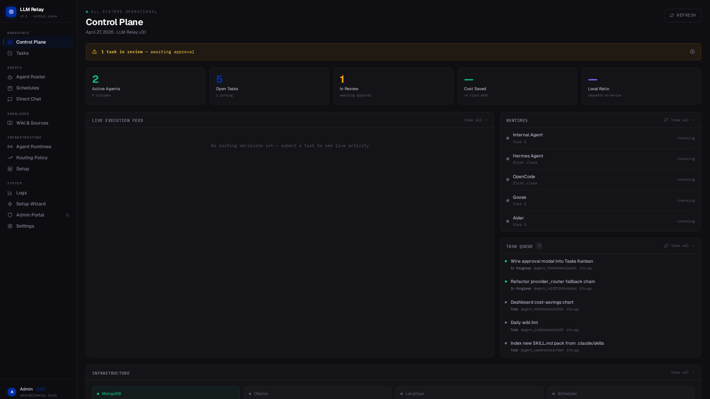
  <br/>
  <sub><em>The v3.1 Control Plane — every agent, runtime, task, and routing decision in one screen.</em></sub>
</p>

---

## ✨ What's new in v3.1

v3.1 is a complete rebuild around a single idea: this should feel like an **AI agent control plane**, not a proxy with a settings page bolted on.

| Pillar | Highlights |
|---|---|
| 🎛 **Control Plane UI** | New `#0F0F13` dark surface, Geist‑driven typography, `rounded‑xl` cards. 5 panes: WORKSPACE · AGENTS · KNOWLEDGE · INFRASTRUCTURE · SYSTEM |
| 🗂 **Kanban Task Board** | Full swim‑lane workflow — TODO → IN PROGRESS → IN REVIEW → BLOCKED → DONE → FAILED — with slide‑in detail, comments, approvals & retries |
| 🤖 **Agent Roster** | Define agents with model, runtime, task types, cost policy, and visibility. Public agents are workspace‑shared, private ones stay yours |
| ⚙️ **Agent Runtimes** | Hermes · OpenCode · Goose · OpenHands · Aider — start, stop, restart, and route each from one panel |
| 🛣 **Routing Policy** | 8‑step engine: local → free cloud → paid escalation, with explicit user approval gates before any commercial call |
| 🔐 **RBAC v3** | Three‑tier roles (Admin / Power User / User), 27 permission flags, signed audit trail on every mutation |
| 🔑 **Social Login** | GitHub + Google OAuth with HMAC‑HS256 JWTs and CSRF state protection |
| 🗝 **User‑scoped Secrets** | AES‑256‑GCM at rest, scoped USER / WORKSPACE / GLOBAL — no API key ever lands in the repo |
| 🖥 **Hardware Detection** | CPU, RAM, NVIDIA, AMD, Apple Silicon, Intel Arc — every model card surfaces compatibility upfront |
| 🧙 **Setup Wizard** | 5 steps: Provider → Models → Runtimes → Default Agent → Cost Policy. Resumable, idempotent, never blocks the dashboard |
| 💸 **Cost Insights** | Live $ saved vs cloud, per‑user breakdowns, time‑series charts, attribution by department |
| 🔄 **Peer Sync** | Syncthing‑style HMAC‑authenticated workspace sync with conflict surfacing |
| 🌐 **GitHub Workspace** | Clone, diff, commit, push, open PRs — all async, never `shell=True` |

---

## 🎬 The control plane in pictures

### 🛬 The way in

A login that sets the tone — local or single‑click GitHub / Google.

<p align="center">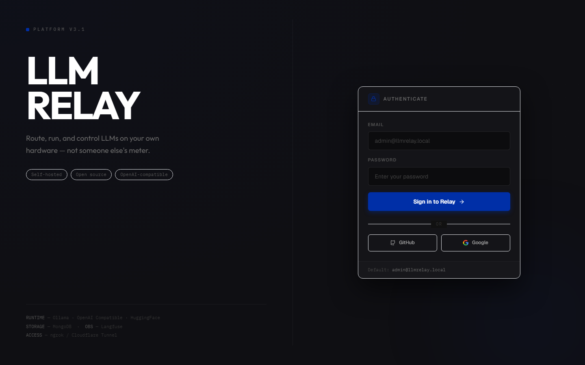</p>

### 🧙 5‑step Setup Wizard

You go from `git clone` to first chat without ever opening a config file.

<p align="center">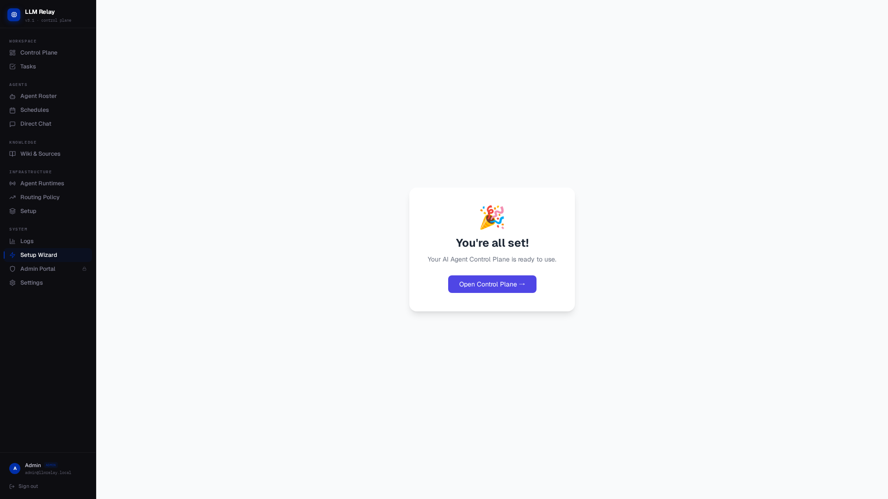</p>

### 🗂 Kanban that actually moves work forward

Every agent run, every approval, every comment — in one board. Tasks auto‑assign to the best available agent based on `task_type`, fall back gracefully, and never crash a flow.

<p align="center">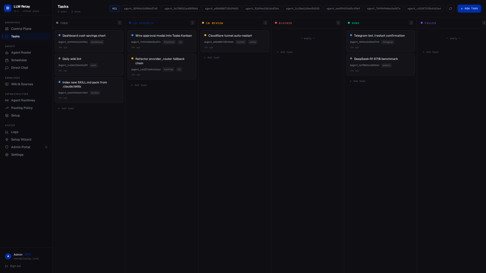</p>

### 🤖 Agent Roster

Compose an agent in one screen — pick a model, a runtime, a cost policy, and decide who else in the workspace can see it.

<p align="center">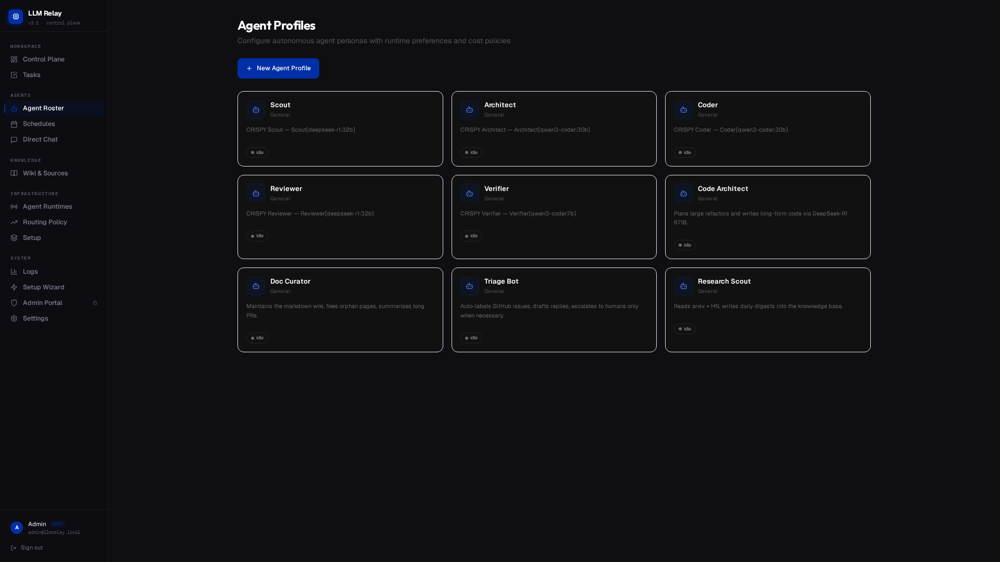</p>

### ⚙️ Agent Runtimes

Hermes, OpenCode, Goose, OpenHands, Aider — start them, stop them, hand them tasks. No SSH, no `docker exec`.

<p align="center">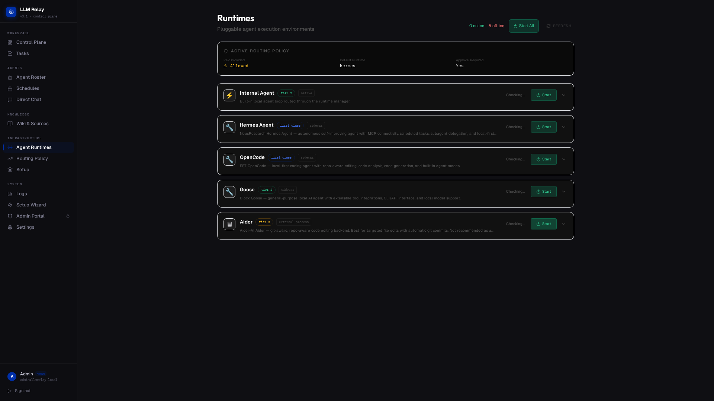</p>

### 🛣 Routing Policy

Local‑first, free‑cloud middle, paid only with explicit consent. The escalation modal pops **before** any commercial call ever fires.

<p align="center">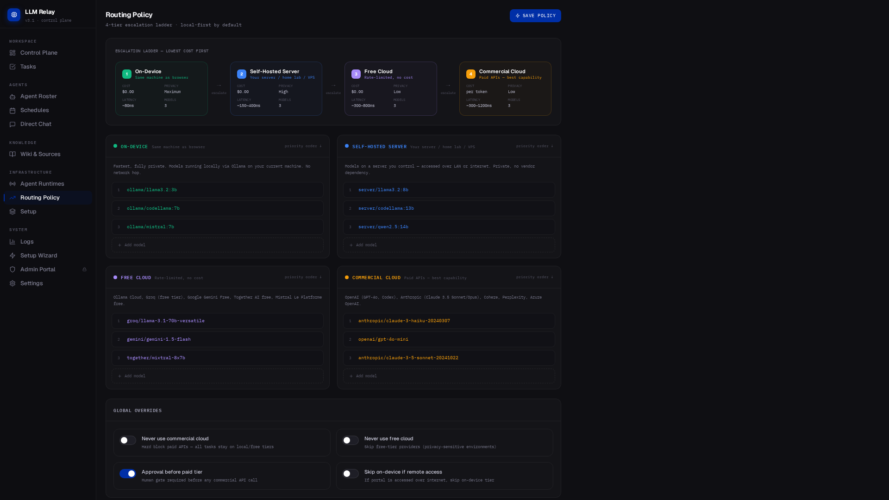</p>

### 🔌 Providers & Models

Every OpenAI‑compatible endpoint you point at — Ollama, HuggingFace, OpenRouter, a remote box on your LAN, an Anthropic key — shows up here, gets one‑click tested, and is ready to route.

<p align="center">
  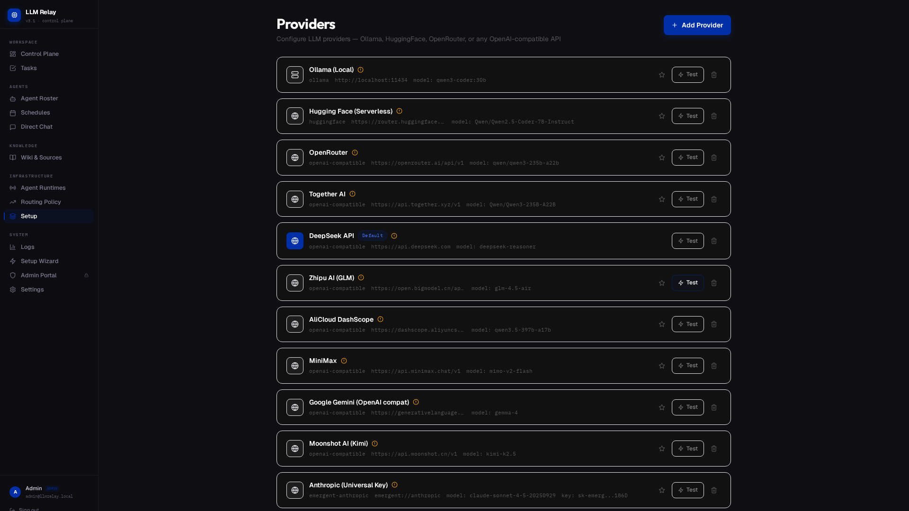
  &nbsp;
  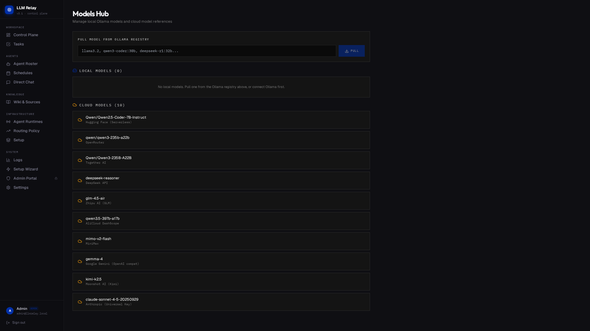
</p>

### 📚 Knowledge — Wiki, Sources, GitHub

A markdown wiki the agent reads from and writes to. Sources (URLs, files, raw text) auto‑summarise into structured pages. Knowledge **compounds** across sessions — it doesn't evaporate when the chat closes.

<p align="center">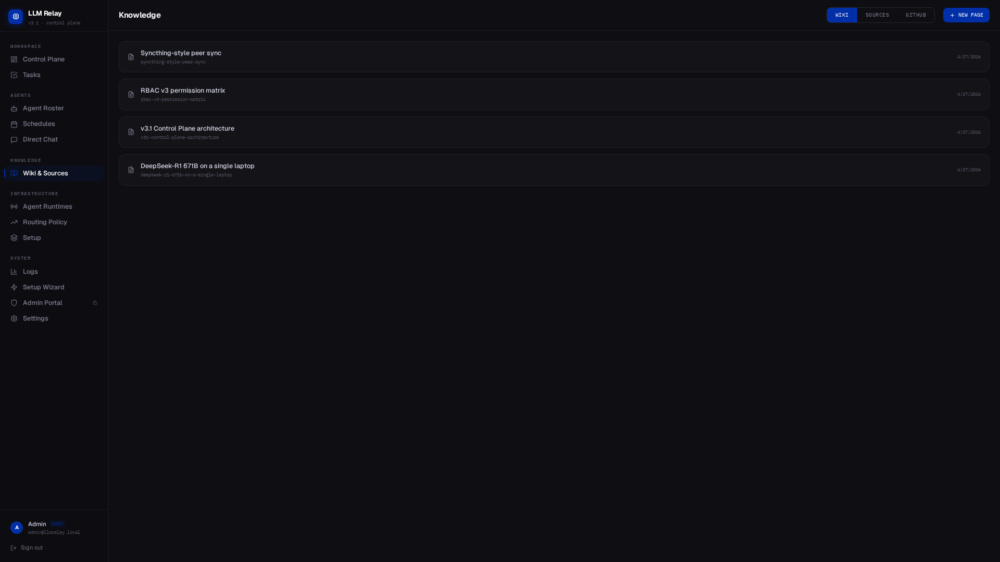</p>

### 💬 Direct Chat with persistent memory

A persistent‑session chat with full wiki context injection, every configured provider, and a commercial‑escalation gate that respects your routing policy.

<p align="center">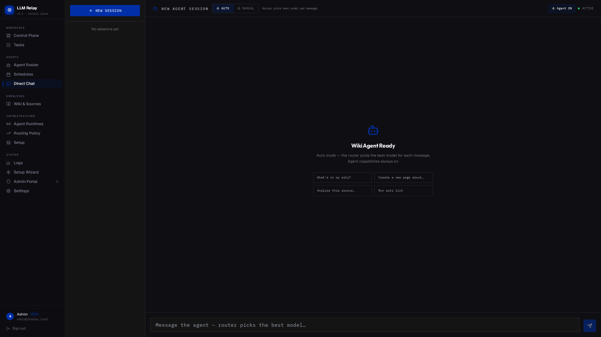</p>

### 🔭 Logs & Live Activity

Every routing decision, every agent action, every approval — streamed and searchable. Plug Langfuse on top for $‑per‑request tracing.

<p align="center">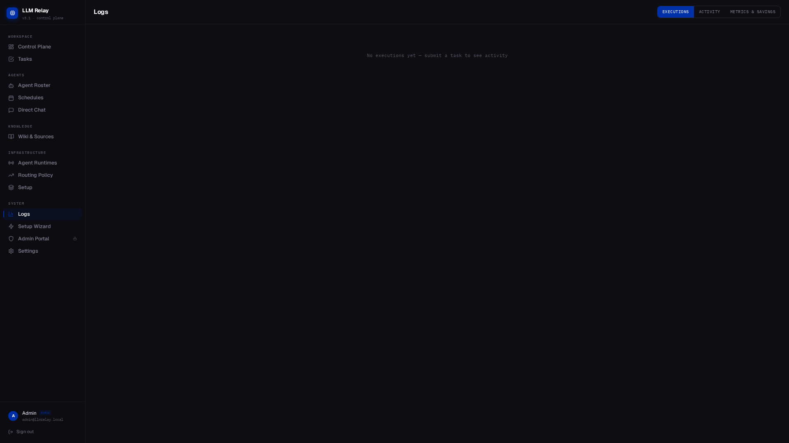</p>

### 🛡 Admin Portal — RBAC v3

Three roles, 27 permission flags, an audit trail you can take to a security review.

<p align="center">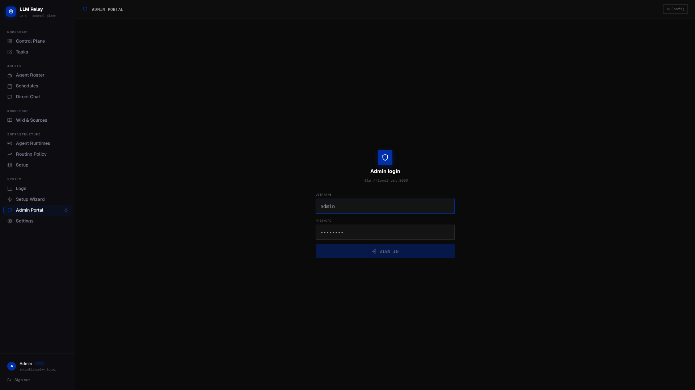</p>

### 🗓 Schedules

Cron‑driven agent runs, webhooks for ad‑hoc triggers, and watchdogs for "fire when this URL changes."

<p align="center">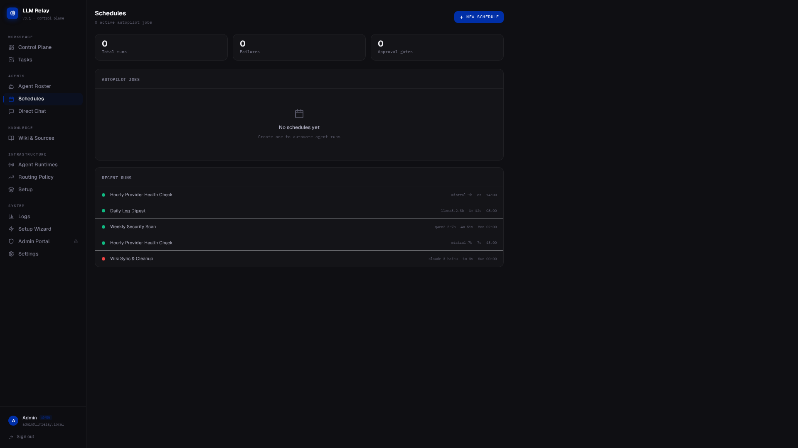</p>

### ⚙️ Settings

System health, public access (ngrok / Cloudflare), GitHub OAuth, version & build info.

<p align="center">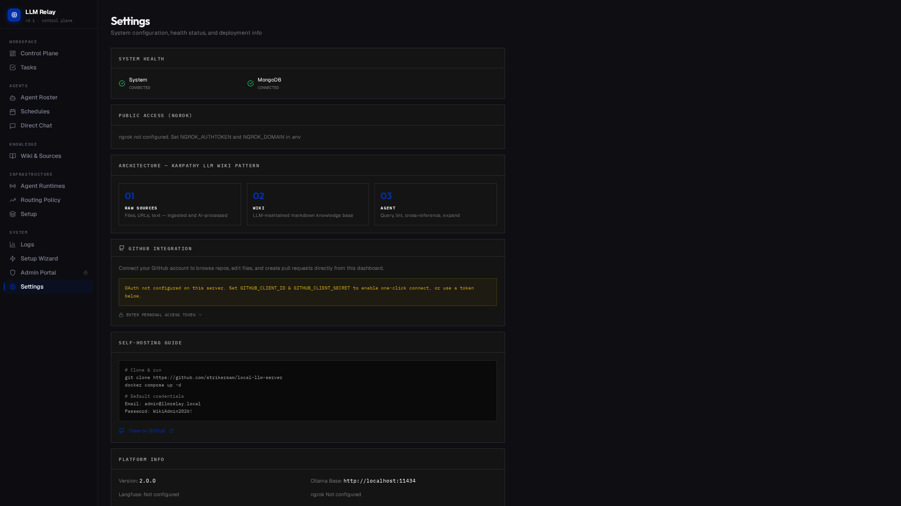</p>

---

## 📊 LLM Relay vs the alternatives

|  | **LLM Relay v3.1** | Bare Ollama | Paid API |
|---|:---:|:---:|:---:|
| OpenAI / Anthropic‑compatible API | ✅ | ✅ | ✅ |
| Unified web control plane | ✅ | ❌ | ❌ |
| Kanban task board with approvals | ✅ | ❌ | ❌ |
| Multi‑agent swarms | ✅ | ❌ | ❌ |
| Agent runtimes (Hermes, OpenCode, Goose…) | ✅ | ❌ | partial |
| Local + free + paid routing tiers | ✅ | ❌ | ❌ |
| User‑scoped encrypted secrets | ✅ | ❌ | partial |
| RBAC + audit trail | ✅ | ❌ | partial |
| Markdown knowledge wiki | ✅ | ❌ | ❌ |
| Background queue + cron + watchdog | ✅ | ❌ | ❌ |
| Cost tracking with attribution | ✅ | ❌ | ✅ |
| Telegram bot control | ✅ | ❌ | ❌ |
| Browser automation tool | ✅ | ❌ | ❌ |
| Zero ongoing API cost | ✅ | ✅ | ❌ |
| Zero vendor lock‑in | ✅ | ✅ | ❌ |

---

## 🧱 Architecture

```
 ┌─────────────────────────────────────────────────────────────────┐
 │                  CLIENT TOOLS (your machine)                    │
 │  Cursor · Claude Code · Aider · Continue · any OpenAI client    │
 └────────────────────────┬────────────────────────────────────────┘
                          │  OpenAI / Anthropic‑compatible API
                          ▼
 ┌─────────────────────────────────────────────────────────────────┐
 │                  PROXY  (port 8000)                             │
 │  proxy.py — FastAPI · async · streaming                         │
 │                                                                 │
 │  ┌──────────────┐ ┌──────────────┐ ┌────────────────────────┐   │
 │  │ Auth + Keys  │ │  LLM Router  │ │  Agent / Task Queue    │   │
 │  │ key_store    │ │ provider_    │ │  agent/loop.py         │   │
 │  │ rbac v3      │ │ router.py    │ │  runtimes/manager.py   │   │
 │  └──────────────┘ └──────┬───────┘ └────────────────────────┘   │
 │  ┌──────────────────┐    │    ┌─────────────────────────────┐   │
 │  │ Admin portal +   │    │    │ React WebUI / SPA           │   │
 │  │ Setup wizard     │    │    │ /admin/app  ·  /app         │   │
 │  └──────────────────┘    │    └─────────────────────────────┘   │
 └──────────────────────────┼──────────────────────────────────────┘
                            │
       ┌────────────────────┼─────────────────────┐
       ▼                    ▼                     ▼
 ┌─────────────┐     ┌──────────────┐     ┌────────────────┐
 │   Ollama    │     │  Cloud APIs  │     │   Langfuse     │
 │ port 11434  │     │ HF · OpenRtr │     │ traces · cost  │
 │ local LLMs  │     │ OpenAI · …   │     │ observability  │
 └─────────────┘     └──────────────┘     └────────────────┘

 ┌─────────────────────────────────────────────────────────────────┐
 │     OPTIONAL · Dashboard stack  (Docker Compose, full profile)  │
 │  React 18 frontend (3000) · FastAPI backend (8001) · MongoDB 7  │
 │  Adds: Kanban tasks, agents, runtimes, wiki, sources, RBAC v3   │
 └─────────────────────────────────────────────────────────────────┘
```

| Mode | What you get |
|---|---|
| **Proxy only** (`uvicorn proxy:app`) | OpenAI/Anthropic‑compatible endpoint + admin portal + agent + WebUI |
| **Full stack** (`docker compose up`) | Everything above + React control plane + Kanban + wiki + MongoDB |

---

## 🚀 Quick start

```bash
git clone https://github.com/strikersam/local-llm-server
cd local-llm-server

cp .env.example .env                       # edit ADMIN_PASSWORD, ADMIN_SECRET, etc.

docker compose up -d                       # core services (proxy + ollama + mongo + 4 agent runtimes)
docker compose --profile dashboard up -d   # + React control plane on http://localhost:3000
docker compose --profile tunnel up -d      # + Cloudflare public tunnel
docker compose --profile ngrok up -d       # + ngrok tunnel (requires NGROK_AUTHTOKEN)
```

Then open **http://localhost:3000** — the control plane loads immediately and walks you through the Setup Wizard.

> **Note:** `docker compose up -d` already starts **all** core services including the 4 agent runtimes (Hermes, OpenCode, Goose, Aider). The `--profile dashboard` flag adds the React frontend and backend API on port 3000/8001.

### Default credentials

> Change these in `.env` before exposing to the internet.

```
React dashboard      (port 3000  → backend 8001)
  Email     admin@llmrelay.local
  Password  $ADMIN_PASSWORD

Proxy admin portal   (port 8000)
  Username  anything (e.g. admin)
  Password  $ADMIN_SECRET
```

Generate a strong secret:

```bash
python -c "import secrets; print(secrets.token_urlsafe(32))"
```

> Weak values (`admin`, `password`, `secret`, `change-me`) are rejected at startup.

---

## 🔌 Connect your tools in 30 seconds

The proxy is OpenAI **and** Anthropic API‑compatible. Any tool that accepts a custom base URL works without changes.

<details>
<summary><b>Cursor IDE</b></summary>

Settings → Models → toggle on **OpenAI API Key**:

```
API Key:                  sk-relay-...
Override OpenAI Base URL: https://your-domain.ngrok-free.dev/v1
```

Click **Verify** — `/v1/models` auto‑populates the model list. Reference config in `client-configs/cursor_settings.json`.

</details>

<details>
<summary><b>Claude Code CLI</b></summary>

```bash
export ANTHROPIC_BASE_URL=https://your-domain.ngrok-free.dev
export ANTHROPIC_API_KEY=sk-relay-...
claude
```

> No `/v1` suffix on `ANTHROPIC_BASE_URL` — Claude Code appends the path itself.

</details>

<details>
<summary><b>Aider · Continue · Zed · VS Code · Python SDK · iOS Shortcuts</b></summary>

Configs live in [`client-configs/`](client-configs/):

| Tool | File |
|---|---|
| Aider | `aider_config.sh` / `aider_config.ps1` |
| Continue (VS Code & JetBrains) | `continue_config.yaml` / `continue_config.json` |
| VS Code generic | `vscode_settings.json` |
| Zed | `zed_settings.json` |
| Python OpenAI SDK | `python_client_example.py` |
| iOS Share Sheet | `quick-note-to-claude.shortcut` |

</details>

<details>
<summary><b>Anywhere with curl</b></summary>

```bash
curl https://your-domain.ngrok-free.dev/v1/chat/completions \
  -H "Authorization: Bearer sk-relay-..." \
  -H "Content-Type: application/json" \
  -d '{"model":"qwen3-coder:30b","messages":[{"role":"user","content":"hi"}]}'
```

</details>

> ⚠️ **Critical .env check:** keep `OLLAMA_BASE=http://localhost:11434`. Pointing it at a tunnel URL causes the proxy to call itself through the internet — and breaks every LLM call when the tunnel blinks.

---

## 🧠 Provider setup

| Provider | Type | Base URL |
|---|---|---|
| **Ollama (local)** | Ollama | `http://localhost:11434` |
| **HuggingFace Inference** | OpenAI Compatible | `https://api-inference.huggingface.co/v1` |
| **OpenRouter** | OpenAI Compatible | `https://openrouter.ai/api/v1` |
| **Remote Ollama (LAN)** | Ollama | `http://192.168.1.100:11434` |
| **OpenAI / Anthropic / Gemini** | native | added in Setup Wizard, key encrypted at rest |

Pull local models on first run:

```bash
docker exec llm-wiki-ollama ollama pull qwen3-coder:30b
docker exec llm-wiki-ollama ollama pull deepseek-r1:671b
```

---

## 🧩 Optional feature dependencies

Every feature degrades gracefully — missing dependencies never crash the server.

| Feature | Install | Env |
|---|---|---|
| Browser automation | `pip install playwright && playwright install chromium` | — |
| Voice (Whisper API) | — | `WHISPER_BASE_URL=http://localhost:9000` |
| Voice (local Whisper) | `pip install openai-whisper` | — |
| Voice recording | `pip install pyaudio` | — |
| Scheduled jobs | bundled (`apscheduler`) | — |

---

## 🛰 Services & ports

| Service | Port | Always on? | Notes |
|---|---|---|---|
| Proxy | 8000 | ✅ | OpenAI/Anthropic endpoint + admin portal + agent + WebUI |
| Ollama | 11434 | ✅ | Local LLM runtime |
| Hermes runtime | 8002 | ✅ | Code execution agent (OpenAI-compatible wrapper) |
| OpenCode runtime | 8003 | ✅ | Code generation agent (OpenAI-compatible wrapper) |
| Goose runtime | 8004 | ✅ | Multi-purpose agent (OpenAI-compatible wrapper) |
| Aider runtime | 8005 | ✅ | Pair programmer agent (OpenAI-compatible wrapper) |
| Cloudflare Tunnel | — | optional | `--profile tunnel` |
| Frontend (React) | 3000 | Docker only | Full control plane (`--profile dashboard`) |
| Backend (FastAPI) | 8001 | Docker only | Wiki, Kanban, RBAC, sources, social login (`--profile dashboard`) |
| MongoDB | 27017 | Docker only | Document store for the dashboard |

### Verify all services are healthy

```bash
# Check all containers
docker compose ps

# Check individual runtime agents
curl http://localhost:8002/health   # Hermes
curl http://localhost:8003/health   # OpenCode
curl http://localhost:8004/health   # Goose
curl http://localhost:8005/health   # Aider

# Check proxy health
curl http://localhost:8000/health
```

All runtimes should report `{"status":"ok","runtime":"..."}`. If any show `models:0`, ensure Ollama has models pulled (`ollama list` inside the ollama container).

---

## 📚 API reference

### Proxy (port 8000)

<details>
<summary><b>LLM endpoints — OpenAI / Anthropic compatible</b></summary>

| Method | Endpoint | Description |
|---|---|---|
| POST | `/v1/chat/completions` | OpenAI chat completions (streaming) |
| GET | `/v1/models` | List available models |
| POST | `/v1/embeddings` | Embeddings passthrough to Ollama |
| POST | `/v1/messages` | Anthropic Messages API |
| POST | `/api/chat` · `/api/generate` | Ollama native |

All LLM endpoints require a `Bearer` token from `API_KEYS` or `KEYS_FILE`.

</details>

<details>
<summary><b>Admin portal — requires <code>ADMIN_SECRET</code></b></summary>

| Method | Endpoint | Description |
|---|---|---|
| GET / POST | `/admin/ui/login` | Browser login |
| GET | `/admin/ui/` | Dashboard (session) |
| POST | `/admin/api/login` | JSON login → `{"token": "adm_..."}` |
| GET | `/admin/api/status` | Service health + signed‑in user |
| POST | `/admin/api/control` | Start / stop / restart `ollama`, `proxy`, `tunnel`, `stack` |
| `*` | `/admin/api/users` | API key CRUD + rotate |
| `*` | `/admin/api/providers` · `/admin/api/workspaces` | Provider & workspace CRUD |
| POST | `/admin/api/commands/run` | Allowlisted shell command |

</details>

<details>
<summary><b>Agent runtime</b></summary>

| Method | Endpoint | Description |
|---|---|---|
| POST | `/agent/coordinate` | Run N workers under one coordinator |
| POST/GET | `/agent/background/tasks` | Background queue submit / list / inspect |
| POST | `/agent/voice/transcribe` | Base64 audio → text |
| POST/GET | `/agent/memory/{session_id}` | Snapshot / restore session state |
| POST | `/agent/context/compress` | Strategy: `reactive\|micro\|inspect` |
| POST | `/agent/sessions/{id}/snip` | Surgical message removal |
| POST | `/agent/scheduler/jobs` | Cron‑driven jobs |
| POST | `/agent/playbooks/{id}/run` | Multi‑step automation |
| POST | `/agent/watchdog/resources` | Watch URL/file for changes |
| POST/GET | `/agent/terminal/{run,snapshot}` | Captured terminal buffer |
| GET | `/agent/skills/search?q=` | Skill library search |
| GET | `/agent/commits` | AI‑attributed git commits |
| POST | `/agent/scaffolding/apply` | Apply a project template |
| POST | `/agent/browser/action` | `navigate \| click \| fill \| screenshot \| evaluate` |

</details>

### Dashboard backend (port 8001 — Docker Compose only)

<details>
<summary><b>Auth · Tasks · Agents · Runtimes · Wiki · Setup</b></summary>

| Method | Endpoint | Description |
|---|---|---|
| `*` | `/api/auth/{login,logout,me,refresh}` | JWT auth (httpOnly cookies) |
| `*` | `/api/auth/{github,google}/{login,callback}` | Social OAuth |
| `*` | `/api/tasks` | Kanban CRUD + `/comments` `/approve` `/retry` `/escalate` |
| `*` | `/api/agents` | Agent definition CRUD + `/use` |
| `*` | `/runtimes` | Runtime control + health |
| `*` | `/api/wiki/pages` | Wiki CRUD + `/api/wiki/lint` |
| `*` | `/api/sources` | Source ingestion |
| `*` | `/api/setup/{state,step/{n},complete,secret}` | Setup wizard persistence |
| GET | `/api/{health,stats,platform,activity}` | Diagnostics |
| GET | `/api/observability/{status,metrics,dashboard-url}` | Langfuse bridge |

</details>

---

## 🛠 Tech stack

| Layer | Technology |
|---|---|
| Proxy & admin | Python 3.11 · FastAPI · Starlette · httpx · Pydantic v2 · Jinja2 |
| WebUI SPA | React 18 · Vite · Tailwind (statically served by the proxy) |
| Control plane | React 18 · Tailwind · React Router 6 · Lucide |
| Dashboard backend | FastAPI · Motor (async MongoDB) · PyJWT · bcrypt |
| Database | MongoDB 7 |
| LLM runtime | Ollama + any OpenAI/Anthropic‑compatible API |
| Observability | Langfuse |
| Tunnel | Cloudflare Tunnel · ngrok |
| Containers | Docker Compose |

---

## 🧙 Setup Wizard & deployments

The 5‑step wizard configures providers, models, runtimes, the default agent, and cost policy.

- Each step persists to `PUT /api/setup/step/{1‑5}` and to `localStorage` (`llm_relay_setup_draft`).
- Re‑opening the wizard rehydrates from the backend (or the local draft if the backend is unreachable).
- Completion clears the draft and never asks again.

**API keys are never stored in this repository or in the static build.** All secrets entered in the wizard are sent to your backend via `POST /api/setup/secret` and stored encrypted server‑side. Only the secret ID lives in the wizard state.

For **GitHub Pages / static frontend** deployments — point the bootstrap step at your backend URL once, it's cached in `localStorage` per browser. Bake it in at build time with the `RENDER_BACKEND_URL` GitHub secret to skip the bootstrap step entirely.

For cross‑origin deploys, set `FRONTEND_URL` in the backend `.env`:

```env
FRONTEND_URL=https://strikersam.github.io
```

---

## 🛡 Troubleshooting

| Symptom | Cause | Fix |
|---|---|---|
| `Invalid value for '--log-level': 'INFO' is not one of...` | `LOG_LEVEL=INFO` (uppercase) in `.env` — Uvicorn only accepts lowercase | Change to `LOG_LEVEL=info` in `.env` and restart |
| Runtime agents (Hermes, Goose, Aider, OpenCode) not responding | Proxy container crashed due to LOG_LEVEL error | Fix LOG_LEVEL to lowercase, rebuild proxy: `docker compose build --no-cache proxy && docker compose up -d proxy` |
| Ollama container stuck `unhealthy` | `ollama/ollama:latest` image lacks `curl` | Already fixed in `docker-compose.yml` — healthcheck now uses `ollama list`. Recreate container: `docker compose up -d --no-deps ollama` |
| `ERR_NGROK_3200` | Tunnel not running | `./run_tunnel.sh` on the server |
| `404` on `/v1/chat/completions` | `OLLAMA_BASE` set to a tunnel URL | Set `OLLAMA_BASE=http://localhost:11434` and restart |
| `401 Unauthorized` | Invalid / missing API key | Check `API_KEYS` in `.env`; regenerate with `python generate_api_key.py` |
| Models list empty | Ollama not running | `ollama serve` or `docker compose up ollama` |
| `502 Bad Gateway` | Proxy not running | `uvicorn proxy:app --port 8000` |
| Setup loop | Setup state stuck `completed=false` | `POST /api/setup/complete` with admin token |

---

## 📂 Repo map

```
local-llm-server/
├── proxy.py                 # FastAPI proxy + admin portal + agent loop
├── provider_router.py       # 8‑step routing engine + tier classifier
├── rbac.py · admin_auth.py  # RBAC v3 + signed sessions
├── secrets_store.py         # AES‑256‑GCM scoped secrets
├── social_auth.py           # GitHub + Google OAuth
├── agents/   · runtimes/    # Agent & runtime control planes
├── tasks/    · workflow/    # Kanban + workflow engine
├── router/                  # Model classifier · health · registry
├── handlers/                # v3 auth + Anthropic compat + models API
├── webui/                   # Static React WebUI served by the proxy
├── frontend/                # React 18 dashboard SPA
├── backend/                 # FastAPI control‑plane backend (port 8001)
├── docker/  · docker-compose.yml
├── client-configs/          # Cursor · Aider · Continue · Zed · VS Code …
├── docs/                    # Screenshots · architecture · runbooks
└── tests/                   # 600+ tests, MongoDB‑backed CI
```

---

## 📝 License

Open source. Use it, fork it, ship it. PRs and issues welcome.

---

<div align="center">

### If LLM Relay saves you money or unblocks your workflow — a star helps others find it.

[](https://github.com/strikersam/local-llm-server/stargazers)

<sub>Built for people who'd rather pay their electricity bill than their API bill.</sub>

</div>
