<div align="center">

# LLM Relay

### Self-hosted OpenAI-compatible proxy with multi-provider routing, agent orchestration, and a team control plane.

**Run local models. Route to 15+ free and commercial providers. Connect any AI coding tool. Keep your data yours.**

[](docs/changelog.md)
[](https://github.com/strikersam/local-llm-server/stargazers)
[](https://github.com/strikersam/local-llm-server/network)
[](LICENSE)

[**Quick start**](#quick-start) · [**Supported models**](#supported-models) · [**Providers**](#providers) · [**What's new**](#whats-new-2026-05-15) · [**Screenshots**](#see-the-product) · [**Docs**](#technical-docs)

</div>

---

## What is LLM Relay?

A **FastAPI proxy** that sits between your AI tools and your models. Point Cursor, Claude Code, Aider, Continue, or any OpenAI SDK client at `http://localhost:8000` and get:

- **Smart routing** — free-first, local-first, cost-aware, or quality-first strategies
- **15+ providers** — Ollama, NVIDIA NIM, Groq, Gemini, DeepSeek, Mistral, Together, Cerebras, SambaNova, Bedrock, Anthropic, OpenRouter, and more
- **Anthropic + OpenAI API compatibility** — both `/v1/messages` and `/v1/chat/completions` on the same server
- **Async agent engine** — plan → execute → verify pipeline with per-role model assignment
- **Team control plane** — React dashboard with chat, task boards, schedules, knowledge wiki, and observability

No GPU required to start: set `NVIDIA_API_KEY` and free NIM inference handles everything.

<p align="center">
  
  <br/>
  <sub><em>The main control plane: chat, tasks, agents, models, knowledge, and system health in one screen.</em></sub>
</p>

---

## Supported Models

### Local (via Ollama)

Pull any model with `ollama pull <name>`. The router auto-selects the best available model for each request category.

| Model | Type | Context | Vision | Notes |
|---|---|---|---|---|
| `qwen3-coder:7b` | Coder | 32k | — | Lightweight · fast |
| `qwen3-coder:30b` | Coder | 32k | — | Balanced default |
| `qwen3-coder:235b` | Coder | 131k | — | Flagship · MoE |
| `qwen3.6:35b` | General | 128k | ✓ | Multimodal · MoE |
| `deepseek-r1:32b` | Reasoning | 32k | — | Chain-of-thought |
| `deepseek-r1:32b-16k` | Reasoning | 16k | — | Memory-efficient |
| `deepseek-r1:671b` | Reasoning | 131k | — | Flagship |
| `deepseek-v3:685b` | Coder | 131k | — | MoE · flagship |
| `gemma4:2b` | General | 32k | — | Ultra-fast |
| `gemma4:9b` | General | 128k | ✓ | Google · lightweight |
| `gemma4:27b` | General | 128k | ✓ | Google · multimodal |
| `llama4-scout:17b` | General | **10M** | ✓ | Meta · MoE · ultra-long ctx |
| `llama4-maverick:17b` | General | 1M | ✓ | Meta · MoE |
| `tinyllama:latest` | General | 2k | — | Minimal footprint |

> Add any Ollama model at runtime via `ROUTER_EXTRA_MODELS` without touching code.

### NVIDIA NIM (free tier)

Set `NVIDIA_API_KEY` and the proxy routes to NIM at highest priority (priority −10).

| Model slug | Notes |
|---|---|
| `nvidia/nemotron-3-super-120b-a12b` | Default · general purpose |
| Any NIM model | Override with `NVIDIA_DEFAULT_MODEL` |

### Free Cloud APIs

All of these are **zero-cost** tiers treated as higher priority than paid commercial providers.

| Provider | Env var | Default model |
|---|---|---|
| Groq | `GROQ_API_KEY` | `llama-3.3-70b-versatile` |
| DeepSeek API | `DEEPSEEK_API_KEY` | `deepseek-chat` |
| Google Gemini | `GOOGLE_API_KEY` or `GEMINI_API_KEY` | `gemini-2.0-flash` |
| Cerebras | `CEREBRAS_API_KEY` | `llama-3.3-70b` |
| SambaNova | `SAMBANOVA_API_KEY` | `Meta-Llama-3.3-70B-Instruct` |
| Together AI | `TOGETHER_API_KEY` | `Llama-3.3-70B-Instruct-Turbo-Free` |
| Mistral | `MISTRAL_API_KEY` | `mistral-small-latest` |
| Hugging Face | `HF_TOKEN` | serverless inference |
| Cloudflare AI | `CLOUDFLARE_API_TOKEN` + `CLOUDFLARE_ACCOUNT_ID` | `@cf/meta/llama-3.3-70b-instruct-fp8-fast` |
| Qwen DashScope | `DASHSCOPE_API_KEY` or `QWEN_API_KEY` | `qwen-plus` |
| ZhipuAI | `ZHIPU_API_KEY` | `glm-4-flash` |
| MiniMax | `MINIMAX_API_KEY` | `MiniMax-Text-01` |
| OpenCode Zen | `OPENCODE_ZEN_API_KEY` | `zen` |

### Commercial Cloud APIs

Tried last, only when all free and local providers are exhausted or down.

| Provider | Env var | Default model |
|---|---|---|
| AWS Bedrock | `AWS_ACCESS_KEY_ID` + `AWS_SECRET_ACCESS_KEY` | `us.anthropic.claude-opus-4-7` (200k ctx) |
| Anthropic | `ANTHROPIC_API_KEY` | configurable |
| OpenRouter | `OPENROUTER_API_KEY` | configurable |

### Claude Aliases

When `ANTHROPIC_BASE_URL` points at LLM Relay, Claude Code's model picker lists these aliases which the proxy routes to the best matching local or NIM model:

`claude-sonnet-4-6` · `claude-opus-4-7` · `claude-3-5-sonnet-20241022` · `claude-3-opus-20240229`

---

## Providers

The provider chain is sorted automatically: **NVIDIA NIM → local Ollama → free cloud → commercial**. Set env vars to activate providers; unset vars disable them silently.

```
Provider priority order (lower number = tried first)
─────────────────────────────────────────────────────
  0  NVIDIA NIM          (free, no local GPU needed)
  1  Local Ollama        (private, on-device — only when INCLUDE_LOCAL_FALLBACK=true or no NIM key)
  3  Free cloud APIs     (Groq, Gemini, DeepSeek, Cerebras, …)
  4  Commercial APIs     (Bedrock, Anthropic, OpenRouter, …)
```

Priority is determined by provider tier, then the numeric `priority` field on each provider record. To influence ordering, set the `priority` field when registering a custom provider via the admin UI or API.

Each provider gets a bounded per-request timeout and failure-type-aware cooldown:
- `401/403` → 5-minute cooldown
- connection error → 15-second cooldown
- other errors → 30-second cooldown

---

## API Compatibility

LLM Relay is a **drop-in replacement** for both the OpenAI and Anthropic APIs.

### OpenAI-compatible endpoints

```
POST /v1/chat/completions     # Streaming + non-streaming chat
GET  /v1/models               # Lists all models including Claude aliases
POST /v1/completions          # Legacy text completion
POST /v1/embeddings           # Embeddings passthrough
```

### Anthropic-compatible endpoints

```
POST /v1/messages             # Full Anthropic Messages API
POST /v1/messages/count_tokens  # Token counting (Claude Code CLI uses this)
```

Structured outputs, extended thinking (routes to reasoning models), and `output_format` are all translated automatically.

### Ollama-native passthrough

```
POST /api/chat    # Ollama NDJSON streaming
POST /api/generate
GET  /api/tags
POST /api/pull
GET  /api/ps
```

---

## What's new (2026-05-15)

**Token counting API, thinking-aware routing, and native structured outputs for the Anthropic compat layer.**

- **`POST /v1/messages/count_tokens`** — Claude Code CLI calls this before sending long prompts to check whether they fit in the model's context window. The proxy now implements it: pass the same body as `/v1/messages` and receive `{"input_tokens": N}` back. No more 404s when `ANTHROPIC_BASE_URL` points at LLM Relay instead of Anthropic directly.
- **Extended thinking → reasoning model routing** — When a request arrives with `thinking: {type: "enabled", budget_tokens: N}`, the proxy routes to the best available reasoning model (DeepSeek-R1, QwQ) instead of routing as a plain chat request. The response includes an `X-Thinking-Budget` header echoing the requested budget.
- **Anthropic `output_format` structured outputs** — The Anthropic API's native `output_format: {type: "json_schema", json_schema: {schema: {...}}}` is now translated to Ollama's `format` field for local structured generation. `json_object` mode maps to `format: "json"`. When active, responses carry `anthropic-beta: structured-outputs-2025-11-13`, matching the real API.

## What's new (2026-05-14)

**Structured output normalization, Claude Code model picker support, and token budget headers.**

- **Structured output normalization** — Pass `response_format: {"type": "json_schema", ...}` from any OpenAI-compatible client and the proxy converts it to Ollama's native `format` field automatically.
- **Claude model aliases in `/v1/models`** — All Claude alias names appear in the model list so Claude Code's built-in gateway model picker works when `ANTHROPIC_BASE_URL` is set to this proxy.
- **`X-Token-Budget-*` response headers** — Chat completion responses include `X-Token-Budget-Remaining`, `X-Token-Budget-Cap`, and `X-Token-Budget-Used` headers when a session budget cap is set.

## What's new (2026-05-09)

**Vision routing, session-aware Langfuse traces, and feature flag bulk controls.**

- **Vision routing** — the proxy auto-detects `image_url` content parts and routes to the best registered vision-capable model (Gemma4, Llama4, Qwen3.6). Set `VISION_MODEL=<name>` to pin.
- **`X-Session-Id` → Langfuse** — pass `X-Session-Id` or `X-Claude-Code-Session-Id` and all turns from that session cluster under one Langfuse trace. Claude Code CLI sends this automatically.
- **`FEATURE_DISABLE` / `FEATURE_ENABLE` bulk env vars** — disable or enable multiple features at once: `FEATURE_DISABLE=jcode_runtime,social_auth`.

See `docs/changelog.md` for the full diff.

---

## What's new in v4.0

v4.0 ships a native-grade mobile experience, a non-blocking async agent engine, NVIDIA NIM as a first-class free provider, and a stack of reliability and observability improvements.

### ⚡ Async agent jobs — no more blocking

`agent_mode=true` returns **202 Accepted** immediately with a poll-able job ID. The agent runs in the background; the chat surface shows a live job-status card with progress events and a cancel button. Long-running coding tasks no longer time out.

### 🆓 NVIDIA NIM — free-tier AI, zero config

Set `NVIDIA_API_KEY` and the system auto-detects it during setup, marks the card "already configured", and routes planner/coder/verifier/judge phases to separate NIM models. Free-tier NIM covers most workloads at zero cost.

### 🧠 Per-role model configuration

Each phase of the agent pipeline — planner, executor/coder, verifier, judge — can use a different model. Pair a fast model for planning with a more powerful one for code generation, all without touching routing config.

### 📱 Native mobile-first UI

Rebuilt around a unified dark app shell: safe-area-aware chrome, thumb-friendly bottom navigation, elevated message bubbles, and a pill-style composer.

<p align="center">
  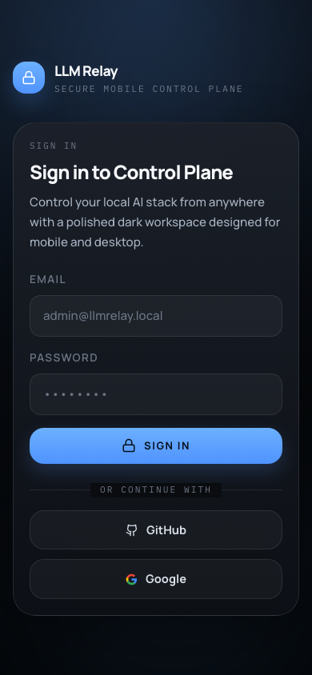
  &nbsp;&nbsp;
  
</p>

### 🩺 Runtime preflight validation

v4 validates every runtime before a task starts and surfaces **actionable structured errors** (missing binary, wrong config, Docker unavailable) instead of cryptic late failures mid-execution.

### 🔄 Concurrent task fanout

The task engine fans out work concurrently across agents. Auto-assignment prefers less-busy agents that match the task type.

### 🔭 Langfuse observability from direct chat

Direct-chat messages now emit Langfuse traces with token counts, latency metadata, and provider attribution — the same detail level previously only available for agent runs.

### 🛡 Provider reliability: bounded timeouts + smart cooldowns

Each provider gets a bounded per-request timeout. On failure the system applies failure-type-aware cooldowns and retries healthy fallbacks without keeping a broken provider pinned.

### Other v4 highlights

- JWT access/refresh tokens include unique `iat`/`jti` claims — replay and same-second refresh attacks are closed
- Setup wizard state persists to MongoDB so hosted setups survive restarts
- Dashboard replaced with a cleaner mobile-first workspace overview
- Social login OAuth callbacks now land correctly without a `/login` redirect bounce
- CodeQL path-traversal finding on agent workspace directories closed

---

## Quick start

### Fastest path — free cloud AI, no GPU needed

```bash
git clone https://github.com/strikersam/local-llm-server
cd local-llm-server

cat > .env <<'ENV'
API_KEYS=sk-relay-dev
ADMIN_SECRET=replace-with-a-long-random-secret
ADMIN_EMAIL=admin@llmrelay.local
ADMIN_PASSWORD=replace-with-a-strong-password
JWT_SECRET=replace-with-another-long-random-secret
NVIDIA_API_KEY=nvapi-...
ENV

docker compose up -d
docker compose --profile dashboard up -d
```

The setup wizard detects `NVIDIA_API_KEY` automatically and configures free NIM models as defaults.

| URL | What's there |
|---|---|
| `http://localhost:3000` | Full control plane (chat, tasks, agents, knowledge) |
| `http://localhost:8000/admin/ui/login` | Built-in admin portal (API keys, health) |
| `http://localhost:8000/app` | Built-in web UI |
| `http://localhost:8000/health` | Health check |

### Add local models (Ollama)

```bash
docker exec llm-server-ollama ollama pull qwen3-coder:30b
docker exec llm-server-ollama ollama pull deepseek-r1:32b
```

Set `INCLUDE_LOCAL_FALLBACK=true` in `.env` to include Ollama in the provider chain when NIM is also configured.

### Core proxy only (no Docker)

```bash
source .venv/bin/activate
uvicorn proxy:app --reload --port 8000
```

---

## Sign in

| Surface | Credentials |
|---|---|
| Control plane (`localhost:3000`) | `ADMIN_EMAIL` / `ADMIN_PASSWORD` |
| Built-in admin portal (`localhost:8000/admin/ui/login`) | any username / `ADMIN_SECRET` |

---

## Connect your tools

### Claude Code

```bash
export ANTHROPIC_BASE_URL=http://localhost:8000
export ANTHROPIC_API_KEY=sk-relay-...
claude
```

### Cursor

```
API Key:                  sk-relay-...
Override OpenAI Base URL: http://localhost:8000/v1
```

### Python / OpenAI SDK

```python
from openai import OpenAI
client = OpenAI(base_url="http://localhost:8000/v1", api_key="sk-relay-...")
response = client.chat.completions.create(
    model="qwen3-coder:30b",
    messages=[{"role": "user", "content": "hello"}]
)
```

### curl

```bash
curl http://localhost:8000/v1/chat/completions \
  -H "Authorization: Bearer sk-relay-..." \
  -H "Content-Type: application/json" \
  -d '{"model":"qwen/qwen2.5-coder-32b-instruct","messages":[{"role":"user","content":"hello"}]}'
```

Aider, Continue, Zed, VS Code, and script examples live in [`client-configs/`](client-configs/).

---

## See the product

### 🛬 Login

<p align="center">
  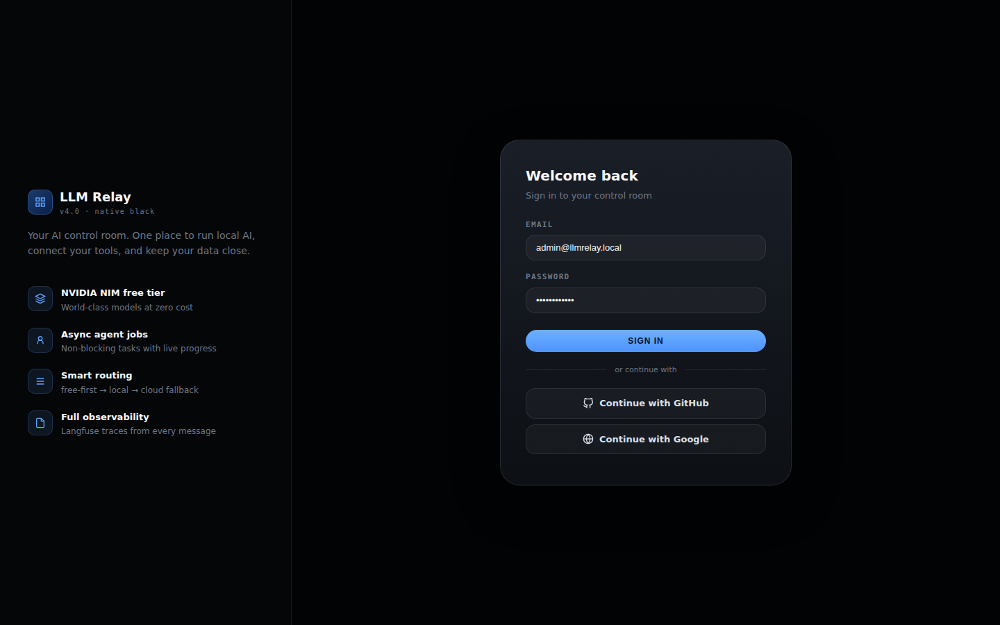
  &nbsp;
  
</p>

### 🧙 Setup Wizard

NVIDIA NIM appears first with "★ Recommended" and "Free" badges, auto-marked "already configured" when `NVIDIA_API_KEY` is set.

<p align="center">
  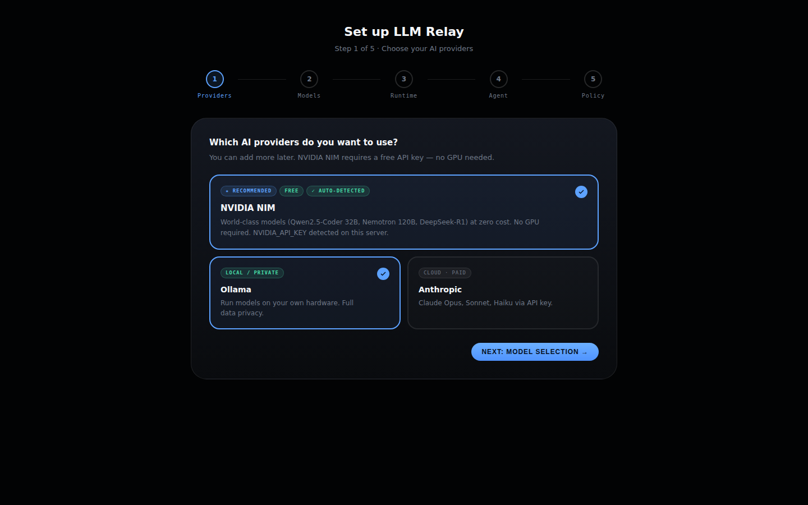
  &nbsp;
  
</p>

### 🏠 Dashboard

Usage stats, live provider health, running task progress bars, and quick-action cards.

<p align="center"></p>

### 💬 Chat

Direct chat with Agent Mode toggle. Enable it for complex multi-step tasks — async job status cards replace the old blocking request.

> **Agent Mode async contract:** `agent_mode=true` returns `202 Accepted` with `(session_id, job_id, status, phase, message)`. Poll `/api/chat/agent-jobs/{job_id}` for status. On completion, render `final_message` as the assistant reply. Runtime/GitHub preflight errors return `HTTP 412` with structured actionable errors.

<p align="center"></p>

### 🗂 Task Board

AI work made visible. v4 fans tasks out concurrently — multiple agents pick up work from the queue simultaneously.

<p align="center">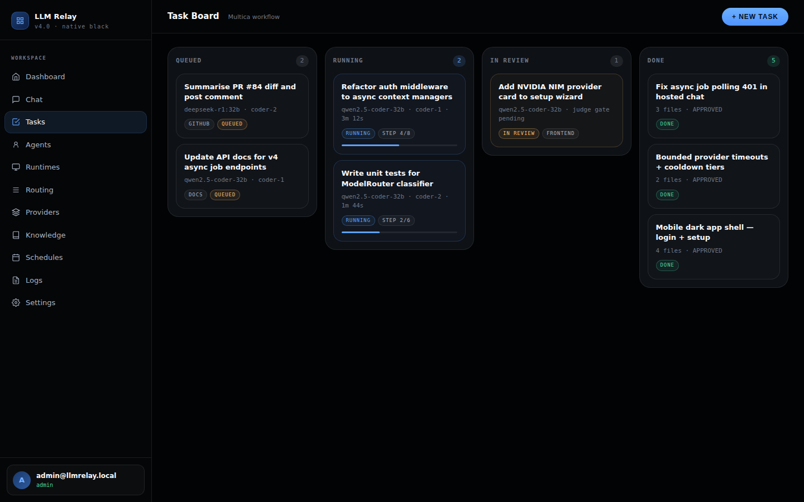</p>

### 🤖 Agent Roster

Each agent has per-role model configuration: planner, coder/executor, verifier, and judge can all use different models.

<p align="center">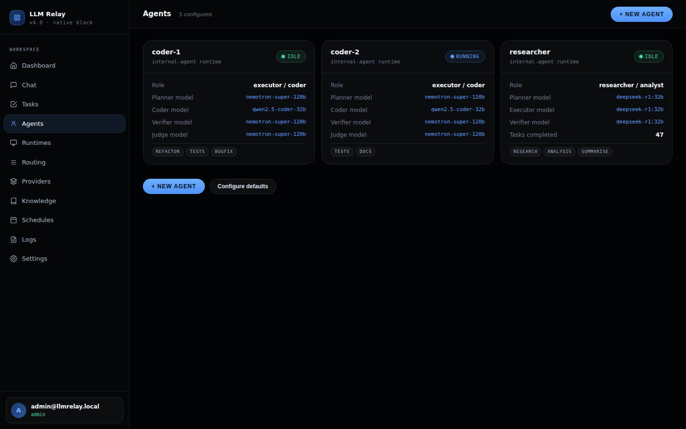</p>

### ⚙️ Runtimes

Runtime preflight validation with structured diagnostics — green for healthy, yellow with actionable messages for unavailable runtimes.

<p align="center">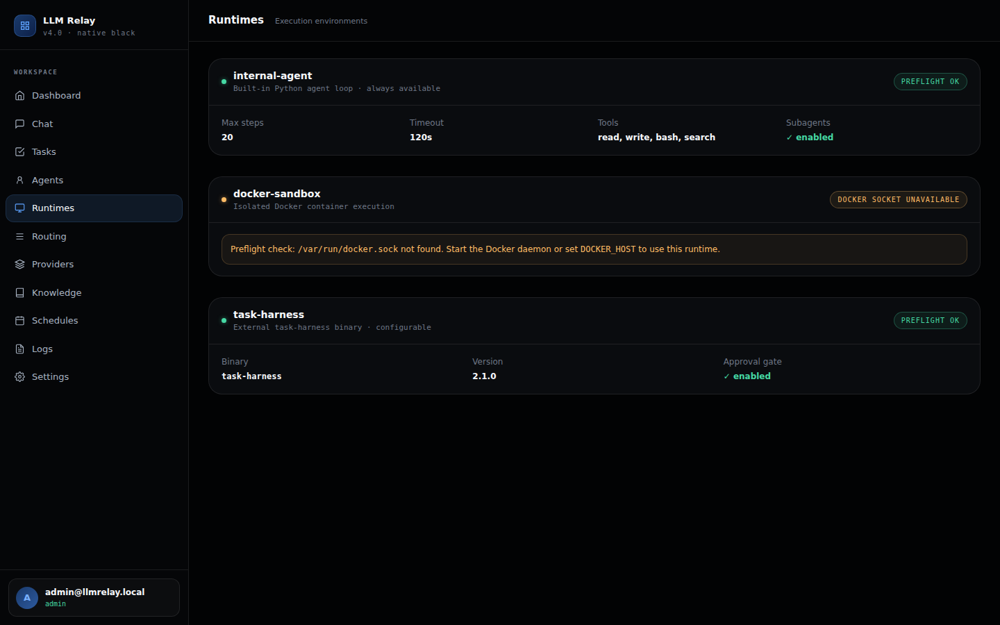</p>

### 🛣 Routing Policy

Choose your strategy (free-first, local-first, cost-aware, quality) and see the live provider priority order with bounded per-provider timeouts and failure-aware cooldowns.

<p align="center"></p>

### 🔌 Providers and Models

NVIDIA NIM at priority −10 with "★ Recommended" and "Free Tier" badges. Models table lists NIM, Ollama, and cloud models with context window, type, and cost at a glance.

<p align="center">
  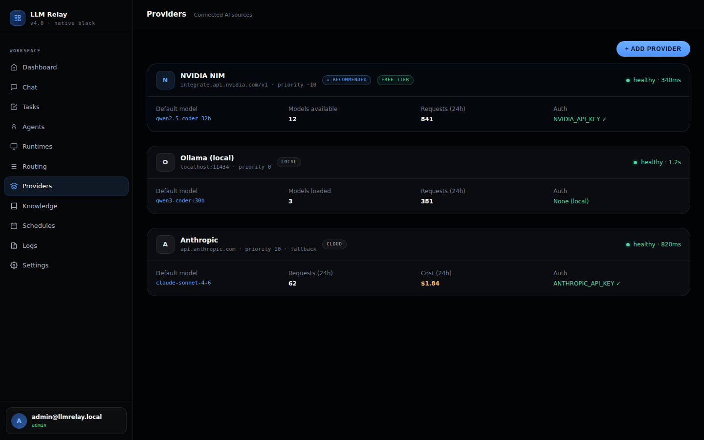
  &nbsp;
  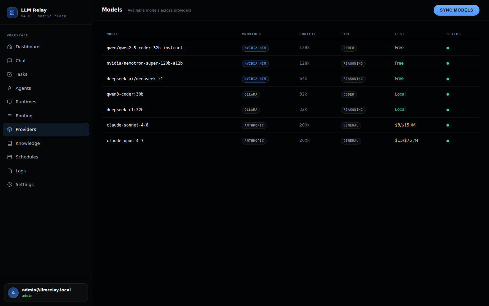
</p>

### 📚 Knowledge

Wiki pages with tags, plus a source library for GitHub repos, URLs, and uploaded files. Agents pull from these sources during task execution.

<p align="center">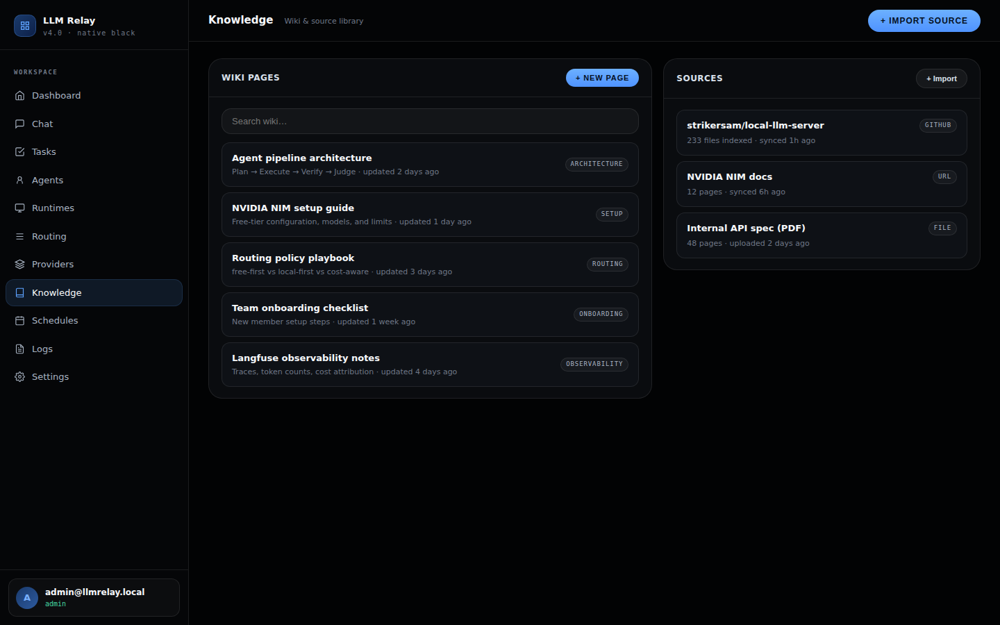</p>

### 🔭 Logs and Activity

Real-time event feed with INFO/WARN/ERROR badges and inline Langfuse trace links. Traces from direct chat include token counts and latency attribution.

<p align="center"></p>

### 🗓 Schedules

Automated agent jobs on cron schedules with a **Run now** button per schedule.

<p align="center">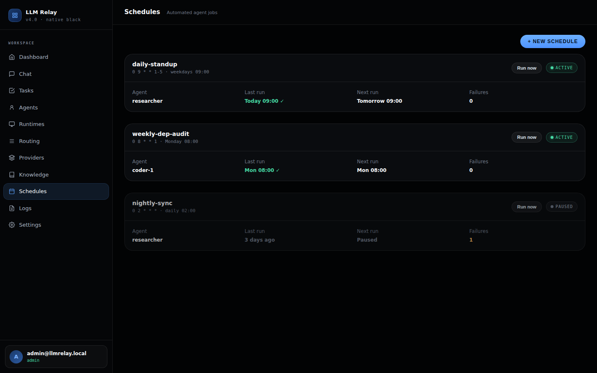</p>

### 🧭 Settings

Central configuration for server name, cost policy, Langfuse tracing, agent defaults (max steps, timeout, per-role models), and integrations.

<p align="center">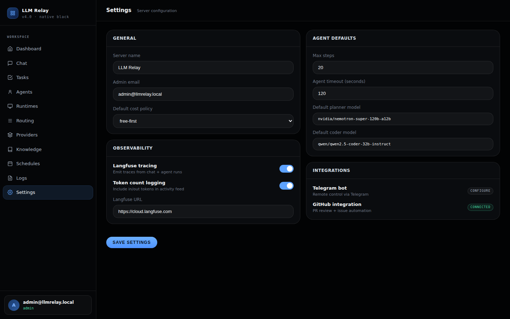</p>

### 🛡 Admin portal

API key management with create / revoke, system health, and server version.

<p align="center"></p>

### 🖥 Built-in web UI

The proxy ships a lightweight built-in app at `/app`, usable without the separate hosted dashboard.

<p align="center">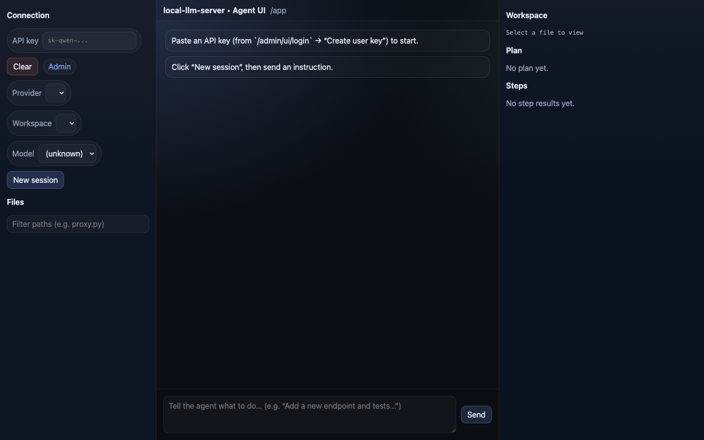</p>

---

## Feature overview

| Category | What's included |
|---|---|
| **API compatibility** | OpenAI `/v1/chat/completions`, Anthropic `/v1/messages` + `/count_tokens`, Ollama `/api/chat` |
| **Model routing** | Free-first · local-first · cost-aware · quality strategies |
| **Vision routing** | Auto-detects `image_url` content, routes to vision-capable model |
| **Thinking routing** | `thinking: {type: "enabled"}` → reasoning model (DeepSeek-R1, QwQ) |
| **Structured outputs** | `json_schema` / `json_object` translated to Ollama `format` automatically |
| **Auth** | Bearer tokens · per-user API keys · JWT (iat/jti) · social login · RBAC |
| **Agent engine** | Async 202 jobs · plan/execute/verify pipeline · per-role models |
| **Task management** | Kanban board · concurrent fanout · approvals · retry |
| **Schedules** | Cron jobs · run-now · webhook triggers |
| **Observability** | Langfuse traces (chat + agent) · session clustering · token/latency attribution |
| **Knowledge** | Wiki pages · source ingestion (GitHub, URL, file) · agent retrieval |
| **GitHub integration** | Repo · branch · file · PR flows |
| **Secrets** | Encrypted secrets store |
| **Peer sync** | Machine-to-machine sync |
| **Telegram bot** | Remote control via Telegram |
| **Browser / voice** | Browser automation · voice transcription tools |
| **Hardware detection** | GPU / CPU / memory profiling |
| **Extensibility** | `ROUTER_EXTRA_MODELS` · `MODEL_MAP` · `FEATURE_DISABLE/ENABLE` |

---

## Technical docs

- [Documentation index](docs/README.md)
- [Feature guide](docs/features.md)
- [API surfaces and route map](docs/api-surfaces.md)
- [Configuration reference](docs/configuration-reference.md)
- [Architecture overview](docs/architecture/overview.md)
- [Model routing guide](docs/model-routing.md)
- [Claude Code setup](docs/claude-code-setup.md)
- [Agent runtime setup](docs/runbooks/agent-runtime-setup.md)
- [Docker agent runtimes](docs/runbooks/docker-agent-runtimes.md)
- [Langfuse observability](docs/langfuse-observability.md)
- [Admin dashboard guide](docs/admin-dashboard.md)
- [Device compatibility](docs/device-compatibility.md)
- [Troubleshooting](docs/troubleshooting.md)
- [Changelog](docs/changelog.md)

---

## License

Open source. Use it, change it, and make it better.

---

<div align="center">

If LLM Relay saves you time or money, a star helps other people find it.

[](https://github.com/strikersam/local-llm-server/stargazers)

</div>
