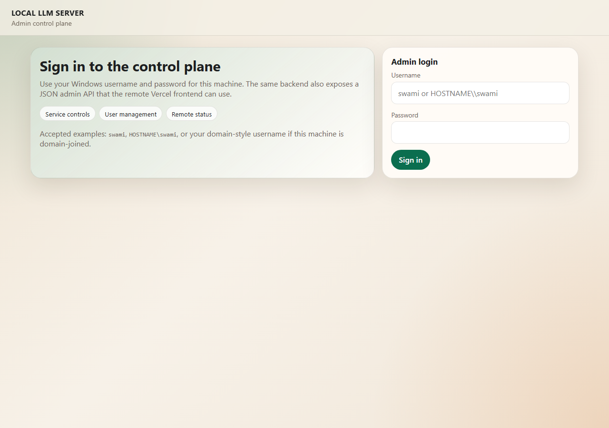
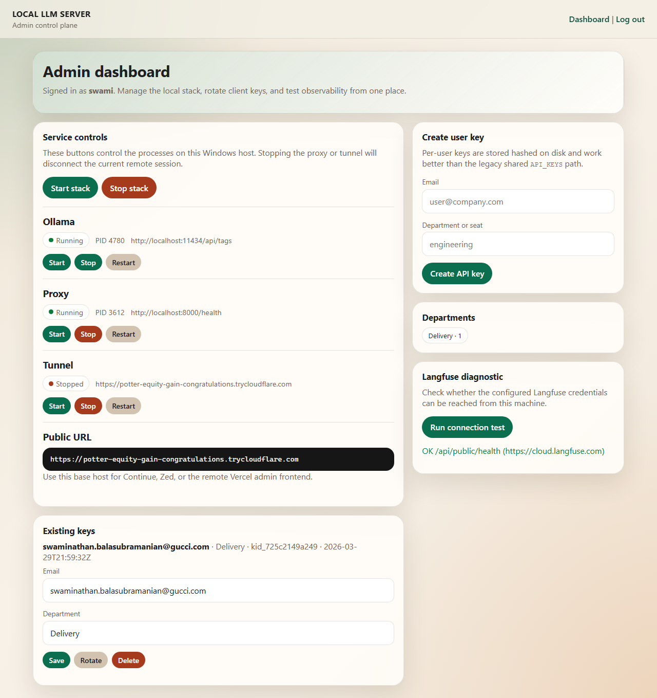

# Admin Dashboard Guide

The admin dashboard is a browser-based management interface for the local LLM server. It lets you manage the stack, users, and observability from one place — without touching the command line.

---

## Accessing the Dashboard

```
http://localhost:8000/admin/ui/login
```

Or remotely via your tunnel URL:

```
https://your-tunnel-url.trycloudflare.com/admin/ui/login
```

> The admin UI is only available when `ADMIN_SECRET` is set in `.env` or `ADMIN_WINDOWS_AUTH=true` on Windows.

---

## Login Screen

**URL:** `/admin/ui/login`

The login form has two fields: **Username** and **Password**.

**Authentication modes:**

| Mode | Config | Behavior |
|------|--------|----------|
| **Windows credentials** | `ADMIN_WINDOWS_AUTH=true` | Use your Windows machine username and password. Works with local accounts and domain accounts. |
| **Secret-based** | `ADMIN_SECRET=<value>` | Use any username and the `ADMIN_SECRET` as password. |

**Optional allow-list:**

If `ADMIN_WINDOWS_ALLOWED_USERS` is set (e.g. `HOSTNAME\swami,swami`), only those Windows usernames can log in via Windows auth. Empty = all Windows users on this machine are allowed.

Sessions last 12 hours and are tracked in memory. Restarting the proxy invalidates all sessions.

---

## Dashboard Layout

After login, the dashboard has two columns:

**Left column:**
- Service controls
- Existing API keys

**Right column:**
- Create user key
- Department summary
- Langfuse diagnostic

---

## Section: Service Controls

**Location:** Left column, top

Shows the running state of each service and provides start/stop/restart buttons.

### Stack controls

Two buttons at the top:

- **Start stack** — starts Ollama, proxy, and tunnel in sequence
- **Stop stack** — stops all three services (confirmation dialog shown first)

> Warning: clicking "Stop stack" from a remote browser session will disconnect you when the proxy stops. The page will fail to respond after the action completes.

### Per-service controls

For each service (ollama, proxy, tunnel):

| Field | Description |
|-------|-------------|
| **Name** | Service identifier (ollama / proxy / tunnel) |
| **Status badge** | Green "Running" or grey "Stopped" |
| **PID** | Process ID of the running service (shown when running) |
| **Detail** | Extra info — e.g. the tunnel URL for the tunnel service |
| **Start / Stop / Restart** | Buttons for individual service control |

**Expected behavior:**

- Stopping Ollama does not affect the proxy — requests will get 502 errors until Ollama restarts
- Stopping the proxy drops all active API connections; the tunnel keeps running but has nothing to proxy to
- Stopping the tunnel drops all remote access; local `http://localhost:8000` still works
- Restarting a service takes 2–5 seconds; the dashboard auto-shows the new state after submit

**Abnormal states to watch for:**

- Service shows "Running" but PID is stale — Ollama crashed after startup; restart it
- Tunnel shows "Running" but no URL appears — the tunnel process started but hasn't connected yet; wait 5s and refresh
- Proxy shows "Stopped" unexpectedly — check `logs/proxy-err.log` for a Python error or port conflict

### Public URL display

The **Public URL** field appears below the service rows and is always visible. It shows and lets you configure the tunnel URL used by all clients.

- **Editable input** — paste any URL and click **Save** to pin it permanently (saved to `.env` as `PUBLIC_URL`, survives restarts)
- **Auto-detect fallback** — if left blank, the field auto-detects the ephemeral quick-tunnel URL from the cloudflared log each time

Use this URL for:
- Continue, Cursor, Zed, Aider client configuration
- The built-in Web UI (App at `/`, Admin at `/admin/app`)
- Claude Code `ANTHROPIC_BASE_URL`

**Recommended:** Run `setup_ngrok.py --token <token>` once on the server to claim a free permanent ngrok domain — it pre-fills this field and never changes. See the [Permanent URL section in README](../README.md#permanent-url).

---

## Section: Existing Keys

**Location:** Left column, below service controls

Lists all API keys stored in `KEYS_FILE` (configured as `KEYS_FILE=keys.json` in `.env`).

**Displayed for each key:**

| Field | Description |
|-------|-------------|
| **Email** | The user's email address (shown as Langfuse `user_id`) |
| **Department** | Seat / team allocation label |
| **key_id** | Stable identifier (format: `kid_xxxxxxxx`) — does not change on rotation |
| **Created** | ISO timestamp of key creation |

**Actions per key:**

- **Save** — update email or department metadata inline without revoking the token
- **Rotate** — generate a new bearer token while keeping the same `key_id`. Old token immediately stops working. New token is shown once in the dashboard flash banner at the top.
- **Delete** — permanently remove the key record. The user cannot authenticate after deletion.

**Error states:**

- If `KEYS_FILE` is not configured in `.env`, the section shows: *"`KEYS_FILE` is not configured on the server."* — Add the config and restart.
- If no keys exist yet, the section shows: *"No API keys yet."*

---

## Section: Create User Key

**Location:** Right column, top

A two-field form for issuing new user API keys:

| Field | Description |
|-------|-------------|
| **Email** | User's email address — becomes the Langfuse `user_id` for this key |
| **Department** | Free-text team/seat label — used for Langfuse tagging and cost allocation |

After clicking **Create API key**:

1. A new key record is written to `keys.json`
2. The bearer token is shown **once** in the flash banner at the top of the dashboard (green box)
3. The token cannot be retrieved again — copy it immediately and give it to the user

```
New bearer token:
sk-qwen-xxxxxxxxxxxxxxxxxxxxxxxxxxxxxxxxxxxxxxxxx
Copy it now. The server only shows it once.
```

> If you miss the token, click **Rotate** on the key record to generate a new one.

---

## Section: Departments

**Location:** Right column, middle

A summary chip for each unique department label currently in use, with the count of keys per department:

```
engineering · 3    design · 1    research · 2
```

This gives a quick headcount view of who has access and how allocations are distributed. Departments are free-text labels — any value entered in the "Create user key" form appears here.

This view mirrors what appears in Langfuse traces as `dept:` tags, making it easy to cross-reference usage with seat allocation.

---

## Section: Langfuse Diagnostic

**Location:** Right column, bottom

A single button: **Run connection test**

Clicking it tests whether the configured Langfuse credentials can reach the Langfuse API:

**Success:**
```
✅ Langfuse connection OK — project: My Project
```

**Failure:**
```
❌ Langfuse connection failed: 401 Unauthorized
```

**Common failure reasons:**

| Error | Cause |
|-------|-------|
| `401 Unauthorized` | Wrong `LANGFUSE_PUBLIC_KEY` or `LANGFUSE_SECRET_KEY` |
| `Connection refused` | Wrong `LANGFUSE_BASE_URL` (for self-hosted) |
| `DNS resolution failed` | Network issue or self-hosted URL is unreachable |

> If credentials are not configured, the button returns a "not configured" message rather than running a test.

---

## Web UI Admin App (Built-in)

The proxy now ships a built-in “Claude Code–style” web UI that includes an Admin app for:
- Provider/model configuration (OpenAI-compatible endpoints; secrets stored server-side)
- Workspace selection (current repo by default; optional git-clone workspaces)
- An admin-only command runner (allow-listed commands like `pytest`, `git status`)

**URL:** `/admin/app`

This is served by the same FastAPI process as the proxy (no Vercel deploy required).

---

## Admin API (Programmatic Access)

All dashboard actions have corresponding JSON API endpoints for automation:

```bash
# Authenticate
curl -X POST http://localhost:8000/admin/api/login \
  -H "Content-Type: application/json" \
  -d '{"username":"admin","password":"your-admin-secret"}'
# → {"token": "sess_xxxxxxxx", "expires_in": 43200}

# Get status
curl http://localhost:8000/admin/api/status \
  -H "Authorization: Bearer sess_xxxxxxxx"

# Control a service
curl -X POST http://localhost:8000/admin/api/control \
  -H "Authorization: Bearer sess_xxxxxxxx" \
  -H "Content-Type: application/json" \
  -d '{"target":"proxy","action":"restart"}'

# Create a key
curl -X POST http://localhost:8000/admin/api/users \
  -H "Authorization: Bearer sess_xxxxxxxx" \
  -H "Content-Type: application/json" \
  -d '{"email":"bob@co.com","department":"engineering"}'
```

You can also use `X-Admin-Secret: <ADMIN_SECRET>` as a stateless alternative to session tokens for API calls.

---

## Screenshots

### Login page



The login form accepts Windows credentials (`ADMIN_WINDOWS_AUTH=true`) or the `ADMIN_SECRET` value as the password. The left panel explains the three feature areas the dashboard covers.

---

### Dashboard — healthy state


All services green. The **Public URL** section shows the active Cloudflare tunnel URL. The **Departments** chip shows the current seat allocation. The **Existing keys** section lists all provisioned users.

---

### Dashboard — key created (one-time token flash)


After clicking **Create API key**, a flash banner appears at the top with the new bearer token. This is the **only time the token is shown** — copy it immediately. The key record (email, department, key_id) is added to the Existing keys section.

---

### Dashboard — Langfuse diagnostic



After clicking **Run connection test**, the result appears below the button. The green message confirms the Langfuse credentials are valid and the endpoint is reachable. A red message indicates a connection failure with the HTTP error code.

> **Note:** The legacy `remote-admin/` static frontend is deprecated; use `/admin/app`.
