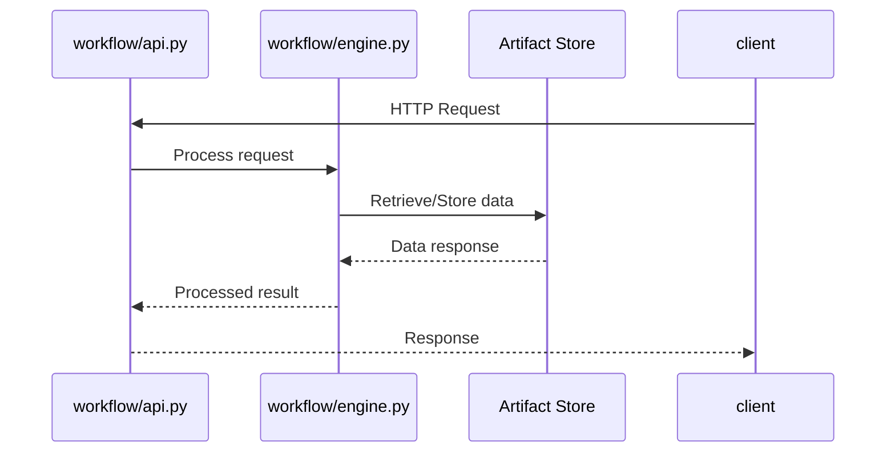

```mermaid
sequenceDiagram
    participant API as workflow/api.py
    participant Engine as workflow/engine.py
    participant Store as Artifact Store
    
    client ->> API: HTTP Request
    API ->> Engine: Process request
    Engine ->> Store: Retrieve/Store data
    Store -->> Engine: Data response
    Engine -->> API: Processed result
    API -->> client: Response
```
This is a basic template - we'll need to refine it once we see the actual code flow.